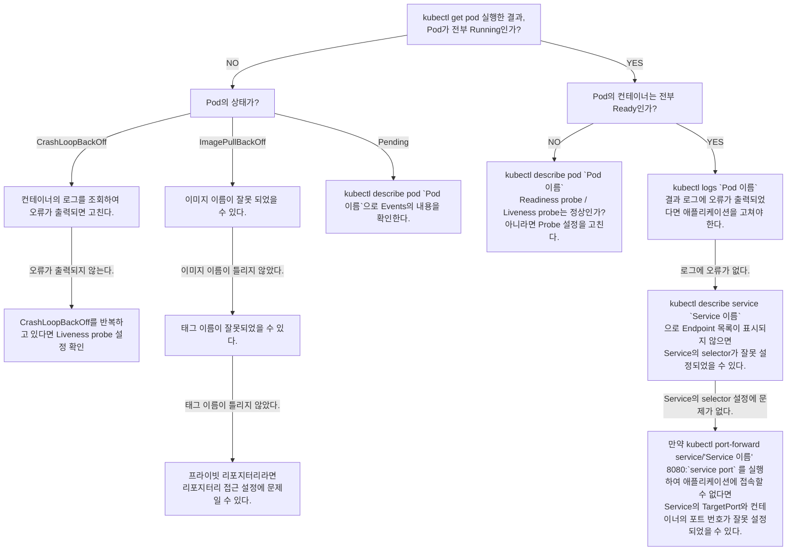

+++
date = 2025-12-07T03:30:00+09:00
title = "[그림과 실습으로 배우는 쿠버네티스 입문] 5장. 트러블 슈팅 가이드와 kubectl 명령어 사용법"
authors = ["Ji-Hoon Kim"]
tags = ["k8s", "kubernetes"]
categories = ["k8s", "kubernetes"]
series = ["k8s", "kubernetes"]
+++


## 5.1 트러블 슈팅 가이드



### 5.1.1 트러블 슈팅에 도움이 되는 Pod의 STATUS 컬럼

- `kubectl get pod` 명령으로 출력되는 STATUS 컬럼은 문제 해결에 도움이 되는 정보를 담고 있음
- 정상적인 STATUS 가 아닌 상태가 오랫동안 지속되거나, 상태가 짧은 시간 안에 계속해서 바뀌는 경우에는 이상이 발생했다고 판단할 수 있음

```bash
~/gitFolders/build-breaking-fixing-kubernetes master                   14:23:30
❯ kubectl get pods --namespace default                                    
NAME          READY   STATUS    RESTARTS   AGE
hello-world   1/1     Running   0          75s

```

| **상태 (Status)** | **의미 (Meaning)**                                                                                                                                                           |
|-----------------|----------------------------------------------------------------------------------------------------------------------------------------------------------------------------|
| Pending         | Kubernetes 클러스터에서 Pod 생성이 허가되었지만, 하나 이상의 컨테이너가 준비 중인 상태입니다. Pod가 처음 시작될 때는 이 STATUS가 표시될 수 있지만, 오랫동안 이 STATUS가 유지된다면 문제가 있다고 의심해야 합니다. Pod의 Events를 참조하여 원인에 대한 단서를 찾아보세요. |
| Running         | Pod가 노드에 스케줄링되었고 모든 컨테이너가 생성된 상태입니다. 하나 이상의 컨테이너가 실행 중이거나 시작 또는 재시작 중입니다. 항상 실행 중이어야 하는 Pod라면 정상적인 STATUS입니다.                                                              |
| Completed       | Pod 내의 모든 컨테이너가 완료된 상태입니다. 재시작되지 않습니다.                                                                                                                                     |
| Unknown         | 어떠한 이유로 Pod의 상태를 가져오지 못했습니다. 이 STATUS는 일반적으로 Pod가 실행되는 노드와의 통신 오류로 발생합니다.                                                                                                  |
| ErrImagePull    | 이미지를 가져오지 못했습니다. Pod의 Events를 참조하여 원인에 대한 단서를 찾아보세요.                                                                                                                       |
| Error           | 컨테이너가 비정상적으로 종료되었습니다. Pod의 로그를 참조하여 원인에 대한 단서를 찾아보세요.                                                                                                                      |
| OOMKilled       | 컨테이너가 메모리 부족(Out Of Memory)으로 종료되었습니다. Pod의 사용 리소스를 늘려 보세요.                                                                                                                |
| Terminating     | Pod가 삭제 중인 상태입니다. Terminating 상태가 반복된다면 이상으로 간주해야 합니다. Pod의 Events를 참조하여 원인에 대한 단서를 찾아보세요.                                                                                 |

## 5.2 kubectl로 현황 파악하기

- 문제가 발생했을 때는 먼저 현재 상황을 파악해야 함
- 여기서 소개하는 명령어는 조회 계열의 작업이므로, 운영 환경에서도 부담 없이 실행할 수 있음
- 문제가 발생했을 때 다양한 리소스에 대해 실행하여 점검해보자
- Pod 는 미리 만들어두기!

```bash
~/gitFolders/build-breaking-fixing-kubernetes master*                  14:41:10
❯ kubectl get pods --namespace default
NAME                  READY   STATUS    RESTARTS   AGE
another-hello-world   1/1     Running   0          45s
hello-world           1/1     Running   0          18m

```

### 5.2.1 리소스 확인하기: kubectl get

```bash
~
❯ kubectl get pod --namespace default 
NAME                  READY   STATUS    RESTARTS   AGE
another-hello-world   1/1     Running   0          102m
hello-world           1/1     Running   0          120m

~
❯ kubectl get pods --namespace default
NAME                  READY   STATUS    RESTARTS   AGE
another-hello-world   1/1     Running   0          103m
hello-world           1/1     Running   0          120m

~
❯ kubectl get pod -n default          
NAME                  READY   STATUS    RESTARTS   AGE
another-hello-world   1/1     Running   0          105m
hello-world           1/1     Running   0          123m

~
❯ kubectl get pods -n default         
NAME                  READY   STATUS    RESTARTS   AGE
another-hello-world   1/1     Running   0          105m
hello-world           1/1     Running   0          123m

```

- `--namespace(-n)` 옵션으로 네임스페이스 지정 가능
- 네임스페이스는 하나의 클러스터 안에서 리소스 그룹을 분리하기 위해 사용하는 리소스
- 보통 네임스페이스 리소스를 만들고 사용하지만, default 라는 이름의 네임스페이스는 클러스터를 만들 때 자동으로 생성됨
- 리소스 이름을 지정하여 특정 리소스 정보만 출력할 수도 있음

```bash
~
❯ kubectl get pod hello-world --namespace default
NAME          READY   STATUS    RESTARTS   AGE
hello-world   1/1     Running   0          131m

~
❯ kubectl get pod another-hello-world --namespace default
NAME                  READY   STATUS    RESTARTS   AGE
another-hello-world   1/1     Running   0          113m

```

- `--output(-o)` : 리소스의 정보를 다양한 방식으로 출력할 수 있음. 자주 사용하기 때문에 기억해 두는 것이 좋음
- `--output wide` 는 IP 정보다 노드의 정보를 가져옴

```bash
~
❯ kubectl get pod --output wide --namespace default      
NAME                  READY   STATUS    RESTARTS   AGE    IP           NODE                 NOMINATED NODE   READINESS GATES
another-hello-world   1/1     Running   0          115m   10.244.0.6   kind-control-plane   <none>           <none>
hello-world           1/1     Running   0          133m   10.244.0.5   kind-control-plane   <none>           <none>

```

- `--output yaml` 은 YAML 형식으로 리소스 정보를 출력

```bash
~
❯ kubectl get pod hello-world --output yaml --namespace default
apiVersion: v1
kind: Pod
metadata:
  annotations:
    kubectl.kubernetes.io/last-applied-configuration: |
      {"apiVersion":"v1","kind":"Pod","metadata":{"annotations":{},"labels":{"app":"hello-world"},"name":"hello-world","namespace":"default"},"spec":{"containers":[{"image":"hello-server:1.0.0","imagePullPolicy":"IfNotPresent","name":"hello-server","ports":[{"containerPort":8080}]}]}}
  creationTimestamp: "2025-11-22T05:23:32Z"
  generation: 1
  labels:
    app: hello-world
  name: hello-world
  namespace: default
  resourceVersion: "8988"
  uid: 8b7b2fff-3c2a-48a2-bf06-c13f44705de2
spec:
  containers:
  - image: hello-server:1.0.0
    imagePullPolicy: IfNotPresent
    name: hello-server
    ports:
    - containerPort: 8080
      protocol: TCP
    resources: {}
    terminationMessagePath: /dev/termination-log
    terminationMessagePolicy: File
    volumeMounts:
    - mountPath: /var/run/secrets/kubernetes.io/serviceaccount
      name: kube-api-access-ptcq2
      readOnly: true
  dnsPolicy: ClusterFirst
  enableServiceLinks: true
  nodeName: kind-control-plane
  preemptionPolicy: PreemptLowerPriority
  priority: 0
  restartPolicy: Always
  schedulerName: default-scheduler
  securityContext: {}
  serviceAccount: default
  serviceAccountName: default
  terminationGracePeriodSeconds: 30
  tolerations:
  - effect: NoExecute
    key: node.kubernetes.io/not-ready
    operator: Exists
    tolerationSeconds: 300
  - effect: NoExecute
    key: node.kubernetes.io/unreachable
    operator: Exists
    tolerationSeconds: 300
  volumes:
  - name: kube-api-access-ptcq2
    projected:
      defaultMode: 420
      sources:
      - serviceAccountToken:
          expirationSeconds: 3607
          path: token
      - configMap:
          items:
          - key: ca.crt
            path: ca.crt
          name: kube-root-ca.crt
      - downwardAPI:
          items:
          - fieldRef:
              apiVersion: v1
              fieldPath: metadata.namespace
            path: namespace
status:
  conditions:
  - lastProbeTime: null
    lastTransitionTime: "2025-11-22T05:23:34Z"
    observedGeneration: 1
    status: "True"
    type: PodReadyToStartContainers
  - lastProbeTime: null
    lastTransitionTime: "2025-11-22T05:23:32Z"
    observedGeneration: 1
    status: "True"
    type: Initialized
  - lastProbeTime: null
    lastTransitionTime: "2025-11-22T05:23:34Z"
    observedGeneration: 1
    status: "True"
    type: Ready
  - lastProbeTime: null
    lastTransitionTime: "2025-11-22T05:23:34Z"
    observedGeneration: 1
    status: "True"
    type: ContainersReady
  - lastProbeTime: null
    lastTransitionTime: "2025-11-22T05:23:32Z"
    observedGeneration: 1
    status: "True"
    type: PodScheduled
  containerStatuses:
  - containerID: containerd://375c3b01c73f9d4ea301aa368dc22796a2dcfa952d5cb12f2463a8e45876c153
    image: docker.io/library/hello-server:1.0.0
    imageID: sha256:09826592b0f07d8fef9da91e8d692a5215f870db4bd573bf78d891acc0624bf2
    lastState: {}
    name: hello-server
    ready: true
    resources: {}
    restartCount: 0
    started: true
    state:
      running:
        startedAt: "2025-11-22T05:23:33Z"
    user:
      linux:
        gid: 0
        supplementalGroups:
        - 0
        - 1
        - 2
        - 3
        - 4
        - 6
        - 10
        - 11
        - 20
        - 26
        - 27
        uid: 0
    volumeMounts:
    - mountPath: /var/run/secrets/kubernetes.io/serviceaccount
      name: kube-api-access-ptcq2
      readOnly: true
      recursiveReadOnly: Disabled
  hostIP: 172.20.0.2
  hostIPs:
  - ip: 172.20.0.2
  observedGeneration: 1
  phase: Running
  podIP: 10.244.0.5
  podIPs:
  - ip: 10.244.0.5
  qosClass: BestEffort
  startTime: "2025-11-22T05:23:32Z"

```

- 이 명령어는 `less` 라는 명령어와 함께 사용하기도 함

```bash
apiVersion: v1
kind: Pod
metadata:
  annotations:
    kubectl.kubernetes.io/last-applied-configuration: |
      {"apiVersion":"v1","kind":"Pod","metadata":{"annotations":{},"labels":{"app":"hello-world"},"name":"hello-world","namespace":"default"},"spec":{"containers":[{"image":"hello-server:1.0.0","imagePullPolicy":"IfNotPresent","name":"hello-server","ports":[{"containerPort":8080}]}]}}
  creationTimestamp: "2025-11-22T05:23:32Z"
  generation: 1
  labels:
    app: hello-world
  name: hello-world
  namespace: default
  resourceVersion: "8988"
  uid: 8b7b2fff-3c2a-48a2-bf06-c13f44705de2
spec:
  containers:
  - image: hello-server:1.0.0
    imagePullPolicy: IfNotPresent
    name: hello-server
    ports:
lines 1-20

```

- 쿠버네티스 클러스터에 실제 적용된 쿠버네티스 오브젝트의 내용과 자신이 적용한 매니페스트와의 차이점을 확인할 수도 있음
    - 이것이 `kubectl run` 이 아닌 `kubectl apply` 를 사용하는 이유 중 하나
- 차이점을 확인해보자

```bash
~/gitFolders/build-breaking-fixing-kubernetes/chapter-04 master
❯ kubectl get pod hello-world --output yaml --namespace default > hello-world-pod.yaml

~/gitFolders/build-breaking-fixing-kubernetes/chapter-04 master*
❯ diff hello-world-pod.yaml hello-world.yaml 
4,8c4
<   annotations:
<     kubectl.kubernetes.io/last-applied-configuration: |
<       {"apiVersion":"v1","kind":"Pod","metadata":{"annotations":{},"labels":{"app":"hello-world"},"name":"hello-world","namespace":"default"},"spec":{"containers":[{"image":"hello-server:1.0.0","imagePullPolicy":"IfNotPresent","name":"hello-server","ports":[{"containerPort":8080}]}]}}
<   creationTimestamp: "2025-11-22T05:23:32Z"
<   generation: 1
---
>   name: hello-world
11,14d6
<   name: hello-world
<   namespace: default
<   resourceVersion: "8988"
<   uid: 8b7b2fff-3c2a-48a2-bf06-c13f44705de2
17,139c9,13
<   - image: hello-server:1.0.0
<     imagePullPolicy: IfNotPresent
<     name: hello-server
<     ports:
<     - containerPort: 8080
<       protocol: TCP
<     resources: {}
<     terminationMessagePath: /dev/termination-log
<     terminationMessagePolicy: File
<     volumeMounts:
<     - mountPath: /var/run/secrets/kubernetes.io/serviceaccount
<       name: kube-api-access-ptcq2
<       readOnly: true
<   dnsPolicy: ClusterFirst
<   enableServiceLinks: true
<   nodeName: kind-control-plane
<   preemptionPolicy: PreemptLowerPriority
<   priority: 0
<   restartPolicy: Always
<   schedulerName: default-scheduler
<   securityContext: {}
<   serviceAccount: default
<   serviceAccountName: default
<   terminationGracePeriodSeconds: 30
<   tolerations:
<   - effect: NoExecute
<     key: node.kubernetes.io/not-ready
<     operator: Exists
<     tolerationSeconds: 300
<   - effect: NoExecute
<     key: node.kubernetes.io/unreachable
<     operator: Exists
<     tolerationSeconds: 300
<   volumes:
<   - name: kube-api-access-ptcq2
<     projected:
<       defaultMode: 420
<       sources:
<       - serviceAccountToken:
<           expirationSeconds: 3607
<           path: token
<       - configMap:
<           items:
<           - key: ca.crt
<             path: ca.crt
<           name: kube-root-ca.crt
<       - downwardAPI:
<           items:
<           - fieldRef:
<               apiVersion: v1
<               fieldPath: metadata.namespace
<             path: namespace
< status:
<   conditions:
<   - lastProbeTime: null
<     lastTransitionTime: "2025-11-22T05:23:34Z"
<     observedGeneration: 1
<     status: "True"
<     type: PodReadyToStartContainers
<   - lastProbeTime: null
<     lastTransitionTime: "2025-11-22T05:23:32Z"
<     observedGeneration: 1
<     status: "True"
<     type: Initialized
<   - lastProbeTime: null
<     lastTransitionTime: "2025-11-22T05:23:34Z"
<     observedGeneration: 1
<     status: "True"
<     type: Ready
<   - lastProbeTime: null
<     lastTransitionTime: "2025-11-22T05:23:34Z"
<     observedGeneration: 1
<     status: "True"
<     type: ContainersReady
<   - lastProbeTime: null
<     lastTransitionTime: "2025-11-22T05:23:32Z"
<     observedGeneration: 1
<     status: "True"
<     type: PodScheduled
<   containerStatuses:
<   - containerID: containerd://375c3b01c73f9d4ea301aa368dc22796a2dcfa952d5cb12f2463a8e45876c153
<     image: docker.io/library/hello-server:1.0.0
<     imageID: sha256:09826592b0f07d8fef9da91e8d692a5215f870db4bd573bf78d891acc0624bf2
<     lastState: {}
<     name: hello-server
<     ready: true
<     resources: {}
<     restartCount: 0
<     started: true
<     state:
<       running:
<         startedAt: "2025-11-22T05:23:33Z"
<     user:
<       linux:
<         gid: 0
<         supplementalGroups:
<         - 0
<         - 1
<         - 2
<         - 3
<         - 4
<         - 6
<         - 10
<         - 11
<         - 20
<         - 26
<         - 27
<         uid: 0
<     volumeMounts:
<     - mountPath: /var/run/secrets/kubernetes.io/serviceaccount
<       name: kube-api-access-ptcq2
<       readOnly: true
<       recursiveReadOnly: Disabled
<   hostIP: 172.20.0.2
<   hostIPs:
<   - ip: 172.20.0.2
<   observedGeneration: 1
<   phase: Running
<   podIP: 10.244.0.5
<   podIPs:
<   - ip: 10.244.0.5
<   qosClass: BestEffort
<   startTime: "2025-11-22T05:23:32Z"
---
>     - name: hello-server
>       image: hello-server:1.0.0 # chapter-01/hello-server
>       imagePullPolicy: IfNotPresent
>       ports:
>         - containerPort: 8080

```

- 차이가 많이 출력된 이유?
    - 매니페스트에는 리소스에 필수적인 내용과 사람이 선언적으로 지정하고 싶은 내용만 기재함
    - 그러나 사실 쿠버네티스가 리소스를 운영하기 위해서는 `kubectl apply` 로 적용한 매니페스트에 있는 내용보다 더 많은 정보가 필요함
    - 쿠버네티스가 내부적으로 다양한 정보(STATUS 나 내부용 ID)를 리소스에 부여하기 때문에, `--output yaml` 을 실행하면 매니페스트에 없는 정보가 많이
      출력됨

`--output(-o)` 으로 jsonpath 를 사용해 필드를 지정하여 출력하기

```bash
~
❯ kubectl get pod hello-world --output jsonpath='{.spec.containers[].image}' --namespace default
hello-server:1.0.0%                                                             

```

- jq 라는 JSON 변환 도구에 익숙하다면 `--output json` 과 조합하여 동일한 작업을 수행할 수 있다.
- 근데 나는 좀 더 빠르다고 하는 `jaq` 를…

```bash
~ 10s
❯ brew info jaq   
==> jaq: stable 2.3.0 (bottled), HEAD
JQ clone focussed on correctness, speed, and simplicity
https://github.com/01mf02/jaq
Conflicts with:
  json2tsv (because both install `jaq` binaries)
Installed
/opt/homebrew/Cellar/jaq/2.3.0 (8 files, 2.3MB) *
  Poured from bottle using the formulae.brew.sh API on 2025-11-23 at 01:10:20
From: https://github.com/Homebrew/homebrew-core/blob/HEAD/Formula/j/jaq.rb
License: MIT
==> Dependencies
Build: rust ✘
==> Options
--HEAD
	Install HEAD version
==> Downloading https://formulae.brew.sh/api/formula/jaq.json
==> Analytics
install: 145 (30 days), 233 (90 days), 1,739 (365 days)
install-on-request: 145 (30 days), 233 (90 days), 1,739 (365 days)
build-error: 0 (30 days)

~
❯ kubectl get pod hello-world --output json --namespace default | jaq '.spec.containers[].image'
"hello-server:1.0.0"

```

`--v` 로 `kubectl` 출력 결과의 로그 레벨 지정하기

- 로그 레벨을 변경하는 일은 자주 없지만, 알아 두면 유용함
- kubectl 이 클라이언트고 kube-apiserver 가 API 서버인 것은 `--v=7` 로 확인 가능

```bash
~
❯ kubectl get pod hello-world --v=7 --namespace default
I1123 01:14:30.559232   27416 cmd.go:527] kubectl command headers turned on
I1123 01:14:30.563318   27416 loader.go:402] Config loaded from file:  /Users/bossm0n5t3r/.kube/config
I1123 01:14:30.563624   27416 envvar.go:172] "Feature gate default state" feature="ClientsPreferCBOR" enabled=false
I1123 01:14:30.563633   27416 envvar.go:172] "Feature gate default state" feature="InOrderInformers" enabled=true
I1123 01:14:30.563636   27416 envvar.go:172] "Feature gate default state" feature="InformerResourceVersion" enabled=false
I1123 01:14:30.563639   27416 envvar.go:172] "Feature gate default state" feature="WatchListClient" enabled=false
I1123 01:14:30.563642   27416 envvar.go:172] "Feature gate default state" feature="ClientsAllowCBOR" enabled=false
I1123 01:14:30.566184   27416 round_trippers.go:527] "Request" verb="GET" url="https://127.0.0.1:50038/api/v1/namespaces/default/pods/hello-world" headers=<
	Accept: application/json;as=Table;v=v1;g=meta.k8s.io,application/json;as=Table;v=v1beta1;g=meta.k8s.io,application/json
	User-Agent: kubectl/v1.34.2 (darwin/arm64) kubernetes/8cc511e
 >
I1123 01:14:30.583893   27416 round_trippers.go:632] "Response" status="200 OK" milliseconds=17
NAME          READY   STATUS    RESTARTS   AGE
hello-world   1/1     Running   2          10h

```

- REST 요청 및 헤더의 내용이 출력됨
- 다른 로그 레벨은 아래 링크 참고
    - https://kubernetes.io/docs/reference/kubectl/quick-reference/#kubectl-output-verbosity-and-debugging

| Verbosity | Description                                                                                                                                                                                       |
|-----------|---------------------------------------------------------------------------------------------------------------------------------------------------------------------------------------------------|
| `--v=0`   | Generally useful for this to *always* be visible to a cluster operator.                                                                                                                           |
| `--v=1`   | A reasonable default log level if you don't want verbosity.                                                                                                                                       |
| `--v=2`   | Useful steady state information about the service and important log messages that may correlate to significant changes in the system. This is the recommended default log level for most systems. |
| `--v=3`   | Extended information about changes.                                                                                                                                                               |
| `--v=4`   | Debug level verbosity.                                                                                                                                                                            |
| `--v=5`   | Trace level verbosity.                                                                                                                                                                            |
| `--v=6`   | Display requested resources.                                                                                                                                                                      |
| `--v=7`   | Display HTTP request headers.                                                                                                                                                                     |
| `--v=8`   | Display HTTP request contents.                                                                                                                                                                    |
| `--v=9`   | Display HTTP request contents without truncation of contents.                                                                                                                                     |

### 5.2.2 리소스 상세 정보 출력하기: kubectl describe

```bash
~
❯ kubectl describe pod hello-world --namespace default
Name:             hello-world
Namespace:        default
Priority:         0
Service Account:  default
Node:             kind-control-plane/172.20.0.2
Start Time:       Sat, 22 Nov 2025 14:23:32 +0900
Labels:           app=hello-world
Annotations:      <none>
Status:           Running
IP:               10.244.0.2
IPs:
  IP:  10.244.0.2
Containers:
  hello-server:
    Container ID:   containerd://5b9ddc08be13da7f191675b8a7e11920ac9b64eb6cb95b5a35a426d2565070dd
    Image:          hello-server:1.0.0
    Image ID:       sha256:09826592b0f07d8fef9da91e8d692a5215f870db4bd573bf78d891acc0624bf2
    Port:           8080/TCP
    Host Port:      0/TCP
    State:          Running
      Started:      Sun, 23 Nov 2025 18:00:09 +0900
    Last State:     Terminated
      Reason:       Unknown
      Exit Code:    255
      Started:      Sun, 23 Nov 2025 17:59:53 +0900
      Finished:     Sun, 23 Nov 2025 18:00:04 +0900
    Ready:          True
    Restart Count:  4
    Environment:    <none>
    Mounts:
      /var/run/secrets/kubernetes.io/serviceaccount from kube-api-access-ptcq2 (ro)
Conditions:
  Type                        Status
  PodReadyToStartContainers   True 
  Initialized                 True 
  Ready                       True 
  ContainersReady             True 
  PodScheduled                True 
Volumes:
  kube-api-access-ptcq2:
    Type:                    Projected (a volume that contains injected data from multiple sources)
    TokenExpirationSeconds:  3607
    ConfigMapName:           kube-root-ca.crt
    Optional:                false
    DownwardAPI:             true
QoS Class:                   BestEffort
Node-Selectors:              <none>
Tolerations:                 node.kubernetes.io/not-ready:NoExecute op=Exists for 300s
                             node.kubernetes.io/unreachable:NoExecute op=Exists for 300s
Events:
  Type    Reason          Age    From     Message
  ----    ------          ----   ----     -------
  Normal  SandboxChanged  6m52s  kubelet  Pod sandbox changed, it will be killed and re-created.
  Normal  Pulled          6m51s  kubelet  Container image "hello-server:1.0.0" already present on machine
  Normal  Created         6m51s  kubelet  Created container: hello-server
  Normal  Started         6m51s  kubelet  Started container hello-server
```

- kubectl get 보다 더 자세한 정보가 필요할 때 kubectl describe 명령을 사용
- 특히 Events 에 출력되는 정보는 문제 해결에 도움이 됨
    - 단 Events 는 일정 시간이 지나면 사라짐

### 5.2.3 컨테이너의 로그 출력하기: kubectl logs

특정 Pod 의 로그 참조하기

```bash
~/gitFolders/build-breaking-fixing-kubernetes master*
❯ kubectl logs hello-world --namespace default             

09:39:07.136 [info] Starting server on port 8080

09:41:45.503 [info] GET /

09:41:45.505 [info] Sent 200 in 1ms

~/gitFolders/build-breaking-fixing-kubernetes master*
❯ kubectl logs hello-world --container hello-server --namespace default

09:39:07.136 [info] Starting server on port 8080

09:41:45.503 [info] GET /

09:41:45.505 [info] Sent 200 in 1ms
```

- 가장 일반적인 사용법
- `kubectl get pod` 로 Pod 이름을 확인 후 `kubectl logs Pod 이름` 으로 Pod 의 로그를 조회
- Pod 내에 컨테이너가 여러 개 있는 경우에는 `--container(-c)` 옵션으로 컨테이너를 지정해야 함
- 위 예에서는 컨테이너가 하나만 있으므로, 컨테이너를 지정하지 않았을 때와 출력 결과가 같음

특정 Deployment 에 연결된 Pod 의 로그 조회하기

```bash
❯ kubectl logs deploy/hello-server                                     
error: error from server (NotFound): deployments.apps "hello-server" not found in namespace "default"

# 아직 Deployment 리소스를 만들지 않아 위 내용처럼 나옴
```

- Deployment 라는 리소스를 사용하여 Pod 를 복제하면 Pod의 이름이 임의로 생성됨
- Pod 이름을 확인하기 위해 매번 `kubectl get pod` 를 실행하는 것은 번거로운 일
- 이때 이 명령을 사용하면 Deployment 에 연결된 모든 Pod 의 로그를 조회할 수 있음
- 여러 개의 Pod로 구성된 애플리케이션을 운영할 때 사용자의 요청이 어떤 Pod에서 이루어졌는지 알 수 없는 경우에 유용함

레이블을 지정하여 참조할 Pod 한정하기

- Deployment 외에도 출력하고 싶은 Pod를 한정하고 싶을 수 있음
- 같은 레이블을 사용하고 있다면 레이블을 지정하여 Pod를 한정할 수 있음

```bash
~/gitFolders/build-breaking-fixing-kubernetes master
❯ kubectl get pod --namespace default                  
NAME                     READY   STATUS    RESTARTS   AGE
another-hello-world      1/1     Running   0          144m
hello-world              1/1     Running   0          144m
hello-world-with-label   1/1     Running   0          2m1s

~/gitFolders/build-breaking-fixing-kubernetes master*
❯ kubectl get pod --selector app=hello-world
NAME                     READY   STATUS    RESTARTS   AGE
hello-world              1/1     Running   0          144m
hello-world-with-label   1/1     Running   0          2m20s

~/gitFolders/build-breaking-fixing-kubernetes master*
❯ kubectl logs --selector app=hello-world   

12:01:31.609 [info] Starting server on port 8080

09:39:07.136 [info] Starting server on port 8080

09:41:45.503 [info] GET /

09:41:45.505 [info] Sent 200 in 1ms
```

## 5.3 kubectl 명령어로 상세 정보 출력하기

- 조회 계열의 명령어로 얻는 정보만으로 충분하지 않을 경우, 아래 명령어 사용가능
- 하지만 더 많은 권한이 필요하므로, 실제 운영 환경에서 실행 가능한 환경인지 먼저 확인 필요

### 5.3.1 디버그용 사이드카 컨테이너 시작하기: kubectl debug

-

`kubectl debug --stdin --tty <디버그 대상 Pod 이름> --image=<디버그용 컨테이너 이미지> --target=<디버그 대상의 컨테이너 이름> --namespace default -- sh`

- 쿠버네티스 1.25 부터 Stable
- 컨테이너는 보통 빠른 시작을 위해 경량화하거나 보안 위험을 줄이기 위해 애플리케이션에 필요한 최소한의 도구만 포함시키는 것이 일반적
    - 결과적으로 디버깅을 하고 싶어도 필요한 도구는 물론 셸조차 없어서 아무것도 할 수 없음
- 이때 디버그용 컨테이너를 사용하면 다양한 디버그 도구를 이용할 수 있음
- 디버그용 컨테이너의 이미지는 임의의 이미지를 지정할 수 있으므로, 자신만의 커스텀 컨테이너 이미지를 만들어 사용할 수 도 있음

```bash
~
❯ kubectl debug --stdin --tty hello-world --image=curlimages/curl:latest --target=hello-server --namespace default -- sh
Targeting container "hello-server". If you don't see processes from this container it may be because the container runtime doesn't support this feature.
--profile=legacy is deprecated and will be removed in the future. It is recommended to explicitly specify a profile, for example "--profile=general".
Defaulting debug container name to debugger-ssst6.
All commands and output from this session will be recorded in container logs, including credentials and sensitive information passed through the command prompt.
If you don't see a command prompt, try pressing enter.
~ $ curl localhost:8080
Hello, world!~ $ exit
Session ended, the ephemeral container will not be restarted but may be reattached using 'kubectl attach hello-world -c debugger-ssst6 -i -t' if it is still running

```

### 5.3.2 컨테이너를 그 자리에서 실행하기 kubectl run

```bash
❯ kubectl --namespace default run busybox --image=busybox:latest --rm --stdin --tty --restart=Never --command -- nslookup google.com
Server:		10.96.0.10
Address:	10.96.0.10:53

Non-authoritative answer:

Non-authoritative answer:
Name:	google.com
Address: 172.217.31.174

pod "busybox" deleted from default namespace
```

- `--rm` : 실행이 완료되면 Pod 를 삭제
- `--stdin(-i)` : 표준 입력 전달 옵션
- `--tty(-t)` : 유사 터미널 할당 옵션
- `--restart=Never` : Pod 의 재시작 정책을 Never 로 설정
    - 컨테이너가 종료되어도 재시작하지 않음
    - 기본적으로 항상 재시작하는 정책이 사용되므로, 이번처럼 한 번만 명령을 실행할 때는 이 설정을 넣어야 함
- `--command --` : `--` 뒤에 전달되는 확장 인자의 첫 번째 인자가 명령어로 사용됨
- `--stdin` 과 `--tty` 대신 `-it` 라고 쓰는 경우가 많음

### 5.3.3 컨테이너에 로그인하기: kubectl exec

- `kubectl exec` 을 사용하면 컨테이너에서 명령어를 실행할 수 있음
    - 만약 컨테이너에 셸이 포함되어 있다면 `/bin/sh` 를 사용하여 직접 대상 컨테이너에 로그인할 수도 있음
- 만약 셸이 포함되어 있지 않은 경우 `kubectl run` 으로 실행한 디버그용 Pod에 로그인하여 사용하기도 함

```bash
~
❯ kubectl --namespace default run curlpod --image=curlimages/curl:latest --command -- /bin/sh -c "while true; do sleep infinity; done;"
pod/curlpod created

~
❯ kubectl get pod --namespace default       
NAME                     READY   STATUS    RESTARTS      AGE
another-hello-world      1/1     Running   1 (30m ago)   3d1h
curlpod                  1/1     Running   0             57s
hello-world              1/1     Running   1 (30m ago)   3d1h
hello-world-with-label   1/1     Running   1 (30m ago)   2d23h

~
❯ kubectl get pod hello-world --output wide --namespace default
NAME          READY   STATUS    RESTARTS      AGE    IP           NODE                 NOMINATED NODE   READINESS GATES
hello-world   1/1     Running   1 (31m ago)   3d1h   10.244.0.6   kind-control-plane   <none>           <none>

~
❯ kubectl --namespace default exec --stdin --tty curlpod -- /bin/sh
~ $ curl 10.244.0.6:8080
Hello, world!~ $ exit
```

### 5.3.4 포트 포워딩으로 애플리케이션에 접속하기

- Pod 에는 쿠버네티스 클러스터의 내부용 IP 주소가 할당됨
- 따라서 아무런 조치를 취하지 않으면 클러스터 외부에서 접속할 수 없음
- Service 라는 리소스를 사용해 클러스터 외부에서 접근하는 방법도 있음

```bash
# Terminal 1
❯ kubectl port-forward hello-world 5555:8080 --namespace default
Forwarding from 127.0.0.1:5555 -> 8080
Forwarding from [::1]:5555 -> 8080
Handling connection for 5555
^C%                                                                             
```

```bash
# Terminal 2
~
❯ curl localhost:5555
Hello, world!%                                                                  
```

```bash
❯ kubectl port-forward hello-world :8080
Forwarding from 127.0.0.1:49852 -> 8080
Forwarding from [::1]:49852 -> 8080
^C%                                                                             
~
❯ kubectl port-forward hello-world :8080
Forwarding from 127.0.0.1:49857 -> 8080
Forwarding from [::1]:49857 -> 8080
^C%                                                                             

```

## 5.4 장애를 해결하기 위한 kubectl 명령어

### 5.4.1 매니페스트를 그 자리에서 편집하기: kubectl edit

- `kubectl edit` 로 리소스의 매니페스트를 수정 가능
- **하지만 수정 내역을 남기기 어렵기 때문에 권장하지 않음**

```bash
~
❯ kubectl edit pod hello-world --namespace default
pod/hello-world edited

~ 16s
❯ kubectl get pod hello-world --output yaml --namespace default
apiVersion: v1
kind: Pod
metadata:
  annotations:
    kubectl.kubernetes.io/last-applied-configuration: |
      {"apiVersion":"v1","kind":"Pod","metadata":{"annotations":{},"labels":{"app":"hello-world"},"name":"hello-world","namespace":"default"},"spec":{"containers":[{"image":"hello-server:1.0.0","imagePullPolicy":"IfNotPresent","name":"hello-server","ports":[{"containerPort":8080}]}]}}
  creationTimestamp: "2025-11-23T09:39:05Z"
  generation: 2
  labels:
    app: hello-world
    env: prod # <----------------------------------------- 추가됨
  name: hello-world
  namespace: default
  resourceVersion: "58196"
  uid: d17de46e-50ab-4f7a-a0d1-788b06ca0d04
spec:
  containers:
  - image: hello-server:1.0.0
    imagePullPolicy: IfNotPresent
    name: hello-server
    ports:
    - containerPort: 8080
      protocol: TCP
    resources: {}
    terminationMessagePath: /dev/termination-log
    terminationMessagePolicy: File
    volumeMounts:
    - mountPath: /var/run/secrets/kubernetes.io/serviceaccount
      name: kube-api-access-rxwrx
      readOnly: true
  dnsPolicy: ClusterFirst
  enableServiceLinks: true
  ephemeralContainers:
  - command:
    - sh
    image: curlimages/curl:latest
    imagePullPolicy: Always
    name: debugger-ssst6
    resources: {}
    stdin: true
    targetContainerName: hello-server
    terminationMessagePath: /dev/termination-log
    terminationMessagePolicy: File
    tty: true
  nodeName: kind-control-plane
  preemptionPolicy: PreemptLowerPriority
  priority: 0
  restartPolicy: Always
  schedulerName: default-scheduler
  securityContext: {}
  serviceAccount: default
  serviceAccountName: default
  terminationGracePeriodSeconds: 30
  tolerations:
  - effect: NoExecute
    key: node.kubernetes.io/not-ready
    operator: Exists
    tolerationSeconds: 300
  - effect: NoExecute
    key: node.kubernetes.io/unreachable
    operator: Exists
    tolerationSeconds: 300
  volumes:
  - name: kube-api-access-rxwrx
    projected:
      defaultMode: 420
      sources:
      - serviceAccountToken:
          expirationSeconds: 3607
          path: token
      - configMap:
          items:
          - key: ca.crt
            path: ca.crt
          name: kube-root-ca.crt
      - downwardAPI:
          items:
          - fieldRef:
              apiVersion: v1
              fieldPath: metadata.namespace
            path: namespace
status:
  conditions:
  - lastProbeTime: null
    lastTransitionTime: "2025-11-26T10:50:14Z"
    observedGeneration: 2
    status: "True"
    type: PodReadyToStartContainers
  - lastProbeTime: null
    lastTransitionTime: "2025-11-23T09:39:05Z"
    observedGeneration: 2
    status: "True"
    type: Initialized
  - lastProbeTime: null
    lastTransitionTime: "2025-11-26T10:50:14Z"
    observedGeneration: 2
    status: "True"
    type: Ready
  - lastProbeTime: null
    lastTransitionTime: "2025-11-26T10:50:14Z"
    observedGeneration: 2
    status: "True"
    type: ContainersReady
  - lastProbeTime: null
    lastTransitionTime: "2025-11-23T09:39:05Z"
    observedGeneration: 2
    status: "True"
    type: PodScheduled
  containerStatuses:
  - containerID: containerd://d5e58aedb87717a317221863db5dbfb7f04e35cf3d78bb7e6ac48b28d9123b1f
    image: docker.io/library/hello-server:1.0.0
    imageID: sha256:42ee6041506dc12d6f7962576f56d0ea2d027727863afab01b246ccae4930c1b
    lastState:
      terminated:
        containerID: containerd://c2ee8c7fa00b3768bb62b20a037ade4b7e7c36c24936cf92298e5e445219d671
        exitCode: 255
        finishedAt: "2025-11-26T10:49:50Z"
        reason: Unknown
        startedAt: "2025-11-23T09:39:06Z"
    name: hello-server
    ready: true
    resources: {}
    restartCount: 1
    started: true
    state:
      running:
        startedAt: "2025-11-26T10:50:13Z"
    user:
      linux:
        gid: 0
        supplementalGroups:
        - 0
        - 1
        - 2
        - 3
        - 4
        - 6
        - 10
        - 11
        - 20
        - 26
        - 27
        uid: 0
    volumeMounts:
    - mountPath: /var/run/secrets/kubernetes.io/serviceaccount
      name: kube-api-access-rxwrx
      readOnly: true
      recursiveReadOnly: Disabled
  ephemeralContainerStatuses:
  - containerID: containerd://89e6422ddd97565383baffc8a7111c09d0ae71d6ad45077953d39cc3ede9c06f
    image: docker.io/curlimages/curl:latest
    imageID: docker.io/curlimages/curl@sha256:935d9100e9ba842cdb060de42472c7ca90cfe9a7c96e4dacb55e79e560b3ff40
    lastState: {}
    name: debugger-ssst6
    ready: false
    resources: {}
    restartCount: 0
    state:
      terminated:
        containerID: containerd://89e6422ddd97565383baffc8a7111c09d0ae71d6ad45077953d39cc3ede9c06f
        exitCode: 0
        finishedAt: "2025-11-23T12:09:35Z"
        reason: Completed
        startedAt: "2025-11-23T12:09:15Z"
    user:
      linux:
        gid: 101
        supplementalGroups:
        - 101
        uid: 100
  hostIP: 172.20.0.2
  hostIPs:
  - ip: 172.20.0.2
  observedGeneration: 2
  phase: Running
  podIP: 10.244.0.6
  podIPs:
  - ip: 10.244.0.6
  qosClass: BestEffort
  startTime: "2025-11-23T09:39:05Z"

```

### 5.4.2 리소스를 삭제하기: kubectl delete

- 실제 운영 환경에서는 매우 신중하게 리소스를 삭제해야 하지만, 의외로 자주 사용되는 명령어
- `kubectl` 에는 ‘Pod를 재시작’ 하는 명령이 없기 때문에 `kubectl delete` 명령어가 대신 사용됨
- 실제 운영 환경에서 애플리케이션은 일반적으로 ‘Deployment’ 라는 리소스를 사용하여 Pod를 다중화함
- 특정 Pod만 응답하지 않고 멈춰 버렸을 때 이 명령어로 Pod를 삭제하곤 함
- Deployment를 사용하면 Pod를 지워도 자동으로 새롭게 만들어지기 때문에 Pod를 삭제해도 문제가 되지 않는 것이 일반적
    - 정확하게 말하자면 Pod를 하나 삭제해도 사용자에게 영향이 없도록 애플리케이션을 작성해야 함

```bash
~
❯ kubectl get pod --namespace default
NAME                     READY   STATUS    RESTARTS      AGE
another-hello-world      1/1     Running   1 (36m ago)   3d1h
curlpod                  1/1     Running   0             7m13s
hello-world              1/1     Running   1 (36m ago)   3d1h
hello-world-with-label   1/1     Running   1 (36m ago)   2d23h

~
❯ kubectl delete pod hello-world --namespace default
pod "hello-world" deleted from default namespace

~
❯ kubectl get pod --namespace default
NAME                     READY   STATUS    RESTARTS      AGE
another-hello-world      1/1     Running   1 (37m ago)   3d1h
curlpod                  1/1     Running   0             7m26s
hello-world-with-label   1/1     Running   1 (37m ago)   2d23h

```

- Deployment 에 연결된 모든 Pod 를 순서대로 재시작하고 싶다면 `kubectl delete` 보다 `kubectl rollout restart` 를 사용하는 것이
  좋음

```bash
~
❯ kubectl delete pod curlpod another-hello-world hello-world-with-label --namespace default
pod "curlpod" deleted from default namespace
pod "another-hello-world" deleted from default namespace
pod "hello-world-with-label" deleted from default namespace

~ 31s
❯ kubectl get pod --namespace default
No resources found in default namespace.

```

## 5.5 터미널을 더 편리하게 사용하기 위한 팁

### 5.5.1 자동 완성 설정하기

- `<TAB>` 사용하기

### 5.5.2 kubectl의 별명 설정하기

```bash
alias k=kubectl
```

### 5.5.3 리소스 이름 축약하기

```bash
kubectl api-resources # SHORTNAMES 참고
```

### 5.5.4 kubectl 작업을 도와주는 도구

- https://github.com/stern/stern
- https://k9scli.io/
- https://starship.rs/

### 5.5.5 kubectl 플러그인 사용해 보기

- https://github.com/ahmetb/kubectx/

## 5.6 [고치기] 디버그해 보기

### 5.6.1 준비: Pod가 실행 중인 것을 확인하기

```bash
~/gitFolders/build-breaking-fixing-kubernetes master ⇡
❯ k apply --filename chapter-05/hello-world.yaml --namespace default
pod/hello-world created

~/gitFolders/build-breaking-fixing-kubernetes master ⇡
❯ k get pod hello-world --namespace default                       
NAME          READY   STATUS    RESTARTS   AGE
hello-world   1/1     Running   0          3m4s

~/gitFolders/build-breaking-fixing-kubernetes master ⇡
❯ k delete pod hello-world --namespace default 
pod "hello-world" deleted from default namespace

```

### 5.6.2 애플리케이션 망가뜨리기

```bash
~/gitFolders/build-breaking-fixing-kubernetes master* ⇡
❯ k apply --filename chapter-05/pod-destruction.yaml --namespace default 
pod/hello-world created

```

### 5.6.3 애플리케이션 조사하기

```bash
~/gitFolders/build-breaking-fixing-kubernetes master* ⇡
❯ k get pod hello-world --namespace default                             
NAME          READY   STATUS         RESTARTS   AGE
hello-world   0/1     ErrImagePull   0          32s

~/gitFolders/build-breaking-fixing-kubernetes master* ⇡
❯ k get pod hello-world --namespace default
NAME          READY   STATUS             RESTARTS   AGE
hello-world   0/1     ImagePullBackOff   0          44s

~/gitFolders/build-breaking-fixing-kubernetes master* ⇡
❯ k describe pod hello-world --namespace default 
Name:             hello-world
Namespace:        default
Priority:         0
Service Account:  default
Node:             kind-control-plane/172.20.0.2
Start Time:       Wed, 26 Nov 2025 21:53:30 +0900
Labels:           app=hello-world
Annotations:      <none>
Status:           Pending
IP:               10.244.0.10
IPs:
  IP:  10.244.0.10
Containers:
  hello-server:
    Container ID:   
    Image:          hello-server:1.1.0
    Image ID:       
    Port:           8080/TCP
    Host Port:      0/TCP
    State:          Waiting
      Reason:       ErrImagePull
    Ready:          False
    Restart Count:  0
    Environment:    <none>
    Mounts:
      /var/run/secrets/kubernetes.io/serviceaccount from kube-api-access-wpdqn (ro)
Conditions:
  Type                        Status
  PodReadyToStartContainers   True 
  Initialized                 True 
  Ready                       False 
  ContainersReady             False 
  PodScheduled                True 
Volumes:
  kube-api-access-wpdqn:
    Type:                    Projected (a volume that contains injected data from multiple sources)
    TokenExpirationSeconds:  3607
    ConfigMapName:           kube-root-ca.crt
    Optional:                false
    DownwardAPI:             true
QoS Class:                   BestEffort
Node-Selectors:              <none>
Tolerations:                 node.kubernetes.io/not-ready:NoExecute op=Exists for 300s
                             node.kubernetes.io/unreachable:NoExecute op=Exists for 300s
Events:
  Type     Reason     Age                From               Message
  ----     ------     ----               ----               -------
  Normal   Scheduled  60s                default-scheduler  Successfully assigned default/hello-world to kind-control-plane
  Normal   Pulling    16s (x3 over 60s)  kubelet            Pulling image "hello-server:1.1.0"
  Warning  Failed     15s (x3 over 58s)  kubelet            Failed to pull image "hello-server:1.1.0": failed to pull and unpack image "docker.io/library/hello-server:1.1.0": failed to resolve reference "docker.io/library/hello-server:1.1.0": pull access denied, repository does not exist or may require authorization: server message: insufficient_scope: authorization failed
  Warning  Failed     15s (x3 over 58s)  kubelet            Error: ErrImagePull
  Normal   BackOff    0s (x3 over 58s)   kubelet            Back-off pulling image "hello-server:1.1.0"
  Warning  Failed     0s (x3 over 58s)   kubelet            Error: ImagePullBackOff

~/gitFolders/build-breaking-fixing-kubernetes master* ⇡
❯ k edit pod hello-world --                     
-- completions --
--allow-missing-template-keys  -- If true, ignore any errors in templates wh
--as                           -- Username to impersonate for the operation.
--as-group                     -- Group to impersonate for the operation, th
--as-uid                       -- UID to impersonate for the operation.
--cache-dir                    -- Default cache directory
--certificate-authority        -- Path to a cert file for the certificate au
--client-certificate           -- Path to a client certificate file for TLS
--client-key                   -- Path to a client key file for TLS
--cluster                      -- The name of the kubeconfig cluster to use
--context                      -- The name of the kubeconfig context to use
--disable-compression          -- If true, opt-out of response compression f
--field-manager                -- Name of the manager used to track field ow
--filename                     -- Filename, directory, or URL to files to us
--help                         -- help for edit
--insecure-skip-tls-verify     -- If true, the server's certificate will not
--kubeconfig                   -- Path to the kubeconfig file to use for CLI
--kuberc                       -- Path to the kuberc file to use for prefere
--kustomize                    -- Process the kustomization directory. This 
--log-flush-frequency          -- Maximum number of seconds between log flus
--match-server-version         -- Require server version to match client ver
--namespace                    -- If present, the namespace scope for this C
--output                       -- Output format. One of: (json, yaml, name, 
--output-patch                 -- Output the patch if the resource is edited
--password                     -- Password for basic authentication to the A
--profile                      -- Name of profile to capture. One of (none|c
--profile-output               -- Name of the file to write the profile to
--recursive                    -- Process the directory used in -f, --filena
--request-timeout              -- The length of time to wait before giving u
--save-config                  -- If true, the configuration of current obje
--server                       -- The address and port of the Kubernetes API
--show-managed-fields          -- If true, keep the managedFields when print
--subresource                  -- If specified, edit will operate on the sub
--template                     -- Template string or path to template file t
--tls-server-name              -- Server name to use for server certificate 
--token                        -- Bearer token for authentication to the API
--user                         -- The name of the kubeconfig user to use
--username                     -- Username for basic authentication to the A
--v                            -- number for the log level verbosity
--validate                     -- Must be one of: strict (or true), warn, ig
--vmodule                      -- comma-separated list of pattern=N settings
--warnings-as-errors           -- Treat warnings received from the server as
--windows-line-endings         -- Defaults to the line ending native to your
~/gitFolders/build-breaking-fixing-kubernetes master* ⇡
❯ k edit pod hello-world --namespace default 
pod/hello-world edited

~/gitFolders/build-breaking-fixing-kubernetes master* ⇡ 16s
❯ k get pod hello-world --namespace default 
NAME          READY   STATUS    RESTARTS   AGE
hello-world   1/1     Running   0          2m1s

~/gitFolders/build-breaking-fixing-kubernetes master* ⇡
❯ k delete --filename chapter-05/pod-destruction.yaml --namespace default 
pod "hello-world" deleted from default namespace

~/gitFolders/build-breaking-fixing-kubernetes master* ⇡
❯ k get pod --namespace default                                          
No resources found in default namespace.
```
