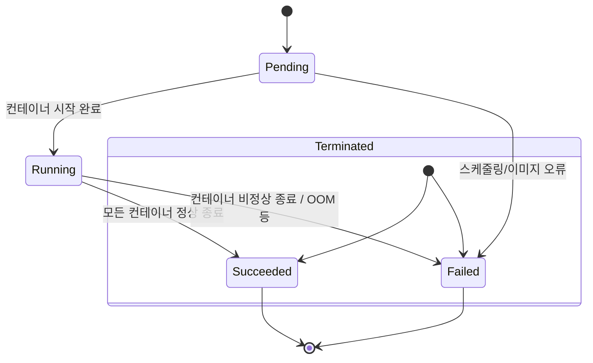
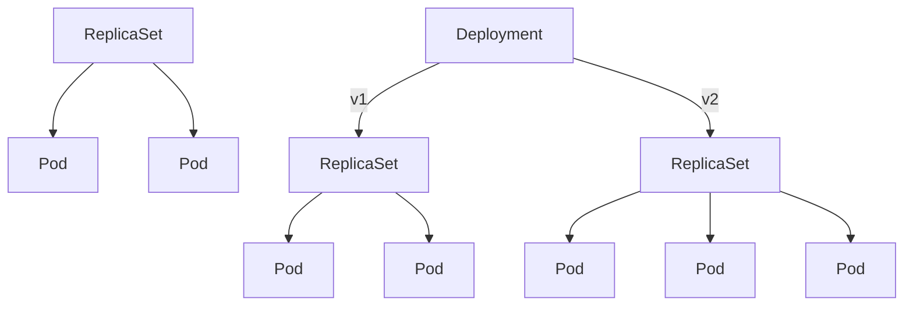
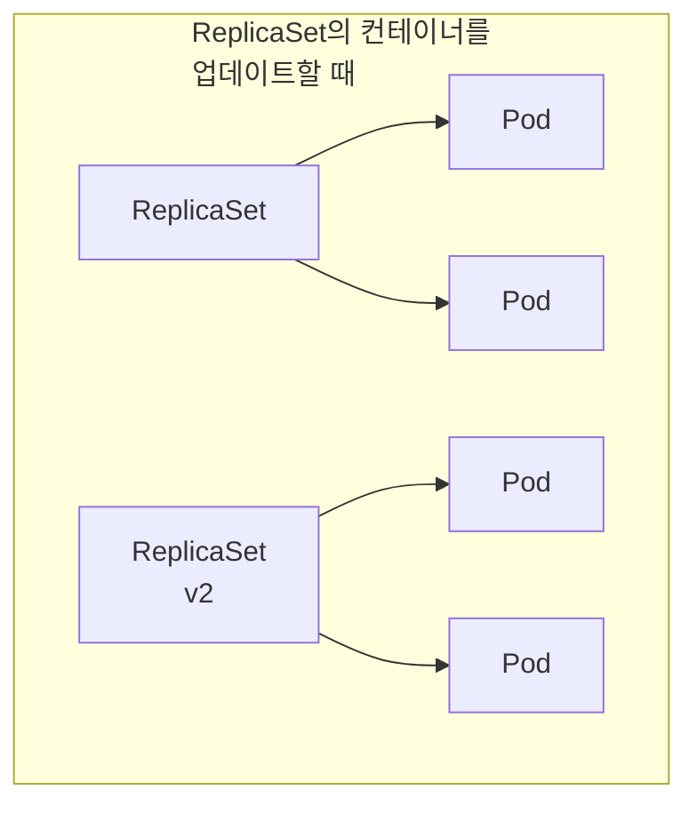
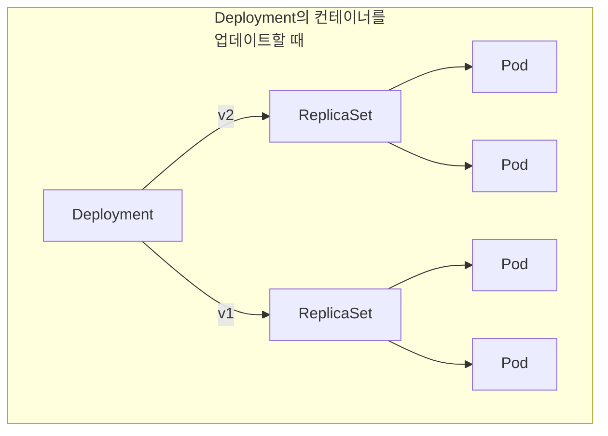
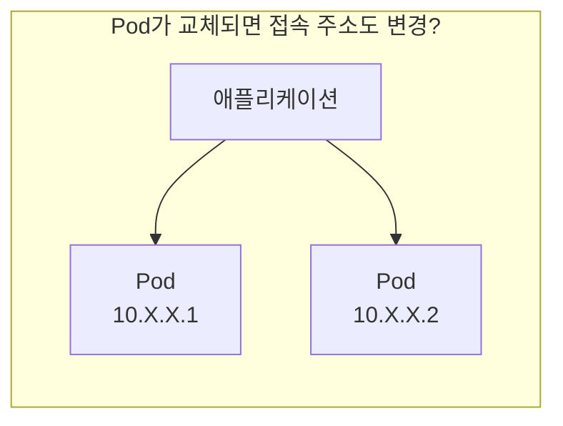
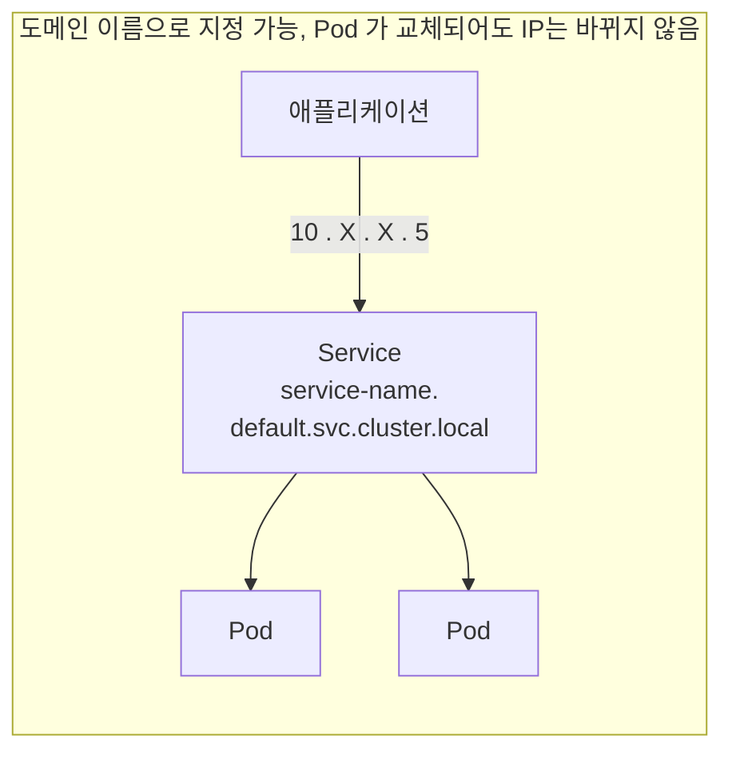

+++
date = 2025-12-07T04:00:00+09:00
title = "[그림과 실습으로 배우는 쿠버네티스 입문] 6장. 쿠버네티스 리소스 만들고 망가뜨리기"
authors = ["Ji-Hoon Kim"]
tags = ["k8s", "kubernetes"]
categories = ["k8s", "kubernetes"]
series = ["k8s", "kubernetes"]
+++


## 6.1 Pod의 라이프사이클 알기

- https://kubernetes.io/docs/concepts/workloads/pods/pod-lifecycle/
- Pod 의 매니페스트에 등록되면 노드에 스케쥴링됨
- 그러면 kubelet 이 컨테이너를 작동하고 완료 조건이 충족되거나 이상이 있으면 종료되는 것으로 Pod의 라이프 사이클이 끝나게 됨
- 가상 머신에서 애플리케이션을 실행하던 시절에 비해, 작동 및 정지가 쉬운 컨테이너를 사용하면서 애플리케이션의 라이프사이클이 단순해졌음



| Value       | Description                                                                                                                                                                                                                                                        |
|-------------|--------------------------------------------------------------------------------------------------------------------------------------------------------------------------------------------------------------------------------------------------------------------|
| `Pending`   | The Pod has been accepted by the Kubernetes cluster, but one or more of the containers has not been set up and made ready to run. This includes time a Pod spends waiting to be scheduled as well as the time spent downloading container images over the network. |
| `Running`   | The Pod has been bound to a node, and all of the containers have been created. At least one container is still running, or is in the process of starting or restarting.                                                                                            |
| `Succeeded` | All containers in the Pod have terminated in success, and will not be restarted.                                                                                                                                                                                   |
| `Failed`    | All containers in the Pod have terminated, and at least one container has terminated in failure. That is, the container either exited with non-zero status or was terminated by the system, and is not set for automatic restarting.                               |
| `Unknown`   | For some reason the state of the Pod could not be obtained. This phase typically occurs due to an error in communicating with the node where the Pod should be running.                                                                                            |

## 6.2 Pod의 다중화를 위한 ReplicaSet과 Deployment



- Pod 를 직접 만드는 것은 실제 운영 환경에서는 권장하지 않음
- Pod 만으로는 컨테이너의 다중화가 불가능하기 때문에 본격적인 운영 환경에는 적합하지 않음
- 그래서 Deployment 라는 리소스를 사용함
- Deployment 는 ReplicaSet 이라는 리소스를 만들고, ReplicaSet 이 Pod 를 만듦

### 6.2.1 ReplicaSet

- ReplicaSet 은 지정한 수만큼 Pod 를 복제하는 리소스
- Pod 리소스와 다른 점은 Pod 를 복제한다는 점
- 복제할 Pod 의 수를 replicas 로 지정함
- ReplicaSet 매니페스트의 예는 다음과 같음

```yaml
apiVersion: apps/v1
kind: ReplicaSet
metadata:
  name: httpserver
  labels:
    app: httpserver
spec:
  replicas: 3
  selector:
    matchLabels:
      app: httpserver
  template:
    metadata:
      labels:
        app: httpserver
    spec:
      containers:
        - name: nginx
          image: nginx:latest

```

```bash
~/gitFolders/build-breaking-fixing-kubernetes master* ⇡
❯ k apply --filename chapter-06/replicaset.yaml --namespace default     
replicaset.apps/httpserver created

~/gitFolders/build-breaking-fixing-kubernetes master* ⇡
❯ k get pod --namespace default                                    
NAME               READY   STATUS    RESTARTS   AGE
httpserver-7xfgc   1/1     Running   0          25s
httpserver-rmvgt   1/1     Running   0          25s
httpserver-xh72w   1/1     Running   0          25s

~/gitFolders/build-breaking-fixing-kubernetes master* ⇡
❯ k get replicaset --namespace default 
NAME         DESIRED   CURRENT   READY   AGE
httpserver   3         3         3       46s

~/gitFolders/build-breaking-fixing-kubernetes master* ⇡
❯ k delete replicaset httpserver --namespace default                     
replicaset.apps "httpserver" deleted from default namespace

~/gitFolders/build-breaking-fixing-kubernetes master* ⇡
❯ k get pod --namespace default       
No resources found in default namespace.

~/gitFolders/build-breaking-fixing-kubernetes master* ⇡
❯ k get replicaset --namespace default              
No resources found in default namespace.

```

### 6.2.2 Deployment





- Deployment 와 ReplicaSet 의 차이는 뭘까?
- 본격적인 운영 환경에서는 단순히 Pod 를 복제하여 다중화하는 것뿐만 아니라, Pod 를 ‘무중단 업데이트’ 해야 함
- ReplicaSet 이 만드는 Pod 의 컨테이너 이미지를 v1 에서 v2 로 변경하려면, v2 의 Pod 를 생성하는 ReplicaSet 을 새롭게 만들어야 함
- v1 에서 v2 로 원활하게 전환하기 위해서는 이들 ReplicaSet 을 연결해주는 상위 개념이 필요함
- 이처럼 ‘여러 ReplicaSet 을 연결하는’ 것이 Deployment 임

```yaml
apiVersion: apps/v1
kind: Deployment
metadata:
  name: nginx-deployment
  labels:
    app: nginx
spec:
  replicas: 3
  selector:
    matchLabels:
      app: nginx
  template:
    metadata:
      labels:
        app: nginx
    spec:
      containers:
        - name: nginx
          image: nginx:latest
          ports:
            - containerPort: 80

```

```bash
~/gitFolders/build-breaking-fixing-kubernetes master* ⇡
❯ k apply --filename chapter-06/deployment.yaml --namespace default
deployment.apps/nginx-deployment created

~/gitFolders/build-breaking-fixing-kubernetes master ⇡
❯ k get deployment --namespace default
NAME               READY   UP-TO-DATE   AVAILABLE   AGE
nginx-deployment   3/3     3            3           44s

~/gitFolders/build-breaking-fixing-kubernetes master ⇡
❯ k get pod --namespace default       
NAME                                READY   STATUS    RESTARTS   AGE
nginx-deployment-7f9c8bf8cd-52x4m   1/1     Running   0          56s
nginx-deployment-7f9c8bf8cd-6ql29   1/1     Running   0          56s
nginx-deployment-7f9c8bf8cd-f7lwt   1/1     Running   0          56s

~/gitFolders/build-breaking-fixing-kubernetes master ⇡
❯ k get replicaset --namespace default
NAME                          DESIRED   CURRENT   READY   AGE
nginx-deployment-7f9c8bf8cd   3         3         3       63s

~/gitFolders/build-breaking-fixing-kubernetes master ⇡
❯ k apply --filename chapter-06/deployment.yaml --namespace default
deployment.apps/nginx-deployment configured

~/gitFolders/build-breaking-fixing-kubernetes master* ⇡
❯ k get pod --namespace default                                    
NAME                                READY   STATUS    RESTARTS   AGE
nginx-deployment-578c8ff859-crdz7   1/1     Running   0          43s
nginx-deployment-578c8ff859-w25xv   1/1     Running   0          44s
nginx-deployment-578c8ff859-xbmdz   1/1     Running   0          47s

~/gitFolders/build-breaking-fixing-kubernetes master* ⇡
❯ k get replicaset --namespace default
NAME                          DESIRED   CURRENT   READY   AGE
nginx-deployment-578c8ff859   3         3         3       53s
nginx-deployment-7f9c8bf8cd   0         0         0       3m12s

~/gitFolders/build-breaking-fixing-kubernetes master* ⇡
❯ k get deployment nginx-deployment -o=jsonpath='{.spec.template.spec.containers[0].image}' --namespace default
nginx:1.29%                                                                     
~/gitFolders/build-breaking-fixing-kubernetes master* ⇡
❯ k describe deployment nginx-deployment 
Name:                   nginx-deployment
Namespace:              default
CreationTimestamp:      Wed, 26 Nov 2025 23:57:15 +0900
Labels:                 app=nginx
Annotations:            deployment.kubernetes.io/revision: 2
Selector:               app=nginx
Replicas:               3 desired | 3 updated | 3 total | 3 available | 0 unavailable
StrategyType:           RollingUpdate # <---------- 업데이트 방법 지정
MinReadySeconds:        0
# RollingUpdate 시의 동작 방식을 지정
RollingUpdateStrategy:  25% max unavailable, 25% max surge 
Pod Template:
  Labels:  app=nginx
  Containers:
   nginx:
    Image:         nginx:1.29
    Port:          80/TCP
    Host Port:     0/TCP
    Environment:   <none>
    Mounts:        <none>
  Volumes:         <none>
  Node-Selectors:  <none>
  Tolerations:     <none>
Conditions:
  Type           Status  Reason
  ----           ------  ------
  Available      True    MinimumReplicasAvailable
  Progressing    True    NewReplicaSetAvailable
OldReplicaSets:  nginx-deployment-7f9c8bf8cd (0/0 replicas created)
NewReplicaSet:   nginx-deployment-578c8ff859 (3/3 replicas created)
Events:
  Type    Reason             Age    From                   Message
  ----    ------             ----   ----                   -------
  Normal  ScalingReplicaSet  4m38s  deployment-controller  Scaled up replica set nginx-deployment-7f9c8bf8cd from 0 to 3
  Normal  ScalingReplicaSet  2m19s  deployment-controller  Scaled up replica set nginx-deployment-578c8ff859 from 0 to 1
  Normal  ScalingReplicaSet  2m16s  deployment-controller  Scaled down replica set nginx-deployment-7f9c8bf8cd from 3 to 2
  Normal  ScalingReplicaSet  2m16s  deployment-controller  Scaled up replica set nginx-deployment-578c8ff859 from 1 to 2
  Normal  ScalingReplicaSet  2m15s  deployment-controller  Scaled down replica set nginx-deployment-7f9c8bf8cd from 2 to 1
  Normal  ScalingReplicaSet  2m15s  deployment-controller  Scaled up replica set nginx-deployment-578c8ff859 from 2 to 3
  Normal  ScalingReplicaSet  2m14s  deployment-controller  Scaled down replica set nginx-deployment-7f9c8bf8cd from 1 to 0

```

- RollingUpdateStrategy 는 Pod 이나 ReplicaSet 에는 없고, Deployment 에만 있는 항목
- 현재는 설정 값이 없어 기본값이 적용됨

**StrategyType**

- StrategyType 은 Deployment 의 Pod 업데이트 전략을 지정하는 옵션
- Recreate 와 RollingUpdate 중 하나를 선택할 수 있음
- Recreate
    - 모든 Pod 를 동시에 업데이트
- RollingUpdate
    - Pod 를 순차적으로 업데이트
    - RollingUpdateStrategy 를 지정할 수 있음
- 기본 값으로 RollingUpdate 가 사용되며, 25% max unavailable, 25% max surge 가 설정됨

**RollingUpdateStrategy**

- RollingUpdateStrategy 필드에는 RollingUpdate 의 구체적인 동작 방식을 지정함
- 쿠버네티스에서는 이를 지원하기 위해 ReplicaSet 보다 상위 개념인 Deployment 를 도입함
- 이를 통해 애플리케이션을 업데이트하는 중에도 운영을 계속할 수 있어 서비스 중단을 최소화할 수 있음
- RollingUpdateStrategy 에 지정할 수 있는 것은 maxUnavailable, maxSurge 두 가지
- maxUnavailable
    - 최대 몇 개의 Pod 를 동시에 종료할 수 있는가
    - 기본 값으로 지정되는 25%는 ‘전체 Pod 의 25% 까지 동시에 종료할 수 있음’을 의미함
    - 퍼센트가 아닌 고정 값을 지정할 수도 있음
- maxSurge
    - 최대 몇 개의 Pod를 새로 생성할 수 있는가
- RollingUpdate 는 오래된 Pod 를 종료하고 새로운 Pod 를 생성하면서 애플리케이션을 업데이트함
- maxSurge 가 크면 그만큼 여분으로 생성되는 Pod 가 늘어나기 때문에, 필요한 클래스터의 용량이 늘어나고 비용도 증가함
    - 상황에 따라 적당한 설정이 필요함
    - 저자는 예전에 maxSurge 설정 때문에 Pod 의 수가 너무 많아져 모든 노드의 용량이 소진되어 RollingUpdate 가 끝나지 않았던 적이 있었음

```bash
~/gitFolders/build-breaking-fixing-kubernetes master* ⇡
❯ k apply --filename chapter-06/deployment-recreate.yaml --namespace default 
deployment.apps/nginx-deployment created

~/gitFolders/build-breaking-fixing-kubernetes master* ⇡
❯ k get pod --namespace default                                             
NAME                                READY   STATUS    RESTARTS   AGE
nginx-deployment-694cc8cdb8-cmbhx   1/1     Running   0          2m4s
nginx-deployment-694cc8cdb8-d2gq8   1/1     Running   0          2m4s
nginx-deployment-694cc8cdb8-dnd6k   1/1     Running   0          2m4s
nginx-deployment-694cc8cdb8-fn44z   1/1     Running   0          2m4s
nginx-deployment-694cc8cdb8-hnhhv   1/1     Running   0          2m4s
nginx-deployment-694cc8cdb8-m7czc   1/1     Running   0          2m4s
nginx-deployment-694cc8cdb8-nt8x7   1/1     Running   0          2m4s
nginx-deployment-694cc8cdb8-t27vf   1/1     Running   0          2m4s
nginx-deployment-694cc8cdb8-xhrr5   1/1     Running   0          2m4s
nginx-deployment-694cc8cdb8-z9kd2   1/1     Running   0          2m4s

~/gitFolders/build-breaking-fixing-kubernetes master* ⇡
❯ k apply --filename chapter-06/deployment-recreate.yaml --namespace default
deployment.apps/nginx-deployment configured

~/gitFolders/build-breaking-fixing-kubernetes master* ⇡
❯ k delete --filename chapter-06/deployment-recreate.yaml --namespace default 
deployment.apps "nginx-deployment" deleted from default namespace

```

```bash
# Terminal 2
~
❯ k get pod --watch --namespace default 
NAME                                READY   STATUS    RESTARTS   AGE
nginx-deployment-694cc8cdb8-cmbhx   1/1     Running   0          3m54s
nginx-deployment-694cc8cdb8-d2gq8   1/1     Running   0          3m54s
nginx-deployment-694cc8cdb8-dnd6k   1/1     Running   0          3m54s
nginx-deployment-694cc8cdb8-fn44z   1/1     Running   0          3m54s
nginx-deployment-694cc8cdb8-hnhhv   1/1     Running   0          3m54s
nginx-deployment-694cc8cdb8-m7czc   1/1     Running   0          3m54s
nginx-deployment-694cc8cdb8-nt8x7   1/1     Running   0          3m54s
nginx-deployment-694cc8cdb8-t27vf   1/1     Running   0          3m54s
nginx-deployment-694cc8cdb8-xhrr5   1/1     Running   0          3m54s
nginx-deployment-694cc8cdb8-z9kd2   1/1     Running   0          3m54s
nginx-deployment-694cc8cdb8-hnhhv   1/1     Terminating   0          4m45s
nginx-deployment-694cc8cdb8-dnd6k   1/1     Terminating   0          4m45s
nginx-deployment-694cc8cdb8-cmbhx   1/1     Terminating   0          4m45s
nginx-deployment-694cc8cdb8-nt8x7   1/1     Terminating   0          4m45s
nginx-deployment-694cc8cdb8-z9kd2   1/1     Terminating   0          4m45s
nginx-deployment-694cc8cdb8-d2gq8   1/1     Terminating   0          4m45s
nginx-deployment-694cc8cdb8-fn44z   1/1     Terminating   0          4m45s
nginx-deployment-694cc8cdb8-t27vf   1/1     Terminating   0          4m45s
nginx-deployment-694cc8cdb8-xhrr5   1/1     Terminating   0          4m45s
nginx-deployment-694cc8cdb8-m7czc   1/1     Terminating   0          4m45s
nginx-deployment-694cc8cdb8-hnhhv   1/1     Terminating   0          4m45s
nginx-deployment-694cc8cdb8-fn44z   1/1     Terminating   0          4m45s
nginx-deployment-694cc8cdb8-d2gq8   1/1     Terminating   0          4m45s
nginx-deployment-694cc8cdb8-z9kd2   1/1     Terminating   0          4m45s
nginx-deployment-694cc8cdb8-cmbhx   1/1     Terminating   0          4m45s
nginx-deployment-694cc8cdb8-dnd6k   1/1     Terminating   0          4m45s
nginx-deployment-694cc8cdb8-nt8x7   1/1     Terminating   0          4m45s
nginx-deployment-694cc8cdb8-t27vf   1/1     Terminating   0          4m45s
nginx-deployment-694cc8cdb8-xhrr5   1/1     Terminating   0          4m45s
nginx-deployment-694cc8cdb8-m7czc   1/1     Terminating   0          4m45s
nginx-deployment-694cc8cdb8-dnd6k   0/1     Completed     0          4m56s
nginx-deployment-694cc8cdb8-hnhhv   0/1     Completed     0          4m56s
nginx-deployment-694cc8cdb8-cmbhx   0/1     Completed     0          4m56s
nginx-deployment-694cc8cdb8-m7czc   0/1     Completed     0          4m56s
nginx-deployment-694cc8cdb8-nt8x7   0/1     Completed     0          4m56s
nginx-deployment-694cc8cdb8-fn44z   0/1     Completed     0          4m56s
nginx-deployment-694cc8cdb8-d2gq8   0/1     Completed     0          4m56s
nginx-deployment-694cc8cdb8-z9kd2   0/1     Completed     0          4m56s
nginx-deployment-694cc8cdb8-t27vf   0/1     Completed     0          4m56s
nginx-deployment-694cc8cdb8-xhrr5   0/1     Completed     0          4m56s
nginx-deployment-694cc8cdb8-m7czc   0/1     Completed     0          4m56s
nginx-deployment-694cc8cdb8-m7czc   0/1     Completed     0          4m56s
nginx-deployment-694cc8cdb8-cmbhx   0/1     Completed     0          4m56s
nginx-deployment-694cc8cdb8-cmbhx   0/1     Completed     0          4m56s
nginx-deployment-694cc8cdb8-hnhhv   0/1     Completed     0          4m56s
nginx-deployment-694cc8cdb8-hnhhv   0/1     Completed     0          4m56s
nginx-deployment-694cc8cdb8-t27vf   0/1     Completed     0          4m56s
nginx-deployment-694cc8cdb8-t27vf   0/1     Completed     0          4m56s
nginx-deployment-694cc8cdb8-xhrr5   0/1     Completed     0          4m56s
nginx-deployment-694cc8cdb8-xhrr5   0/1     Completed     0          4m56s
nginx-deployment-694cc8cdb8-fn44z   0/1     Completed     0          4m56s
nginx-deployment-694cc8cdb8-fn44z   0/1     Completed     0          4m56s
nginx-deployment-694cc8cdb8-d2gq8   0/1     Completed     0          4m56s
nginx-deployment-694cc8cdb8-d2gq8   0/1     Completed     0          4m56s
nginx-deployment-694cc8cdb8-z9kd2   0/1     Completed     0          4m56s
nginx-deployment-694cc8cdb8-z9kd2   0/1     Completed     0          4m56s
nginx-deployment-694cc8cdb8-dnd6k   0/1     Completed     0          4m56s
nginx-deployment-694cc8cdb8-dnd6k   0/1     Completed     0          4m56s
nginx-deployment-694cc8cdb8-dnd6k   0/1     Completed     0          4m56s
nginx-deployment-694cc8cdb8-nt8x7   0/1     Completed     0          4m56s
nginx-deployment-694cc8cdb8-nt8x7   0/1     Completed     0          4m56s
nginx-deployment-654bd456c9-zs4lj   0/1     Pending       0          0s
nginx-deployment-654bd456c9-tqmgv   0/1     Pending       0          0s
nginx-deployment-654bd456c9-gtkn4   0/1     Pending       0          0s
nginx-deployment-654bd456c9-zs4lj   0/1     Pending       0          0s
nginx-deployment-654bd456c9-tqmgv   0/1     Pending       0          0s
nginx-deployment-654bd456c9-7vlvv   0/1     Pending       0          0s
nginx-deployment-654bd456c9-9rrch   0/1     Pending       0          0s
nginx-deployment-654bd456c9-gtkn4   0/1     Pending       0          0s
nginx-deployment-654bd456c9-8fv6l   0/1     Pending       0          0s
nginx-deployment-654bd456c9-mzqwl   0/1     Pending       0          0s
nginx-deployment-654bd456c9-7vlvv   0/1     Pending       0          0s
nginx-deployment-654bd456c9-zs4lj   0/1     ContainerCreating   0          0s
nginx-deployment-654bd456c9-8fv6l   0/1     Pending             0          0s
nginx-deployment-654bd456c9-9rrch   0/1     Pending             0          0s
nginx-deployment-654bd456c9-mzqwl   0/1     Pending             0          0s
nginx-deployment-654bd456c9-tzzbf   0/1     Pending             0          0s
nginx-deployment-654bd456c9-42ccx   0/1     Pending             0          0s
nginx-deployment-654bd456c9-67dwb   0/1     Pending             0          0s
nginx-deployment-654bd456c9-42ccx   0/1     Pending             0          0s
nginx-deployment-654bd456c9-67dwb   0/1     Pending             0          0s
nginx-deployment-654bd456c9-tzzbf   0/1     Pending             0          0s
nginx-deployment-654bd456c9-tqmgv   0/1     ContainerCreating   0          0s
nginx-deployment-654bd456c9-gtkn4   0/1     ContainerCreating   0          0s
nginx-deployment-654bd456c9-mzqwl   0/1     ContainerCreating   0          0s
nginx-deployment-654bd456c9-tzzbf   0/1     ContainerCreating   0          0s
nginx-deployment-654bd456c9-8fv6l   0/1     ContainerCreating   0          0s
nginx-deployment-654bd456c9-9rrch   0/1     ContainerCreating   0          0s
nginx-deployment-654bd456c9-67dwb   0/1     ContainerCreating   0          0s
nginx-deployment-654bd456c9-7vlvv   0/1     ContainerCreating   0          0s
nginx-deployment-654bd456c9-42ccx   0/1     ContainerCreating   0          0s
nginx-deployment-654bd456c9-tzzbf   1/1     Running             0          2s
nginx-deployment-654bd456c9-9rrch   1/1     Running             0          2s
nginx-deployment-654bd456c9-gtkn4   1/1     Running             0          2s
nginx-deployment-654bd456c9-mzqwl   1/1     Running             0          2s
nginx-deployment-654bd456c9-8fv6l   1/1     Running             0          2s
nginx-deployment-654bd456c9-67dwb   1/1     Running             0          2s
nginx-deployment-654bd456c9-zs4lj   1/1     Running             0          2s
nginx-deployment-654bd456c9-7vlvv   1/1     Running             0          2s
nginx-deployment-654bd456c9-42ccx   1/1     Running             0          2s
nginx-deployment-654bd456c9-tqmgv   1/1     Running             0          2s

```

- RollingUpdate

```bash
# Terminal 1
~/gitFolders/build-breaking-fixing-kubernetes master* ⇡
❯ k apply --filename chapter-06/deployment-rollingupdate.yaml --namespace default 
deployment.apps/nginx-deployment created

~/gitFolders/build-breaking-fixing-kubernetes master ⇡
❯ k get pod --namespace default        
NAME                                READY   STATUS    RESTARTS   AGE
nginx-deployment-694cc8cdb8-28z7m   1/1     Running   0          2m40s
nginx-deployment-694cc8cdb8-4grjm   1/1     Running   0          2m40s
nginx-deployment-694cc8cdb8-bs2d6   1/1     Running   0          2m40s
nginx-deployment-694cc8cdb8-kb6gp   1/1     Running   0          2m40s
nginx-deployment-694cc8cdb8-l5qzb   1/1     Running   0          2m40s
nginx-deployment-694cc8cdb8-mfs6j   1/1     Running   0          2m40s
nginx-deployment-694cc8cdb8-qdlxl   1/1     Running   0          2m40s
nginx-deployment-694cc8cdb8-vx5t2   1/1     Running   0          2m40s
nginx-deployment-694cc8cdb8-xc6t5   1/1     Running   0          2m40s
nginx-deployment-694cc8cdb8-xvlk4   1/1     Running   0          2m40s

~/gitFolders/build-breaking-fixing-kubernetes master ⇡
❯ k get deployment nginx-deployment -o jsonpath='{.spec.strategy}'             
{"rollingUpdate":{"maxSurge":"100%","maxUnavailable":"25%"},"type":"RollingUpdate"}%                                                                            
~/gitFolders/build-breaking-fixing-kubernetes master ⇡
❯ k apply --filename chapter-06/deployment-rollingupdate.yaml --namespace default
deployment.apps/nginx-deployment configured

~/gitFolders/build-breaking-fixing-kubernetes master* ⇡
❯ k get pod --namespace default        
NAME                                READY   STATUS    RESTARTS   AGE
nginx-deployment-654bd456c9-97qh5   1/1     Running   0          60s
nginx-deployment-654bd456c9-glw47   1/1     Running   0          60s
nginx-deployment-654bd456c9-k654r   1/1     Running   0          60s
nginx-deployment-654bd456c9-l459t   1/1     Running   0          60s
nginx-deployment-654bd456c9-m4pb7   1/1     Running   0          60s
nginx-deployment-654bd456c9-qrhft   1/1     Running   0          60s
nginx-deployment-654bd456c9-vls6h   1/1     Running   0          60s
nginx-deployment-654bd456c9-vrmft   1/1     Running   0          60s
nginx-deployment-654bd456c9-w49bx   1/1     Running   0          60s
nginx-deployment-654bd456c9-wd5ms   1/1     Running   0          60s

~/gitFolders/build-breaking-fixing-kubernetes master* ⇡
❯ k delete --filename chapter-06/deployment-rollingupdate.yaml --namespace default 
deployment.apps "nginx-deployment" deleted from default namespace

~/gitFolders/build-breaking-fixing-kubernetes master* ⇡
❯ k get pod --namespace default
No resources found in default namespace.

```

```bash
# Terminal 2
~
❯ k get pod --watch --namespace default
NAME                                READY   STATUS    RESTARTS   AGE
nginx-deployment-694cc8cdb8-28z7m   1/1     Running   0          4m10s
nginx-deployment-694cc8cdb8-4grjm   1/1     Running   0          4m10s
nginx-deployment-694cc8cdb8-bs2d6   1/1     Running   0          4m10s
nginx-deployment-694cc8cdb8-kb6gp   1/1     Running   0          4m10s
nginx-deployment-694cc8cdb8-l5qzb   1/1     Running   0          4m10s
nginx-deployment-694cc8cdb8-mfs6j   1/1     Running   0          4m10s
nginx-deployment-694cc8cdb8-qdlxl   1/1     Running   0          4m10s
nginx-deployment-694cc8cdb8-vx5t2   1/1     Running   0          4m10s
nginx-deployment-694cc8cdb8-xc6t5   1/1     Running   0          4m10s
nginx-deployment-694cc8cdb8-xvlk4   1/1     Running   0          4m10s
nginx-deployment-654bd456c9-vrmft   0/1     Pending   0          0s
nginx-deployment-654bd456c9-glw47   0/1     Pending   0          0s
nginx-deployment-654bd456c9-vrmft   0/1     Pending   0          0s
nginx-deployment-654bd456c9-glw47   0/1     Pending   0          0s
nginx-deployment-654bd456c9-l459t   0/1     Pending   0          0s
nginx-deployment-654bd456c9-97qh5   0/1     Pending   0          0s
nginx-deployment-654bd456c9-l459t   0/1     Pending   0          0s
nginx-deployment-654bd456c9-wd5ms   0/1     Pending   0          0s
nginx-deployment-654bd456c9-m4pb7   0/1     Pending   0          0s
nginx-deployment-654bd456c9-k654r   0/1     Pending   0          0s
nginx-deployment-694cc8cdb8-vx5t2   1/1     Terminating   0          4m29s
nginx-deployment-694cc8cdb8-xvlk4   1/1     Terminating   0          4m29s
nginx-deployment-654bd456c9-vrmft   0/1     ContainerCreating   0          0s
nginx-deployment-654bd456c9-w49bx   0/1     Pending             0          0s
nginx-deployment-654bd456c9-97qh5   0/1     Pending             0          0s
nginx-deployment-654bd456c9-m4pb7   0/1     Pending             0          0s
nginx-deployment-654bd456c9-wd5ms   0/1     Pending             0          0s
nginx-deployment-654bd456c9-k654r   0/1     Pending             0          0s
nginx-deployment-654bd456c9-vls6h   0/1     Pending             0          0s
nginx-deployment-654bd456c9-qrhft   0/1     Pending             0          0s
nginx-deployment-654bd456c9-w49bx   0/1     Pending             0          0s
nginx-deployment-654bd456c9-qrhft   0/1     Pending             0          0s
nginx-deployment-654bd456c9-vls6h   0/1     Pending             0          0s
nginx-deployment-654bd456c9-glw47   0/1     ContainerCreating   0          0s
nginx-deployment-694cc8cdb8-vx5t2   1/1     Terminating         0          4m29s
nginx-deployment-654bd456c9-l459t   0/1     ContainerCreating   0          0s
nginx-deployment-654bd456c9-w49bx   0/1     ContainerCreating   0          0s
nginx-deployment-654bd456c9-k654r   0/1     ContainerCreating   0          0s
nginx-deployment-654bd456c9-qrhft   0/1     ContainerCreating   0          0s
nginx-deployment-654bd456c9-wd5ms   0/1     ContainerCreating   0          0s
nginx-deployment-654bd456c9-97qh5   0/1     ContainerCreating   0          0s
nginx-deployment-694cc8cdb8-xvlk4   1/1     Terminating         0          4m29s
nginx-deployment-654bd456c9-m4pb7   0/1     ContainerCreating   0          0s
nginx-deployment-654bd456c9-vls6h   0/1     ContainerCreating   0          1s
nginx-deployment-654bd456c9-vls6h   1/1     Running             0          2s
nginx-deployment-654bd456c9-qrhft   1/1     Running             0          2s
nginx-deployment-694cc8cdb8-bs2d6   1/1     Terminating         0          4m31s
nginx-deployment-654bd456c9-wd5ms   1/1     Running             0          2s
nginx-deployment-654bd456c9-97qh5   1/1     Running             0          2s
nginx-deployment-654bd456c9-glw47   1/1     Running             0          2s
nginx-deployment-694cc8cdb8-qdlxl   1/1     Terminating         0          4m31s
nginx-deployment-694cc8cdb8-28z7m   1/1     Terminating         0          4m31s
nginx-deployment-654bd456c9-vrmft   1/1     Running             0          2s
nginx-deployment-654bd456c9-m4pb7   1/1     Running             0          2s
nginx-deployment-654bd456c9-l459t   1/1     Running             0          2s
nginx-deployment-654bd456c9-w49bx   1/1     Running             0          2s
nginx-deployment-694cc8cdb8-xc6t5   1/1     Terminating         0          4m31s
nginx-deployment-694cc8cdb8-kb6gp   1/1     Terminating         0          4m31s
nginx-deployment-694cc8cdb8-l5qzb   1/1     Terminating         0          4m31s
nginx-deployment-654bd456c9-k654r   1/1     Running             0          2s
nginx-deployment-694cc8cdb8-bs2d6   1/1     Terminating         0          4m31s
nginx-deployment-694cc8cdb8-xc6t5   1/1     Terminating         0          4m31s
nginx-deployment-694cc8cdb8-l5qzb   1/1     Terminating         0          4m31s
nginx-deployment-694cc8cdb8-kb6gp   1/1     Terminating         0          4m31s
nginx-deployment-694cc8cdb8-28z7m   1/1     Terminating         0          4m31s
nginx-deployment-694cc8cdb8-qdlxl   1/1     Terminating         0          4m31s
nginx-deployment-694cc8cdb8-mfs6j   1/1     Terminating         0          4m31s
nginx-deployment-694cc8cdb8-mfs6j   1/1     Terminating         0          4m31s
nginx-deployment-694cc8cdb8-4grjm   1/1     Terminating         0          4m31s
nginx-deployment-694cc8cdb8-4grjm   1/1     Terminating         0          4m31s
nginx-deployment-694cc8cdb8-xvlk4   0/1     Completed           0          4m40s
nginx-deployment-694cc8cdb8-vx5t2   0/1     Completed           0          4m40s
nginx-deployment-694cc8cdb8-xvlk4   0/1     Completed           0          4m40s
nginx-deployment-694cc8cdb8-xvlk4   0/1     Completed           0          4m40s
nginx-deployment-694cc8cdb8-vx5t2   0/1     Completed           0          4m40s
nginx-deployment-694cc8cdb8-vx5t2   0/1     Completed           0          4m40s
nginx-deployment-694cc8cdb8-qdlxl   0/1     Completed           0          4m41s
nginx-deployment-694cc8cdb8-28z7m   0/1     Completed           0          4m41s
nginx-deployment-694cc8cdb8-bs2d6   0/1     Completed           0          4m41s
nginx-deployment-694cc8cdb8-kb6gp   0/1     Completed           0          4m41s
nginx-deployment-694cc8cdb8-l5qzb   0/1     Completed           0          4m41s
nginx-deployment-694cc8cdb8-xc6t5   0/1     Completed           0          4m41s
nginx-deployment-694cc8cdb8-mfs6j   0/1     Completed           0          4m42s
nginx-deployment-694cc8cdb8-4grjm   0/1     Completed           0          4m42s
nginx-deployment-694cc8cdb8-kb6gp   0/1     Completed           0          4m42s
nginx-deployment-694cc8cdb8-kb6gp   0/1     Completed           0          4m42s
nginx-deployment-694cc8cdb8-28z7m   0/1     Completed           0          4m42s
nginx-deployment-694cc8cdb8-28z7m   0/1     Completed           0          4m42s
nginx-deployment-694cc8cdb8-qdlxl   0/1     Completed           0          4m42s
nginx-deployment-694cc8cdb8-qdlxl   0/1     Completed           0          4m42s
nginx-deployment-694cc8cdb8-xc6t5   0/1     Completed           0          4m42s
nginx-deployment-694cc8cdb8-xc6t5   0/1     Completed           0          4m42s
nginx-deployment-694cc8cdb8-4grjm   0/1     Completed           0          4m42s
nginx-deployment-694cc8cdb8-4grjm   0/1     Completed           0          4m42s
nginx-deployment-694cc8cdb8-l5qzb   0/1     Completed           0          4m42s
nginx-deployment-694cc8cdb8-l5qzb   0/1     Completed           0          4m42s
nginx-deployment-694cc8cdb8-mfs6j   0/1     Completed           0          4m42s
nginx-deployment-694cc8cdb8-mfs6j   0/1     Completed           0          4m42s
nginx-deployment-694cc8cdb8-bs2d6   0/1     Completed           0          4m42s
nginx-deployment-694cc8cdb8-bs2d6   0/1     Completed           0          4m42s

```

### 6.2.3 [만들고 고치기] Deployment를 만들고 망가뜨리기

- 새로운 도커 이미지 추가

```bash
~/gitFolders/build-breaking-fixing-kubernetes master* ⇡ 34s
❯ docker build ./chapter-06/hello-server --tag hello-server:1.1.0
[+] Building 17.0s (10/10) FINISHED                              docker:default
 => [internal] load build definition from Dockerfile                       0.0s
 => => transferring dockerfile: 259B                                       0.0s
 => [internal] load metadata for docker.io/library/elixir:1.19-alpine      1.6s
 => [internal] load .dockerignore                                          0.0s
 => => transferring context: 2B                                            0.0s
 => [1/5] FROM docker.io/library/elixir:1.19-alpine@sha256:b7720b425b17ac  0.0s
 => => resolve docker.io/library/elixir:1.19-alpine@sha256:b7720b425b17ac  0.0s
 => [internal] load build context                                          0.0s
 => => transferring context: 672B                                          0.0s
 => CACHED [2/5] RUN mix local.hex --force && mix local.rebar --force      0.0s
 => CACHED [3/5] WORKDIR /app                                              0.0s
 => [4/5] COPY main.exs .                                                  0.0s
 => [5/5] RUN elixir -e "Mix.install([{:plug_cowboy, "~> 2.7"}])"         14.9s
 => exporting to image                                                     0.4s 
 => => exporting layers                                                    0.3s 
 => => exporting manifest sha256:141d788f9d034c65785c5568f3f553be6e8d1468  0.0s 
 => => exporting config sha256:6e837a3e0569ce948a6722148326e7436bbdf48ee7  0.0s 
 => => exporting attestation manifest sha256:ffca38ae3335047167b61ae72949  0.0s 
 => => exporting manifest list sha256:63daa742d6689f73a3ef551a12ed12eb761  0.0s 
 => => naming to docker.io/library/hello-server:1.1.0                      0.0s
 => => unpacking to docker.io/library/hello-server:1.1.0                   0.1s

~/gitFolders/build-breaking-fixing-kubernetes master* ⇡ 17s
❯ kind load docker-image hello-server:1.1.0
Image: "hello-server:1.1.0" with ID "sha256:63daa742d6689f73a3ef551a12ed12eb761e2992537bdc95239ce7c1fa0cb0c3" not yet present on node "kind-control-plane", loading...

```

- `hello-server:1.1.0` 를 새로 추가

```bash
# Terminal 1
~/gitFolders/build-breaking-fixing-kubernetes master ⇡
❯ k apply --filename chapter-06/deployment-hello-server.yaml --namespace default 
deployment.apps/hello-server created

~/gitFolders/build-breaking-fixing-kubernetes master ⇡
❯ k get pod --namespace default
NAME                            READY   STATUS    RESTARTS   AGE
hello-server-7bfd8444c4-kw4g8   1/1     Running   0          70s
hello-server-7bfd8444c4-lm7l4   1/1     Running   0          70s
hello-server-7bfd8444c4-r68lf   1/1     Running   0          70s

~/gitFolders/build-breaking-fixing-kubernetes master ⇡
❯ k delete pod hello-server-7bfd8444c4-kw4g8 --namespace default 
pod "hello-server-7bfd8444c4-kw4g8" deleted from default namespace

~/gitFolders/build-breaking-fixing-kubernetes master ⇡
❯ k get pod --namespace default                                 
NAME                            READY   STATUS    RESTARTS   AGE
hello-server-7bfd8444c4-lm7l4   1/1     Running   0          2m22s
hello-server-7bfd8444c4-qrftf   1/1     Running   0          5s
hello-server-7bfd8444c4-r68lf   1/1     Running   0          2m22s

~/gitFolders/build-breaking-fixing-kubernetes master ⇡
❯ curl localhost:8080                             
Hello, world!%                                                                  
~/gitFolders/build-breaking-fixing-kubernetes master ⇡
❯ k apply --filename chapter-06/deployment-hello-server-rollingupdate.yaml --namespace default
deployment.apps/hello-server configured

~/gitFolders/build-breaking-fixing-kubernetes master ⇡
❯ k get pod --namespace default
NAME                            READY   STATUS         RESTARTS   AGE
hello-server-7bfd8444c4-lm7l4   1/1     Running        0          3m7s
hello-server-7bfd8444c4-qrftf   1/1     Running        0          50s
hello-server-7bfd8444c4-r68lf   1/1     Running        0          3m7s
hello-server-8588dc8-7phcm      0/1     ErrImagePull   0          10s

~/gitFolders/build-breaking-fixing-kubernetes master ⇡
❯ curl localhost:8080
Hello, world!%                                                                  
~/gitFolders/build-breaking-fixing-kubernetes master ⇡
❯ k get deployment --namespace default
NAME           READY   UP-TO-DATE   AVAILABLE   AGE
hello-server   3/3     1            3           3m24s

~/gitFolders/build-breaking-fixing-kubernetes master ⇡
❯ k get replicaset --namespace default
NAME                      DESIRED   CURRENT   READY   AGE
hello-server-7bfd8444c4   3         3         3       3m35s
hello-server-8588dc8      1         1         0       38s

~/gitFolders/build-breaking-fixing-kubernetes master ⇡
❯ k describe pod hello-server-8588dc8-7phcm --namespace default 
Name:             hello-server-8588dc8-7phcm
Namespace:        default
Priority:         0
Service Account:  default
Node:             kind-control-plane/172.20.0.2
Start Time:       Thu, 27 Nov 2025 01:50:00 +0900
Labels:           app=hello-server
                  pod-template-hash=8588dc8
Annotations:      <none>
Status:           Pending
IP:               10.244.0.72
IPs:
  IP:           10.244.0.72
Controlled By:  ReplicaSet/hello-server-8588dc8
Containers:
  hello-server:
    Container ID:   
    Image:          hello-server:1.1.1
    Image ID:       
    Port:           8080/TCP
    Host Port:      0/TCP
    State:          Waiting
      Reason:       ImagePullBackOff
    Ready:          False
    Restart Count:  0
    Environment:    <none>
    Mounts:
      /var/run/secrets/kubernetes.io/serviceaccount from kube-api-access-fqfr4 (ro)
Conditions:
  Type                        Status
  PodReadyToStartContainers   True 
  Initialized                 True 
  Ready                       False 
  ContainersReady             False 
  PodScheduled                True 
Volumes:
  kube-api-access-fqfr4:
    Type:                    Projected (a volume that contains injected data from multiple sources)
    TokenExpirationSeconds:  3607
    ConfigMapName:           kube-root-ca.crt
    Optional:                false
    DownwardAPI:             true
QoS Class:                   BestEffort
Node-Selectors:              <none>
Tolerations:                 node.kubernetes.io/not-ready:NoExecute op=Exists for 300s
                             node.kubernetes.io/unreachable:NoExecute op=Exists for 300s
Events:
  Type     Reason     Age                From               Message
  ----     ------     ----               ----               -------
  Normal   Scheduled  59s                default-scheduler  Successfully assigned default/hello-server-8588dc8-7phcm to kind-control-plane
  Normal   BackOff    27s (x2 over 58s)  kubelet            Back-off pulling image "hello-server:1.1.1"
  Warning  Failed     27s (x2 over 58s)  kubelet            Error: ImagePullBackOff
  Normal   Pulling    13s (x3 over 59s)  kubelet            Pulling image "hello-server:1.1.1"
  Warning  Failed     12s (x3 over 58s)  kubelet            Failed to pull image "hello-server:1.1.1": failed to pull and unpack image "docker.io/library/hello-server:1.1.1": failed to resolve reference "docker.io/library/hello-server:1.1.1": pull access denied, repository does not exist or may require authorization: server message: insufficient_scope: authorization failed
  Warning  Failed     12s (x3 over 58s)  kubelet            Error: ErrImagePull

~/gitFolders/build-breaking-fixing-kubernetes master ⇡
❯ k edit deployment hello-server --namespace default           
deployment.apps/hello-server edited

~/gitFolders/build-breaking-fixing-kubernetes master ⇡ 12s
❯ k get pod,replicaset --namespace default          
NAME                                READY   STATUS    RESTARTS   AGE
pod/hello-server-57b9fc47dc-2pl4x   1/1     Running   0          9s
pod/hello-server-57b9fc47dc-8cvqt   1/1     Running   0          10s
pod/hello-server-57b9fc47dc-fm4z6   1/1     Running   0          8s

NAME                                      DESIRED   CURRENT   READY   AGE
replicaset.apps/hello-server-57b9fc47dc   3         3         3       10s
replicaset.apps/hello-server-7bfd8444c4   0         0         0       4m29s
replicaset.apps/hello-server-8588dc8      0         0         0       92s

~/gitFolders/build-breaking-fixing-kubernetes master ⇡
❯ curl localhost:8080
Hello, world!
server_id=0ab92ca04f57ef6e

~/gitFolders/build-breaking-fixing-kubernetes master ⇡
❯ k delete --filename chapter-06/deployment-hello-server-rollingupdate.yaml --namespace default
deployment.apps "hello-server" deleted from default namespace

```

```bash
# Terminal 2
~
❯ k port-forward deployment/hello-server 8080:8080                    
Forwarding from 127.0.0.1:8080 -> 8080
Forwarding from [::1]:8080 -> 8080
Handling connection for 8080
Handling connection for 8080
^C%                                                                             
~ 2m 10s
❯ k port-forward deployment/hello-server 8080:8080
Forwarding from 127.0.0.1:8080 -> 8080
Forwarding from [::1]:8080 -> 8080
Handling connection for 8080
^C%                                                                             

```

## 6.3 Pod로의 접속을 도와주는 Service





- Deployment 는 IP 주소를 가지지 않음
- Deployment 로 만든 리소스에 접근하려면 각 Pod 에 할당된 IP 로 접근해야 함
    - 그러면 RollingUpdate 기능을 사용한다고 해도 접속 중인 Pod 가 지워지면 연결이 끊어지게 됨
- Deployment 로 생성한 여러 Pod 에게로 적절히 라우팅하기 위해 Service 라는 리소스가 사용됨

```yaml
apiVersion: v1
kind: Service
metadata:
  name: hello-server-service
spec:
  selector:
    app: hello-server
  ports:
    - protocol: TCP
      port: 8080
      targetPort: 8080
```

```bash
# Terminal 1
~/gitFolders/build-breaking-fixing-kubernetes master* ⇡
❯ k apply --filename chapter-06/deployment-hello-server.yaml --namespace default 
deployment.apps/hello-server created

~/gitFolders/build-breaking-fixing-kubernetes master* ⇡
❯ k get pod --namespace default
NAME                            READY   STATUS    RESTARTS   AGE
hello-server-7bfd8444c4-5k4gg   1/1     Running   0          20s
hello-server-7bfd8444c4-mp7pg   1/1     Running   0          20s
hello-server-7bfd8444c4-zmv4z   1/1     Running   0          20s

~/gitFolders/build-breaking-fixing-kubernetes master* ⇡
❯ k apply --filename chapter-06/service.yaml --namespace default 
service/hello-server-service created

~/gitFolders/build-breaking-fixing-kubernetes master* ⇡
❯ k get service hello-server-service --namespace default        
NAME                   TYPE        CLUSTER-IP      EXTERNAL-IP   PORT(S)    AGE
hello-server-service   ClusterIP   10.96.140.119   <none>        8080/TCP   17s

~/gitFolders/build-breaking-fixing-kubernetes master* ⇡
❯ curl localhost:8080
Hello, world!%                                                                  

```

```bash
# Terminal 2
~
❯ k port-forward svc/hello-server-service 8080:8080 --namespace default 
Forwarding from 127.0.0.1:8080 -> 8080
Forwarding from [::1]:8080 -> 8080
Handling connection for 8080

```

### 6.3.1 Service의 Type 알기

- kubectl get service 로 출력된 결과의 Type 은 여러 종류가 있고, 기본값은 ClusterIP
- ClusterIP
    - 클러스터 내부의 IP 주소로 Service 를 공개함
    - 이 Type 으로 지정된 IP 주소는 클러스터 내부에서만 접속할 수 있음
        - 지정된 IP 주소란 `kubectl get service` 의 CLUSTER-IP 컬럼에 출력되는 IP 주소
    - Ingress 라는 리소스를 사용하면 외부에 공개 가능
- NodePort
    - 모든 노드의 IP 주소에서 지정한 포트 번호 (NodePort)를 공개함
- LoadBalancer
    - 외부 로드 밸런서를 사용하여 외부 IP 주소를 공개함
    - 로드 밸런서는 별도로 준비해야 함
- ExternalName
    - Service 를 externalName 에 매핑함
        - 예를 들면 호스트 이름이 api.example.com
    - 이 매핑을 통해 클러스터의 DNS 서버가 해당 외부 호스트 이름의 값을 가진 CNAME 레코드를 반환하게 됨

**Type: ClusterIP**

```bash
~
❯ k get service hello-server-service --namespace default
NAME                   TYPE        CLUSTER-IP      EXTERNAL-IP   PORT(S)    AGE
hello-server-service   ClusterIP   10.96.140.119   <none>        8080/TCP   3d12h

~
❯ k run curl --image curlimages/curl --rm --stdin --tty --restart=Never --command -- curl 10.96.140.119:8080
Hello, world!pod "curl" deleted from default namespace

~
❯ cd ~/gitFolders/build-breaking-fixing-kubernetes             

~/gitFolders/build-breaking-fixing-kubernetes master
❯ k delete --filename chapter-06/deployment-hello-server.yaml --namespace default
deployment.apps "hello-server" deleted from default namespace

~/gitFolders/build-breaking-fixing-kubernetes master
❯ k delete --filename chapter-06/service.yaml --namespace default
service "hello-server-service" deleted from default namespace

```

**Type: NodePort**

- NodePort 를 사용하면 클러스터 외부에서도 접근이 가능해져서 port-forward 를 할 필요가 없어짐
- 준비하기
    - https://kind.sigs.k8s.io/docs/user/configuration/#nodeport-with-port-mappings

```bash
~/gitFolders/build-breaking-fixing-kubernetes master*
❯ kind create cluster --name kind-nodeport --config kind/export-mapping.yaml --image=kindest/node:v1.34.0
Creating cluster "kind-nodeport" ...
 ✓ Ensuring node image (kindest/node:v1.34.0) 🖼 
 ✓ Preparing nodes 📦  
 ✓ Writing configuration 📜 
 ✓ Starting control-plane 🕹️ 
 ✓ Installing CNI 🔌 
 ✓ Installing StorageClass 💾 
Set kubectl context to "kind-kind-nodeport"
You can now use your cluster with:

kubectl cluster-info --context kind-kind-nodeport

Have a question, bug, or feature request? Let us know! https://kind.sigs.k8s.io/#community 🙂

~/gitFolders/build-breaking-fixing-kubernetes master* 59s
❯ kind load docker-image hello-server:1.0.0 --name kind-nodeport
Image: "hello-server:1.0.0" with ID "sha256:2d3682b6b1c5226f27996bb3947e819707f7cfeea283634bec5b5fcd279ec4de" not yet present on node "kind-nodeport-control-plane", loading...

```

- service

```yaml
apiVersion: v1
kind: Service
metadata:
  name: hello-server-external
spec:
  type: NodePort
  selector:
    app: hello-server
  ports:
    - port: 8080
      targetPort: 8080
      nodePort: 30599
```

```bash
~/gitFolders/build-breaking-fixing-kubernetes master*
❯ k apply --filename chapter-06/deployment-hello-server.yaml --namespace default
deployment.apps/hello-server created

~/gitFolders/build-breaking-fixing-kubernetes master*
❯ k apply --filename chapter-06/service-nodeport.yaml --namespace default
service/hello-server-external created

~/gitFolders/build-breaking-fixing-kubernetes master*
❯ k get service hello-server-external --namespace default                
NAME                    TYPE       CLUSTER-IP    EXTERNAL-IP   PORT(S)          AGE
hello-server-external   NodePort   10.96.3.131   <none>        8080:30599/TCP   6s

~/gitFolders/build-breaking-fixing-kubernetes master*
❯ k get pod --namespace default                          
NAME                            READY   STATUS    RESTARTS   AGE
hello-server-7bfd8444c4-6fc9f   1/1     Running   0          20s
hello-server-7bfd8444c4-c4t5h   1/1     Running   0          20s
hello-server-7bfd8444c4-wrbrq   1/1     Running   0          20s

~/gitFolders/build-breaking-fixing-kubernetes master*
❯ k get nodes -o jsonpath='{.items[*].status.addresses[?(@.type=="InternalIP")].address}'
172.20.0.2
                                                                     
~/gitFolders/build-breaking-fixing-kubernetes master*
❯ curl 172.20.0.2:30599                           
curl: (28) Failed to connect to 172.20.0.2 port 30599 after 75002 ms: Couldn't connect to server

~/gitFolders/build-breaking-fixing-kubernetes master* 1m 15s
❯ curl localhost:30599 
Hello, world!
                                                                  
~/gitFolders/build-breaking-fixing-kubernetes master*
❯ k delete --filename chapter-06/deployment-hello-server.yaml --namespace default
deployment.apps "hello-server" deleted from default namespace

~/gitFolders/build-breaking-fixing-kubernetes master*
❯ k delete --filename chapter-06/service-nodeport.yaml --namespace default
service "hello-server-external" deleted from default namespace

```

- NodePort 는 모든 노드의 Port 와 연결하므로, port-forward 를 하지 않아도 hello-server 에 접근할 수 있음
- 매번 port-forward 를 할 필요가 없어 편리하지만, 접속하던 노드가 고장나거나 하면 접속할 수 없게 됨
- 로컬 개발 환경에서 사용하기에는 편리해서 좋지만, 실제 운영 환경에서는 ClusterIP 나 LoadBalancer 를 사용하는 것이 좋음
- 결국 InternalIP 를 통해 호출은 하지 못했다. 하지만 아래와 같이 `colima ssh` 로 접속해서는 확인이 가능했다.

```bash
~/gitFolders/build-breaking-fixing-kubernetes master*
❯ k apply --filename chapter-06/deployment-hello-server.yaml --namespace default
deployment.apps/hello-server created

~/gitFolders/build-breaking-fixing-kubernetes master*
❯ k apply --filename chapter-06/service-nodeport.yaml --namespace default
service/hello-server-external created

~/gitFolders/build-breaking-fixing-kubernetes master*
❯ k get service hello-server-external --namespace default
NAME                    TYPE       CLUSTER-IP     EXTERNAL-IP   PORT(S)          AGE
hello-server-external   NodePort   10.96.96.132   <none>        8080:30599/TCP   8s

~/gitFolders/build-breaking-fixing-kubernetes master*
❯ k get nodes -o jsonpath='{.items[*].status.addresses[?(@.type=="InternalIP")].address}'
172.20.0.2%                                                                     

# 여기에서 colima ssh 에 접속
~/gitFolders/build-breaking-fixing-kubernetes master*
❯ colima ssh          

# colima ssh 내에서 호출했더니 정상 호출 확인
bossm0n5t3r@colima:/Users/bossm0n5t3r/gitFolders/build-breaking-fixing-kubernetes$ curl 172.20.0.2:30599
Hello, world!

bossm0n5t3r@colima:/Users/bossm0n5t3r/gitFolders/build-breaking-fixing-kubernetes$ exit
logout

~/gitFolders/build-breaking-fixing-kubernetes master* 15s
❯ curl localhost:30599
Hello, world!%                                                                  

~/gitFolders/build-breaking-fixing-kubernetes master*
❯ k delete --filename chapter-06/deployment-hello-server.yaml --namespace default
deployment.apps "hello-server" deleted from default namespace

~/gitFolders/build-breaking-fixing-kubernetes master*
❯ k delete --filename chapter-06/service-nodeport.yaml --namespace default
service "hello-server-external" deleted from default namespace

```

### 6.3.2 Service를 사용한 DNS

- 쿠버네티스에서는 Service 용 DNS 레코드를 자동으로 생성해 주기 때문에 FQDN(정규화된 도메인 이름)을 기억해 두면 편리함
    - Fully Qualified Domain Name
- 일반적으로 Service 는 다음 명령으로 접속할 수 있음

```
<Service 이름>.<Namespace 이름>.svc.cluster.local
```

```bash
~/gitFolders/build-breaking-fixing-kubernetes master ⇡
❯ k apply --filename chapter-06/service.yaml --namespace default
service/hello-server-service created

~/gitFolders/build-breaking-fixing-kubernetes master ⇡
❯ k apply --filename chapter-06/deployment-hello-server.yaml --namespace default 
deployment.apps/hello-server created

~/gitFolders/build-breaking-fixing-kubernetes master ⇡
❯ k --namespace default run curl --image curlimages/curl --rm --stdin --tty --restart=Never --command -- curl hello-server-service.default.svc.cluster.local:8080
Hello, world!pod "curl" deleted from default namespace

~/gitFolders/build-breaking-fixing-kubernetes master ⇡ 7s
❯ k delete --filename chapter-06/service.yaml --namespace default
service "hello-server-service" deleted from default namespace

~/gitFolders/build-breaking-fixing-kubernetes master ⇡
❯ k delete --filename chapter-06/deployment-hello-server.yaml --namespace default
deployment.apps "hello-server" deleted from default namespace

```

### 6.3.3 [망가뜨리기] Service 망가뜨리기

```bash
~/gitFolders/build-breaking-fixing-kubernetes master ⇡
❯ k apply --filename chapter-06/service-nodeport.yaml --namespace default
service/hello-server-external created

~/gitFolders/build-breaking-fixing-kubernetes master ⇡
❯ k apply --filename chapter-06/deployment-hello-server.yaml --namespace default 
deployment.apps/hello-server created

~/gitFolders/build-breaking-fixing-kubernetes master ⇡
❯ k get nodes -o jsonpath='{.items[*].status.addresses[?(@.type=="InternalIP")].address}'
172.20.0.2%                                                                     

~/gitFolders/build-breaking-fixing-kubernetes master ⇡
❯ curl 172.20.0.2:30599
curl: (28) Failed to connect to 172.20.0.2 port 30599 after 75002 ms: Couldn\'t connect to server

~/gitFolders/build-breaking-fixing-kubernetes master ⇡ 1m 15s
❯ colima ssh           

bossm0n5t3r@colima:/Users/bossm0n5t3r/gitFolders/build-breaking-fixing-kubernetes$ curl 172.20.0.2:30599
Hello, world!

bossm0n5t3r@colima:/Users/bossm0n5t3r/gitFolders/build-breaking-fixing-kubernetes$ exit
logout

~/gitFolders/build-breaking-fixing-kubernetes master ⇡ 16s
❯ curl localhost:30599 
Hello, world!%                                                                  

~/gitFolders/build-breaking-fixing-kubernetes master ⇡
❯ k apply --filename chapter-06/service-destruction.yaml --namespace default
service/hello-server-external configured

~/gitFolders/build-breaking-fixing-kubernetes master* ⇡
❯ curl 172.20.0.2:30599
curl: (28) Failed to connect to 172.20.0.2 port 30599 after 75003 ms: Couldn\'t connect to server

~/gitFolders/build-breaking-fixing-kubernetes master* ⇡ 1m 15s
❯ colima ssh           

bossm0n5t3r@colima:/Users/bossm0n5t3r/gitFolders/build-breaking-fixing-kubernetes$ curl 172.20.0.2:30599
curl: (7) Failed to connect to 172.20.0.2 port 30599 after 0 ms: Couldn't connect to server

bossm0n5t3r@colima:/Users/bossm0n5t3r/gitFolders/build-breaking-fixing-kubernetes$ exit
logout
FATA[0007] exit status 7                                

~/gitFolders/build-breaking-fixing-kubernetes master* ⇡ 8s
❯ curl localhost:30599 
curl: (52) Empty reply from server

~/gitFolders/build-breaking-fixing-kubernetes master* ⇡
❯ k get pod --namespace default
NAME                            READY   STATUS    RESTARTS   AGE
hello-server-7bfd8444c4-6kwxg   1/1     Running   0          5m38s
hello-server-7bfd8444c4-f2s6d   1/1     Running   0          5m38s
hello-server-7bfd8444c4-f7ldn   1/1     Running   0          5m38s

~/gitFolders/build-breaking-fixing-kubernetes master* ⇡
❯ k get deployment --namespace default
NAME           READY   UP-TO-DATE   AVAILABLE   AGE
hello-server   3/3     3            3           5m51s

~/gitFolders/build-breaking-fixing-kubernetes master* ⇡
❯ k get service --namespace default                      
NAME                    TYPE        CLUSTER-IP     EXTERNAL-IP   PORT(S)          AGE
hello-server-external   NodePort    10.96.107.47   <none>        8080:30599/TCP   6m12s
kubernetes              ClusterIP   10.96.0.1      <none>        443/TCP          26m

```

- 트러블 슈팅에 대해 다시 정리
- 실제 운영 환경에서는 인터넷에 서비스를 공개를 하는 경우가 많아 원인을 파악하는 것이 더 어려움
- 원인을 파악할 때는 가능한 한 애플리케이션에서 가까운 곳부터 파악해 나가는 것이 좋음
- 이번 경우에는 다음과 같은 순서대로 살펴볼 것

1. Pod 내부에서의 애플리케이션 연결을 확인
    1. 여기에 문제가 있으면 Pod 내부에 문제가 있는 것
2. 클러스터 내의 다른 Pod 에서 연결을 확인
    1. 여기에 문제가 있으면 Pod 의 네트워크에 문제가 있는 것
3. 클러스터 내의 다른 Pod 에서 Service 를 통한 연결을 확인
    1. 1, 2 모두 문제가 없고 3에 문제가 있으면 Service 설정에 문제가 있는 것
4. 만약 모두 문제가 없다면 클러스터 내부와 외부 연결 설정에 문제가 있는 것

1. **Pod 내에서 애플리케이션 접속 확인하기**

- 동작 중인 컨테이너에는 셸이 없으므로, 디버깅용 컨테이너를 사용하여 확인해야 함
- 먼저 Pod 의 이름을 확인
- 이번에는 모든 Pod 의 STATUS 가 동일하므로, 임의의 Pod 를 선택하여 이름을 복사

```bash
~/gitFolders/build-breaking-fixing-kubernetes master* ⇡
❯ k get pod --namespace default
NAME                            READY   STATUS    RESTARTS   AGE
hello-server-7bfd8444c4-6kwxg   1/1     Running   0          9m26s
hello-server-7bfd8444c4-f2s6d   1/1     Running   0          9m26s
hello-server-7bfd8444c4-f7ldn   1/1     Running   0          9m26s

```

- 디버깅용 컨테이너를 실행하여 `localhost` 에 접근함
- 외부에 공개된 포트 번호와 애플리케이션이 공개하는 포트 번호가 다르니 주의하기 바람

```bash
~/gitFolders/build-breaking-fixing-kubernetes master* ⇡
❯ k --namespace default debug --stdin --tty hello-server-7bfd8444c4-f7ldn --image curlimages/curl --target=hello-server -- sh

Targeting container "hello-server". If you don't see processes from this container it may be because the container runtime doesn't support this feature.
--profile=legacy is deprecated and will be removed in the future. It is recommended to explicitly specify a profile, for example "--profile=general".
Defaulting debug container name to debugger-b7gmc.
All commands and output from this session will be recorded in container logs, including credentials and sensitive information passed through the command prompt.
If you don\'t see a command prompt, try pressing enter.
~ $ curl localhost:8080
Hello, world!
~ $ exit
Session ended, the ephemeral container will not be restarted but may be reattached using 'kubectl attach hello-server-7bfd8444c4-f7ldn -c debugger-b7gmc -i -t' if it is still running

```

- 문제없이 잘 동작했기 때문에 Pod 의 내부 문제는 아니라고 볼 수 있음

1. **클러스터 내의 별도의 Pod 로부터 접속 확인하기**

```bash
~/gitFolders/build-breaking-fixing-kubernetes master* ⇡
❯ k get pods -o custom-columns=NAME:.metadata.name,IP:.status.podIP
NAME                            IP
hello-server-7bfd8444c4-6kwxg   10.244.0.15
hello-server-7bfd8444c4-f2s6d   10.244.0.16
hello-server-7bfd8444c4-f7ldn   10.244.0.17

~/gitFolders/build-breaking-fixing-kubernetes master* ⇡
❯ k --namespace default run curl --image curlimages/curl --rm --stdin --tty --restart=Never --command -- curl 10.244.0.17:8080
Hello, world!pod "curl" deleted from default namespace

```

- 클러스터 내 다른 Pod 로부터의 접속도 문제가 없음을 알 수 있음

1. **클러스터 내 별도의 Pod로부터 Service를 통해 접속 확인하기**

```bash
~/gitFolders/build-breaking-fixing-kubernetes master* ⇡
❯ k get svc -o custom-columns=NAME:.metadata.name,IP:.spec.clusterIP
NAME                    IP
hello-server-external   10.96.107.47
kubernetes              10.96.0.1

~/gitFolders/build-breaking-fixing-kubernetes master* ⇡
❯ k --namespace default run curl --image curlimages/curl --rm --stdin --tty --restart=Never --command -- curl 10.96.107.47:8080                 
curl: (7) Failed to connect to 10.96.107.47 port 8080 after 0 ms: Could not connect to server
pod "curl" deleted from default namespace
pod default/curl terminated (Error)

```

- 서버에 연결할 수 없다는 오류가 출력됨
- Service 를 통해 접근할 때 문제가 발생하는 것을 알 수 있음
- 그러면 Service 의 설정을 확인

```bash
~/gitFolders/build-breaking-fixing-kubernetes master* ⇡
❯ k describe service hello-server-external --namespace default
Name:                     hello-server-external
Namespace:                default
Labels:                   <none>
Annotations:              <none>
Selector:                 app=hello-serve # <--------- 이상한 부분
Type:                     NodePort
IP Family Policy:         SingleStack
IP Families:              IPv4
IP:                       10.96.107.47
IPs:                      10.96.107.47
Port:                     <unset>  8080/TCP
TargetPort:               8080/TCP
NodePort:                 <unset>  30599/TCP
Endpoints:                
Session Affinity:         None
External Traffic Policy:  Cluster
Internal Traffic Policy:  Cluster
Events:                   <none>

```

- Selector 를 보면 `app=hello-server` 가 아니라 `hello-serve` 로 되어 있음을 알 수 있음
- `diff` 를 통해 쉽게 확인 가능

```bash
~/gitFolders/build-breaking-fixing-kubernetes master* ⇡
❯ k diff --filename chapter-06/service-nodeport.yaml
diff -u -N /var/folders/1f/68700tnx4r9_tjvn5mppmxs00000gn/T/LIVE-3131923767/v1.Service.default.hello-server-external /var/folders/1f/68700tnx4r9_tjvn5mppmxs00000gn/T/MERGED-3195286824/v1.Service.default.hello-server-external
--- /var/folders/1f/68700tnx4r9_tjvn5mppmxs00000gn/T/LIVE-3131923767/v1.Service.default.hello-server-external    2025-12-05 00:21:17
+++ /var/folders/1f/68700tnx4r9_tjvn5mppmxs00000gn/T/MERGED-3195286824/v1.Service.default.hello-server-external    2025-12-05 00:21:17
@@ -24,7 +24,7 @@
     protocol: TCP
     targetPort: 8080
   selector:
-    app: hello-serve
+    app: hello-server
   sessionAffinity: None
   type: NodePort
 status:

```

- 실제 운영 환경에서는 `git` 으로 매니페스트를 관리하고, `diff` 를 보면서 문제가 없는 매니페스트만을 적용해야 함
- 원래 사용하던 매니페스트를 다시 적용하여 문제를 해결하고 끝내자

```bash
~/gitFolders/build-breaking-fixing-kubernetes master* ⇡
❯ k apply --filename chapter-06/service-nodeport.yaml --namespace default
service/hello-server-external configured

~/gitFolders/build-breaking-fixing-kubernetes master* ⇡
❯ curl 172.20.0.2:30599
curl: (28) Failed to connect to 172.20.0.2 port 30599 after 75003 ms: Couldn\'t connect to server

~/gitFolders/build-breaking-fixing-kubernetes master* ⇡ 1m 15s
❯ colima ssh           

bossm0n5t3r@colima:/Users/bossm0n5t3r/gitFolders/build-breaking-fixing-kubernetes$ curl 172.20.0.2:30599
Hello, world!

bossm0n5t3r@colima:/Users/bossm0n5t3r/gitFolders/build-breaking-fixing-kubernetes$ exit
logout

~/gitFolders/build-breaking-fixing-kubernetes master* ⇡ 6s
❯ curl localhost:30599 
Hello, world!%                                                                  

~/gitFolders/build-breaking-fixing-kubernetes master* ⇡
❯ k get svc -o custom-columns=NAME:.metadata.name,IP:.spec.clusterIP     
NAME                    IP
hello-server-external   10.96.107.47
kubernetes              10.96.0.1

~/gitFolders/build-breaking-fixing-kubernetes master* ⇡
❯ k --namespace default run curl --image curlimages/curl --rm --stdin --tty --restart=Never --command -- curl 10.96.107.47:8080
All commands and output from this session will be recorded in container logs, including credentials and sensitive information passed through the command prompt.
If you don't see a command prompt, try pressing enter.
warning: couldn't attach to pod/curl, falling back to streaming logs: Internal error occurred: unable to upgrade connection: container curl not found in pod curl_default
Hello, world!pod "curl" deleted from default namespace

~/gitFolders/build-breaking-fixing-kubernetes master* ⇡
❯ kind delete cluster --name kind-nodeport                      
Deleting cluster "kind-nodeport" ...
Deleted nodes: ["kind-nodeport-control-plane"]

~/gitFolders/build-breaking-fixing-kubernetes master* ⇡
❯ kind create cluster
Creating cluster "kind" ...
 ✓ Ensuring node image (kindest/node:v1.34.0) 🖼
 ✓ Preparing nodes 📦  
 ✓ Writing configuration 📜 
 ✓ Starting control-plane 🕹️ 
 ✓ Installing CNI 🔌 
 ✓ Installing StorageClass 💾 
Set kubectl context to "kind-kind"
You can now use your cluster with:

kubectl cluster-info --context kind-kind

Have a nice day! 👋

~/gitFolders/build-breaking-fixing-kubernetes master* ⇡ 13s
❯ kind load docker-image hello-server:1.0.0                     
Image: "hello-server:1.0.0" with ID "sha256:2d3682b6b1c5226f27996bb3947e819707f7cfeea283634bec5b5fcd279ec4de" not yet present on node "kind-control-plane", loading...

```

## 6.4 Pod의 외부에서 정보를 읽어들이는 ConfigMap

- ConfigMap 은 컨테이너 외부에서 내부로 값을 설정할 때 사용하는 리소스
    - 예를 들어 데이터베이스 이름, 사용자 이름과 같이 환경에 따라 다른 값을 설정하고 싶을 때 사용
- ConfigMap 을 사용하는 세 가지 방법
    - 컨테이너에서 실행할 명령어의 인자로 읽어들이기
    - 환경 변수로 읽어들이기
    - 볼륨을 통해 설정 파일 읽어 들이기
- 자주 사용하는 2번 과 3번을 설명, 1번은 공식 문서를 참고하자.
    - https://kubernetes.io/docs/concepts/configuration/configmap/#configmaps-and-pods

### 6.4.1 환경 변수로 읽어들이기

- 애플리케이션이 환경 변수를 읽도록 구현하면 이 방법을 통해 외부 설정 값을 읽어들이게 됨
- 이를 위해 hello-server 의 구현을 변경하여 포트 번호를 외부에서 지정할 수 있게 함
- 매니페스트를 통해 포트 번호를 변경해보자

```yaml
---
apiVersion: apps/v1
kind: Deployment
metadata:
  name: hello-server
  labels:
    app: hello-server
spec:
  replicas: 1
  selector:
    matchLabels:
      app: hello-server
  template:
    metadata:
      labels:
        app: hello-server
    spec:
      containers:
        - name: hello-server
          image: hello-server:1.2.0
          imagePullPolicy: IfNotPresent
          env:
            - name: PORT
              valueFrom:
                configMapKeyRef:
                  name: hello-server-configmap
                  key: PORT
---
apiVersion: v1
kind: ConfigMap
metadata:
  name: hello-server-configmap
data:
  PORT: "8081"
```

- `hello-server 1.2.0` 생성 및 추가

```bash
~/gitFolders/build-breaking-fixing-kubernetes master* ⇡
❯ docker build ./hello-server/1.2.0 --tag hello-server:1.2.0 
[+] Building 17.9s (10/10) FINISHED                              docker:default
 => [internal] load build definition from Dockerfile                       0.0s
 => => transferring dockerfile: 247B                                       0.0s
 => [internal] load metadata for docker.io/library/elixir:1.19-alpine      1.6s
 => [internal] load .dockerignore                                          0.0s
 => => transferring context: 2B                                            0.0s
 => [1/5] FROM docker.io/library/elixir:1.19-alpine@sha256:a12f1fa321184a  0.0s
 => => resolve docker.io/library/elixir:1.19-alpine@sha256:a12f1fa321184a  0.0s
 => [internal] load build context                                          0.0s
 => => transferring context: 820B                                          0.0s
 => CACHED [2/5] RUN mix local.hex --force && mix local.rebar --force      0.0s
 => CACHED [3/5] WORKDIR /app                                              0.0s
 => [4/5] COPY main.exs .                                                  0.0s
 => [5/5] RUN elixir -e "Mix.install([{:plug_cowboy, "~> 2.7"}])"         15.8s
 => exporting to image                                                     0.4s 
 => => exporting layers                                                    0.3s 
 => => exporting manifest sha256:bd5591917ce0f1e2f54a457f403d2a48dab795f1  0.0s 
 => => exporting config sha256:f9c69caa2f0f28efc9c96f53c1a1274674ad14d21d  0.0s 
 => => exporting attestation manifest sha256:d521ac607f874e43ab1d6fe16182  0.0s 
 => => exporting manifest list sha256:25f0cfeead6cd3040596343c0692104fb76  0.0s 
 => => naming to docker.io/library/hello-server:1.2.0                      0.0s
 => => unpacking to docker.io/library/hello-server:1.2.0                   0.1s

~/gitFolders/build-breaking-fixing-kubernetes master* ⇡ 18s
❯ kind load docker-image hello-server:1.2.0
Image: "hello-server:1.2.0" with ID "sha256:25f0cfeead6cd3040596343c0692104fb7623b8af8c3cbb3e884629aaee4e331" not yet present on node "kind-control-plane", loading...

```

- 리소스 생성

```bash
# Terminal 1
~/gitFolders/build-breaking-fixing-kubernetes master* ⇡
❯ k apply --filename chapter-06/configmap/hello-server-env.yaml --namespace default 
deployment.apps/hello-server created
configmap/hello-server-configmap created

~/gitFolders/build-breaking-fixing-kubernetes master* ⇡
❯ k get deployment,configmap --namespace default                    
NAME                           READY   UP-TO-DATE   AVAILABLE   AGE
deployment.apps/hello-server   1/1     1            1           20s

NAME                               DATA   AGE
configmap/hello-server-configmap   1      20s
configmap/kube-root-ca.crt         1      45m

~/gitFolders/build-breaking-fixing-kubernetes master* ⇡
❯ k port-forward deployment/hello-server 8081:8081 --namespace default 
Forwarding from 127.0.0.1:8081 -> 8081
Forwarding from [::1]:8081 -> 8081
Handling connection for 8081
^C%                                                                             

```

```bash
# Terminal 2
~
❯ curl localhost:8081 
Hello, world!
server_id=91ce0c5bc804758b

```

- port 변경: `8081` → `5555`

```bash
# Terminal 1
~/gitFolders/build-breaking-fixing-kubernetes master* ⇡ 34s
❯ k apply --filename chapter-06/configmap/hello-server-env.yaml
deployment.apps/hello-server unchanged
configmap/hello-server-configmap configured

~/gitFolders/build-breaking-fixing-kubernetes master* ⇡
❯ k rollout restart deployment/hello-server --namespace default 
deployment.apps/hello-server restarted

~/gitFolders/build-breaking-fixing-kubernetes master* ⇡
❯ k port-forward deployment/hello-server 5555:5555                    
Forwarding from 127.0.0.1:5555 -> 5555
Forwarding from [::1]:5555 -> 5555
Handling connection for 5555
^C%                                                                             
~/gitFolders/build-breaking-fixing-kubernetes master* ⇡ 18s
❯ k delete --filename chapter-06/configmap/hello-server-env.yaml --namespace default 
deployment.apps "hello-server" deleted from default namespace
configmap "hello-server-configmap" deleted from default namespace

```

```bash
# Terminal 2
~
❯ curl localhost:5555
Hello, world!
server_id=414a01a3c85324d2

```

### 6.4.2 볼륨을 통해 설정 파일 읽어들이기

- Pod 에 볼륨을 설정하면 보존해야 되는 파일을 저장하거나 Pod 간 파일을 공유하기 위해 파일 시스템을 사용할 수 있게 됨
- 이 책은 상태가 없는 (stateless) 애플리케이션을 다루기 때문에 볼륨에 대한 자세한 설명은 생략
- 하지만, 상태가 있는 (stateful) 애플리케이션은 데이터를 저장할 곳이 필요함
    - → 이때 사용하는 것이 볼륨과 관련된 리소스
    - https://kubernetes.io/docs/concepts/storage/volumes/
- `hello-server 1.3.0` 생성 및 추가

```bash
~/gitFolders/build-breaking-fixing-kubernetes master* ⇡
❯ docker build ./hello-server/1.3.0 --tag hello-server:1.3.0
[+] Building 17.4s (10/10) FINISHED                              docker:default
 => [internal] load build definition from Dockerfile                       0.0s
 => => transferring dockerfile: 247B                                       0.0s
 => [internal] load metadata for docker.io/library/elixir:1.19-alpine      1.5s
 => [internal] load .dockerignore                                          0.0s
 => => transferring context: 2B                                            0.0s
 => [1/5] FROM docker.io/library/elixir:1.19-alpine@sha256:a12f1fa321184a  0.0s
 => => resolve docker.io/library/elixir:1.19-alpine@sha256:a12f1fa321184a  0.0s
 => [internal] load build context                                          0.0s
 => => transferring context: 1.73kB                                        0.0s
 => CACHED [2/5] RUN mix local.hex --force && mix local.rebar --force      0.0s
 => CACHED [3/5] WORKDIR /app                                              0.0s
 => [4/5] COPY main.exs .                                                  0.0s
 => [5/5] RUN elixir -e "Mix.install([{:plug_cowboy, "~> 2.7"}])"         15.4s
 => exporting to image                                                     0.4s 
 => => exporting layers                                                    0.3s 
 => => exporting manifest sha256:ddead85f3ac049d6b76bf317714e9ac131b5f7d3  0.0s 
 => => exporting config sha256:dd777af5483e6a69450a465282434b6024b55ef828  0.0s 
 => => exporting attestation manifest sha256:4746fe454e4d710c45011c5b7271  0.0s 
 => => exporting manifest list sha256:1a105520d08557b14b1ba4e9c4364c29591  0.0s 
 => => naming to docker.io/library/hello-server:1.3.0                      0.0s
 => => unpacking to docker.io/library/hello-server:1.3.0                   0.1s

~/gitFolders/build-breaking-fixing-kubernetes master* ⇡ 18s
❯ kind load docker-image hello-server:1.3.0
Image: "hello-server:1.3.0" with ID "sha256:1a105520d08557b14b1ba4e9c4364c295914d9baa52851c96e6cbc2ddad683e8" not yet present on node "kind-control-plane", loading...

```

- 매니페스트 적용

```bash
# Terminal 1
~/gitFolders/build-breaking-fixing-kubernetes master* ⇡
❯ k apply --filename chapter-06/configmap/hello-server-volume.yaml --namespace default 
deployment.apps/hello-server created
configmap/hello-server-configmap created

~/gitFolders/build-breaking-fixing-kubernetes master* ⇡
❯ k get pod --namespace default                                    
NAME                            READY   STATUS    RESTARTS   AGE
hello-server-8467f4b4c9-54nwd   1/1     Running   0          10s
hello-server-8467f4b4c9-dt5sw   1/1     Running   0          10s
hello-server-8467f4b4c9-pwg98   1/1     Running   0          10s

~/gitFolders/build-breaking-fixing-kubernetes master* ⇡
❯ k describe configmap hello-server-configmap --namespace default 
Name:         hello-server-configmap
Namespace:    default
Labels:       <none>
Annotations:  <none>

Data
====
myconfig.txt:
----
I am hungry.

BinaryData
====

Events:  <none>

~/gitFolders/build-breaking-fixing-kubernetes master* ⇡
❯ k port-forward deployment/hello-server 8080:8080                    
Forwarding from 127.0.0.1:8080 -> 8080
Forwarding from [::1]:8080 -> 8080
Handling connection for 8080
^C%                                                                             
~/gitFolders/build-breaking-fixing-kubernetes master* ⇡ 22s
❯ k delete --filename chapter-06/configmap/hello-server-volume.yaml 
deployment.apps "hello-server" deleted from default namespace
configmap "hello-server-configmap" deleted from default namespace

```

```bash
# Terminal 2
~
❯ curl localhost:8080
/etc/config/myconfig.txt:
I am hungry.

server_id=575c75f753a567d4

```

### 6.4.3 [망가뜨리기] ConfigMap 설정으로 인한 장애!

- 먼저 hello-server-env.yaml 를 사용

```bash
# Terminal 1
~/gitFolders/build-breaking-fixing-kubernetes master* ⇡
❯ k apply --filename chapter-06/configmap/hello-server-env.yaml
deployment.apps/hello-server created
configmap/hello-server-configmap created

~/gitFolders/build-breaking-fixing-kubernetes master* ⇡
❯ k get pod --namespace default                                
NAME                            READY   STATUS    RESTARTS   AGE
hello-server-5749dbfdf6-lrdsp   1/1     Running   0          10s

~/gitFolders/build-breaking-fixing-kubernetes master* ⇡
❯ k port-forward deployment/hello-server 8081:8081                    
Forwarding from 127.0.0.1:8081 -> 8081
Forwarding from [::1]:8081 -> 8081
Handling connection for 8081

# Terminal 2
~
❯ curl localhost:8081
Hello, world!
server_id=96f791f49c2d0252
```

- 새로운 매니페스트를 적용

```bash
~/gitFolders/build-breaking-fixing-kubernetes master* ⇡ 28s
❯ k apply --filename chapter-06/configmap/hello-server-destruction.yaml 
deployment.apps/hello-server configured
configmap/hello-server-configmap unchanged

~/gitFolders/build-breaking-fixing-kubernetes master* ⇡
❯ k port-forward deployment/hello-server 8081:8081                     
error: unable to forward port because pod is not running. Current status=Pending

~/gitFolders/build-breaking-fixing-kubernetes master* ⇡
❯ k port-forward deployment/hello-server 8081:8081
error: unable to forward port because pod is not running. Current status=Pending
```

- 애플리케이션에 장애가 발생한 것을 확인!
- 원인을 찾기 위해 Pod 의 상태를 확인

```bash
~/gitFolders/build-breaking-fixing-kubernetes master* ⇡
❯ k get pod --namespace default                   
NAME                          READY   STATUS                       RESTARTS   AGE
hello-server-d876cf4d-x27xk   0/1     CreateContainerConfigError   0          44s
```

- `STATUS` 가 `CreateContainerConfigError` 로 된 것을 확인
- Pod 의 상세 정보 확인

```bash
~/gitFolders/build-breaking-fixing-kubernetes master* ⇡
❯ k describe pod --namespace default                               
Name:             hello-server-d876cf4d-x27xk
Namespace:        default
Priority:         0
Service Account:  default
Node:             kind-control-plane/172.20.0.2
Start Time:       Fri, 05 Dec 2025 01:47:40 +0900
Labels:           app=hello-server
                  pod-template-hash=d876cf4d
Annotations:      <none>
Status:           Pending
IP:               10.244.0.11
IPs:
  IP:           10.244.0.11
Controlled By:  ReplicaSet/hello-server-d876cf4d
Containers:
  hello-server:
    Container ID:   
    Image:          hello-server:1.2.0
    Image ID:       
    Port:           <none>
    Host Port:      <none>
    State:          Waiting
      Reason:       CreateContainerConfigError
    Ready:          False
    Restart Count:  0
    Environment:
      PORT:  <set to the key 'PORT' of config map 'hello-server-configmap'>  Optional: false
      HOST:  <set to the key 'HOST' of config map 'hello-server-configmap'>  Optional: false
    Mounts:
      /var/run/secrets/kubernetes.io/serviceaccount from kube-api-access-mqq7j (ro)
Conditions:
  Type                        Status
  PodReadyToStartContainers   True 
  Initialized                 True 
  Ready                       False 
  ContainersReady             False 
  PodScheduled                True 
Volumes:
  kube-api-access-mqq7j:
    Type:                    Projected (a volume that contains injected data from multiple sources)
    TokenExpirationSeconds:  3607
    ConfigMapName:           kube-root-ca.crt
    Optional:                false
    DownwardAPI:             true
QoS Class:                   BestEffort
Node-Selectors:              <none>
Tolerations:                 node.kubernetes.io/not-ready:NoExecute op=Exists for 300s
                             node.kubernetes.io/unreachable:NoExecute op=Exists for 300s
Events:
  Type     Reason     Age               From               Message
  ----     ------     ----              ----               -------
  Normal   Scheduled  63s               default-scheduler  Successfully assigned default/hello-server-d876cf4d-x27xk to kind-control-plane
  Normal   Pulled     2s (x7 over 63s)  kubelet            Container image "hello-server:1.2.0" already present on machine
  Warning  Failed     2s (x7 over 63s)  kubelet            Error: couldn't find key HOST in ConfigMap default/hello-server-configmap

```

- 마지막에 `Error: couldn't find key HOST in ConfigMap default/hello-server-configmap` 가 출력된 것을 확인
- 즉, ConfigMap 에 HOST 라는 Key 가 없다는 뜻
- Deployment 의 매니페스트에서 HOST 라는 key 를 지정하고 있는 부분을 확인

```bash
~/gitFolders/build-breaking-fixing-kubernetes master* ⇡
❯ k get deployment hello-server --output yaml --namespace default 
apiVersion: apps/v1
kind: Deployment
metadata:
  annotations:
    deployment.kubernetes.io/revision: "2"
    kubectl.kubernetes.io/last-applied-configuration: |
      {"apiVersion":"apps/v1","kind":"Deployment","metadata":{"annotations":{},"labels":{"app":"hello-server"},"name":"hello-server","namespace":"default"},"spec":{"replicas":1,"selector":{"matchLabels":{"app":"hello-server"}},"strategy":{"rollingUpdate":{"maxSurge":0},"type":"RollingUpdate"},"template":{"metadata":{"labels":{"app":"hello-server"}},"spec":{"containers":[{"env":[{"name":"PORT","valueFrom":{"configMapKeyRef":{"key":"PORT","name":"hello-server-configmap"}}},{"name":"HOST","valueFrom":{"configMapKeyRef":{"key":"HOST","name":"hello-server-configmap"}}}],"image":"hello-server:1.2.0","imagePullPolicy":"IfNotPresent","name":"hello-server"}]}}}}
  creationTimestamp: "2025-12-04T16:46:10Z"
  generation: 2
  labels:
    app: hello-server
  name: hello-server
  namespace: default
  resourceVersion: "7236"
  uid: 35fcfb9a-fc32-4d44-b88f-57429faff830
spec:
  progressDeadlineSeconds: 600
  replicas: 1
  revisionHistoryLimit: 10
  selector:
    matchLabels:
      app: hello-server
  strategy:
    rollingUpdate:
      maxSurge: 0
      maxUnavailable: 25%
    type: RollingUpdate
  template:
    metadata:
      labels:
        app: hello-server
    spec:
      containers:
      - env:
        - name: PORT
          valueFrom:
            configMapKeyRef:
              key: PORT
              name: hello-server-configmap
        - name: HOST
          valueFrom:
            configMapKeyRef:
              key: HOST # <---------------------------- 확인
              name: hello-server-configmap
        image: hello-server:1.2.0
        imagePullPolicy: IfNotPresent
        name: hello-server
        resources: {}
        terminationMessagePath: /dev/termination-log
        terminationMessagePolicy: File
      dnsPolicy: ClusterFirst
      restartPolicy: Always
      schedulerName: default-scheduler
      securityContext: {}
      terminationGracePeriodSeconds: 30
status:
  conditions:
  - lastTransitionTime: "2025-12-04T16:46:11Z"
    lastUpdateTime: "2025-12-04T16:46:11Z"
    message: Deployment has minimum availability.
    reason: MinimumReplicasAvailable
    status: "True"
    type: Available
  - lastTransitionTime: "2025-12-04T16:46:10Z"
    lastUpdateTime: "2025-12-04T16:47:40Z"
    message: ReplicaSet "hello-server-d876cf4d" is progressing.
    reason: ReplicaSetUpdated
    status: "True"
    type: Progressing
  observedGeneration: 2
  replicas: 1
  unavailableReplicas: 1
  updatedReplicas: 1

```

- Deployment 의 매니페스트는 hello-server-configmap 에 키가 HOST 인 데이터가 있다고 가정
- 실제로 있는지 확인

```bash
~/gitFolders/build-breaking-fixing-kubernetes master* ⇡
❯ k get configmap hello-server-configmap --output yaml --namespace default 
apiVersion: v1
data:
  PORT: "8081" # <-------------- PORT 밖에 없음
kind: ConfigMap
metadata:
  annotations:
    kubectl.kubernetes.io/last-applied-configuration: |
      {"apiVersion":"v1","data":{"PORT":"8081"},"kind":"ConfigMap","metadata":{"annotations":{},"name":"hello-server-configmap","namespace":"default"}}
  creationTimestamp: "2025-12-04T16:46:10Z"
  name: hello-server-configmap
  namespace: default
  resourceVersion: "7079"
  uid: 0b3f55cc-c341-4016-b7cc-661338fc0672

```

- Deployment 는 HOST 라는 key 가 있다고 가정하고 있지만, ConfigMap 의 data 에는 PORT 만 있음
- ConfigMap 을 만들지 않거나, key 를 추가하지 않거나, 다른 ConfigMap 을 지정하는 것과 같은 실수가 가끔 발생함
- 하지만 이런 실수가 있더라도 Deployment 의 RollingUpdate 를 사용한다면, 애플리케이션에 대한 접속 장애가 발생하지는 않았을 것
- 무엇이 잘못되었는지 다시 한 번 Deployment 의 매니페스트를 확인

```bash
~/gitFolders/build-breaking-fixing-kubernetes master* ⇡
❯ k get deployment hello-server --output yaml --namespace default         
apiVersion: apps/v1
kind: Deployment
metadata:
  annotations:
    deployment.kubernetes.io/revision: "2"
    kubectl.kubernetes.io/last-applied-configuration: |
      {"apiVersion":"apps/v1","kind":"Deployment","metadata":{"annotations":{},"labels":{"app":"hello-server"},"name":"hello-server","namespace":"default"},"spec":{"replicas":1,"selector":{"matchLabels":{"app":"hello-server"}},"strategy":{"rollingUpdate":{"maxSurge":0},"type":"RollingUpdate"},"template":{"metadata":{"labels":{"app":"hello-server"}},"spec":{"containers":[{"env":[{"name":"PORT","valueFrom":{"configMapKeyRef":{"key":"PORT","name":"hello-server-configmap"}}},{"name":"HOST","valueFrom":{"configMapKeyRef":{"key":"HOST","name":"hello-server-configmap"}}}],"image":"hello-server:1.2.0","imagePullPolicy":"IfNotPresent","name":"hello-server"}]}}}}
  creationTimestamp: "2025-12-04T16:46:10Z"
  generation: 2
  labels:
    app: hello-server
  name: hello-server
  namespace: default
  resourceVersion: "7236"
  uid: 35fcfb9a-fc32-4d44-b88f-57429faff830
spec:
  progressDeadlineSeconds: 600
  replicas: 1
  revisionHistoryLimit: 10
  selector:
    matchLabels:
      app: hello-server
  strategy:
    rollingUpdate:
      maxSurge: 0
      maxUnavailable: 25%
    type: RollingUpdate
  template:
    metadata:
      labels:
        app: hello-server
    spec:
      containers:
      - env:
        - name: PORT
          valueFrom:
            configMapKeyRef:
              key: PORT
              name: hello-server-configmap
        - name: HOST
          valueFrom:
            configMapKeyRef:
              key: HOST
              name: hello-server-configmap
        image: hello-server:1.2.0
        imagePullPolicy: IfNotPresent
        name: hello-server
        resources: {}
        terminationMessagePath: /dev/termination-log
        terminationMessagePolicy: File
      dnsPolicy: ClusterFirst
      restartPolicy: Always
      schedulerName: default-scheduler
      securityContext: {}
      terminationGracePeriodSeconds: 30
status:
  conditions:
  - lastTransitionTime: "2025-12-04T16:46:11Z"
    lastUpdateTime: "2025-12-04T16:46:11Z"
    message: Deployment has minimum availability.
    reason: MinimumReplicasAvailable
    status: "True"
    type: Available
  - lastTransitionTime: "2025-12-04T16:46:10Z"
    lastUpdateTime: "2025-12-04T16:47:40Z"
    message: ReplicaSet "hello-server-d876cf4d" is progressing.
    reason: ReplicaSetUpdated
    status: "True"
    type: Progressing
  observedGeneration: 2
  replicas: 1
  unavailableReplicas: 1
  updatedReplicas: 1

```

- maxSurge 가 명시적으로 0으로 설정되어 있음
- 만약 maxSurge 가 1 이상이었다면 정상적으로 동작하는 Pod 가 남아 있을 것이기 때문에 문제가 발생하지 않았을 것
- 원인을 알았으니 해결해보자.
- 먼저 hello-server-destruction.yaml 에 HOST 를 추가

```yaml
---
apiVersion: apps/v1
kind: Deployment
metadata:
  name: hello-server
  labels:
    app: hello-server
spec:
  strategy:
    type: RollingUpdate
    rollingUpdate:
      maxSurge: 0
  replicas: 1
  selector:
    matchLabels:
      app: hello-server
  template:
    metadata:
      labels:
        app: hello-server
    spec:
      containers:
        - name: hello-server
          image: hello-server:1.2.0
          imagePullPolicy: IfNotPresent
          env:
            - name: PORT
              valueFrom:
                configMapKeyRef:
                  name: hello-server-configmap
                  key: PORT
            - name: HOST
              valueFrom:
                configMapKeyRef:
                  name: hello-server-configmap
                  key: HOST
---
apiVersion: v1
kind: ConfigMap
metadata:
  name: hello-server-configmap
data:
  PORT: "8081"
  HOST: "localhost" # <-------- 추가

```

```bash
# Terminal 1
~/gitFolders/build-breaking-fixing-kubernetes master* ⇡
❯ k apply --filename chapter-06/configmap/hello-server-destruction.yaml --namespace default 
deployment.apps/hello-server unchanged
configmap/hello-server-configmap configured

~/gitFolders/build-breaking-fixing-kubernetes master* ⇡
❯ k get pod --namespace default                                  
NAME                          READY   STATUS    RESTARTS   AGE
hello-server-d876cf4d-x27xk   1/1     Running   0          3m25s

~/gitFolders/build-breaking-fixing-kubernetes master* ⇡
❯ k port-forward deployment/hello-server 8081:8081 --namespace default
Forwarding from 127.0.0.1:8081 -> 8081
Forwarding from [::1]:8081 -> 8081
Handling connection for 8081
^C%                                                                             
~/gitFolders/build-breaking-fixing-kubernetes master* ⇡ 14s
❯ k delete --filename chapter-06/configmap/hello-server-destruction.yaml --namespace default 
deployment.apps "hello-server" deleted from default namespace
configmap "hello-server-configmap" deleted from default namespace

# Terminal 2
~
❯ curl localhost:8081
Hello, world!
server_id=5a3f848e1724b2fa

```

## 6.5 기밀 데이터를 다루기 위한 Secret

- 애플리케이션 외부에서 값을 설정하기 위해 ConfigMap 을 사용하지만, ConfigMap 을 볼 수 있는 모든 사람이 비밀 정보에 접근하는 것은 보안상 바람직하지 않음
- 이때 Secret 이라는 리소스를 사용하면 접근 권한을 분리할 수 있음
- Secret 의 데이터는 Base64 로 인코딩하여 등록해야 함
    - macOS 는 기본적으로 `base64` 가 명령어로 등록되어있음
- Secret 을 Pod 에서 읽어들이는 방법은 두 가지
    - 환경 변수로 읽어들이기
    - 볼륨을 통해 설정 파일로 읽어들이기

### 6.5.1 환경 변수로 읽어들이기

```bash
~/gitFolders/build-breaking-fixing-kubernetes master ⇡
❯ echo -n 'admin' | base64
YWRtaW4=

~/gitFolders/build-breaking-fixing-kubernetes master ⇡
❯ echo -n 'admin123' | base64
YWRtaW4xMjM=
```

- 생성한 데이터를 사용하여 매니페스트를 작성

```yaml
---
apiVersion: v1
kind: Pod
metadata:
  name: nginx-sample
spec:
  containers:
    - name: nginx-container
      image: nginx:1.25.3
      env:
        - name: USERNAME
          valueFrom:
            secretKeyRef:
              name: nginx-secret
              key: username
        - name: PASSWORD
          valueFrom:
            secretKeyRef:
              name: nginx-secret
              key: password
---
apiVersion: v1
kind: Secret
metadata:
  name: nginx-secret
type: Opaque
data:
  username: YWRtaW4=
  password: YWRtaW4xMjM=
```

```bash
~/gitFolders/build-breaking-fixing-kubernetes master ⇡
❯ k apply --filename chapter-06/secret/nginx-sample.yaml --namespace default 
pod/nginx-sample created
secret/nginx-secret created

~/gitFolders/build-breaking-fixing-kubernetes master* ⇡
❯ k get pod,secrets --namespace default   
NAME               READY   STATUS    RESTARTS   AGE
pod/nginx-sample   1/1     Running   0          20s

NAME                  TYPE     DATA   AGE
secret/nginx-secret   Opaque   2      20s

~/gitFolders/build-breaking-fixing-kubernetes master* ⇡
❯ k exec -it nginx-sample -- /bin/sh                
# echo $USERNAME
admin
# echo $PASSWORD
admin123
# exit

~/gitFolders/build-breaking-fixing-kubernetes master* ⇡ 19s
❯ k delete --filename chapter-06/secret/nginx-sample.yaml        
pod "nginx-sample" deleted from default namespace
secret "nginx-secret" deleted from default namespace
```

### 6.5.2 볼륨을 사용해서 컨테이너의 설정 파일 읽어들이기

- `nginx-volume.yaml` 를 사용
- 이 매니페스트는 NGINX 컨테이너 내 경로 `/etc/config` 에서 Secret 을 읽어들임

```bash
~/gitFolders/build-breaking-fixing-kubernetes master* ⇡
❯ k apply --filename chapter-06/secret/nginx-volume.yaml --namespace default 
pod/nginx-sample created
secret/nginx-secret created

~/gitFolders/build-breaking-fixing-kubernetes master* ⇡
❯ k get pod --namespace default                                             
NAME           READY   STATUS    RESTARTS   AGE
nginx-sample   1/1     Running   0          6s

~/gitFolders/build-breaking-fixing-kubernetes master* ⇡
❯ k exec --stdin --tty nginx-sample -- /bin/sh
# cat /etc/config/server.key
eM9ku3ecCpUL9zPoIIuG2ptZZC5Cu4ZCQXRymlHajYvZyffpM6
# exit

~/gitFolders/build-breaking-fixing-kubernetes master* ⇡ 17s
❯ k delete --filename chapter-06/secret/nginx-volume.yaml 
pod "nginx-sample" deleted from default namespace
secret "nginx-secret" deleted from default namespace
```

## 6.6 한 번만 실행하는 태스크를 위한 Job

- Job 은 한 번만 실행하고 싶은 Pod 를 위해 사용함
- Job 을 실행하면, Pod 의 실행이 성공할 때까지 지정한 횟수만큼 재시도를 수행함
- 또한 Pod 를 여러 개 동시에 실행할 수도 있음

```yaml
apiVersion: batch/v1
kind: Job
metadata:
  name: date-checker
spec:
  template:
    spec:
      containers:
        - name: date
          image: ubuntu:22.04
          command: [ "date" ]
      restartPolicy: Never
  backoffLimit: 4
```

```bash
~/gitFolders/build-breaking-fixing-kubernetes master* ⇡
❯ k apply --filename chapter-06/job.yaml --namespace default 
job.batch/date-checker created

~/gitFolders/build-breaking-fixing-kubernetes master* ⇡
❯ k get job --namespace default                             
NAME           STATUS    COMPLETIONS   DURATION   AGE
date-checker   Running   0/1           10s        10s

~/gitFolders/build-breaking-fixing-kubernetes master* ⇡
❯ k get job --namespace default
NAME           STATUS     COMPLETIONS   DURATION   AGE
date-checker   Complete   1/1           11s        23s

~/gitFolders/build-breaking-fixing-kubernetes master* ⇡
❯ k get pod --namespace default
NAME                 READY   STATUS      RESTARTS   AGE
date-checker-s52g6   0/1     Completed   0          28s

~/gitFolders/build-breaking-fixing-kubernetes master* ⇡
❯ k logs date-checker-s52g6 --namespace default 
Thu Dec  4 19:03:59 UTC 2025

~/gitFolders/build-breaking-fixing-kubernetes master* ⇡
❯ k describe job date-checker --namespace default        
Name:             date-checker
Namespace:        default
Selector:         batch.kubernetes.io/controller-uid=32e06921-0902-4684-8fc3-590d5855da1b
Labels:           batch.kubernetes.io/controller-uid=32e06921-0902-4684-8fc3-590d5855da1b
                  batch.kubernetes.io/job-name=date-checker
                  controller-uid=32e06921-0902-4684-8fc3-590d5855da1b
                  job-name=date-checker
Annotations:      <none>
Parallelism:      1
Completions:      1
Completion Mode:  NonIndexed
Suspend:          false
Backoff Limit:    4
Start Time:       Fri, 05 Dec 2025 04:03:51 +0900
Completed At:     Fri, 05 Dec 2025 04:04:02 +0900
Duration:         11s
Pods Statuses:    0 Active (0 Ready) / 1 Succeeded / 0 Failed
Pod Template:
  Labels:  batch.kubernetes.io/controller-uid=32e06921-0902-4684-8fc3-590d5855da1b
           batch.kubernetes.io/job-name=date-checker
           controller-uid=32e06921-0902-4684-8fc3-590d5855da1b
           job-name=date-checker
  Containers:
   date:
    Image:      ubuntu:22.04
    Port:       <none>
    Host Port:  <none>
    Command:
      date
    Environment:   <none>
    Mounts:        <none>
  Volumes:         <none>
  Node-Selectors:  <none>
  Tolerations:     <none>
Events:
  Type    Reason            Age   From            Message
  ----    ------            ----  ----            -------
  Normal  SuccessfulCreate  80s   job-controller  Created pod: date-checker-s52g6
  Normal  Completed         69s   job-controller  Job completed

~/gitFolders/build-breaking-fixing-kubernetes master* ⇡
❯ k delete --filename chapter-06/job.yaml --namespace default 
job.batch "date-checker" deleted from default namespace
```

## 6.7 Job을 정기적으로 실행하는 CronJob

- CronJob 은 정기적으로 Job 을 생성하는 리소스
- Linux 의 cron 과 동일하게 동작하는 Job 이라고 생각하면 됨
- 정기적으로 실행하고 싶은 작업이 있을 때 이 리소스를 사용
- CronJob 은 Job 을 생성하고, Job 은 Pod 를 생성함

```yaml
apiVersion: batch/v1
kind: CronJob
metadata:
  name: date
spec:
  schedule: "*/2 * * * *"
  jobTemplate:
    spec:
      template:
        spec:
          containers:
            - name: date
              image: ubuntu:22.04
              command: [ "date" ]
          restartPolicy: Never
```

- schedule 필드에 Job 을 실행하는 시점을 기재
    - 지정한 날짜와 시간대는 기본적으로 kube-controller-manager 의 시간대를 기준으로 함
    - 그리고 `.spec.timeZone` 에 특정 시간대를 지정할 수 있음

```yaml
  * * * * * <command to execute>
  # | | | | |
  # | | | | day of the week (0–6) (Sunday to Saturday; 
  # | | | month (1–12)             7 is also Sunday on some systems)
  # | | day of the month (1–31)
  # | hour (0–23)
  # minute (0–59)
```

- https://en.wikipedia.org/wiki/Cron

```bash
~/gitFolders/build-breaking-fixing-kubernetes master* ⇡
❯ k apply --filename chapter-06/cronjob.yaml --namespace default 
cronjob.batch/date created

~/gitFolders/build-breaking-fixing-kubernetes master* ⇡
❯ k get cronjob --namespace default                                       
NAME   SCHEDULE      TIMEZONE   SUSPEND   ACTIVE   LAST SCHEDULE   AGE
date   */2 * * * *   <none>     False     0        41s             45s

~/gitFolders/build-breaking-fixing-kubernetes master* ⇡
❯ k get job --namespace default    
NAME            STATUS     COMPLETIONS   DURATION   AGE
date-29414594   Complete   1/1           3s         49s

~/gitFolders/build-breaking-fixing-kubernetes master* ⇡
❯ k get job --namespace default
NAME            STATUS     COMPLETIONS   DURATION   AGE
date-29414594   Complete   1/1           3s         2m18s
date-29414596   Complete   1/1           2s         18s

~/gitFolders/build-breaking-fixing-kubernetes master* ⇡
❯ k get pod --namespace default
NAME                  READY   STATUS      RESTARTS   AGE
date-29414594-h9z7q   0/1     Completed   0          2m25s
date-29414596-9khvd   0/1     Completed   0          25s

~/gitFolders/build-breaking-fixing-kubernetes master* ⇡
❯ k delete --filename chapter-06/cronjob.yaml --namespace default 
cronjob.batch "date" deleted from default namespace
```

- `cronjob-hello-server.yaml`

```bash
~/gitFolders/build-breaking-fixing-kubernetes master* ⇡
❯ k apply --filename chapter-06/cronjob-hello-server.yaml --namespace default 
deployment.apps/hello-server created
service/hello-server-service created
cronjob.batch/ping created

~/gitFolders/build-breaking-fixing-kubernetes master* ⇡
❯ k get cronjob --namespace default                                          
NAME   SCHEDULE      TIMEZONE   SUSPEND   ACTIVE   LAST SCHEDULE   AGE
ping   */1 * * * *   <none>     False     0        <none>          13s

~/gitFolders/build-breaking-fixing-kubernetes master* ⇡
❯ k get job --namespace default    
No resources found in default namespace.

~/gitFolders/build-breaking-fixing-kubernetes master* ⇡
❯ k get pod --namespace default
NAME                            READY   STATUS    RESTARTS   AGE
hello-server-7bfd8444c4-44fvj   1/1     Running   0          42s
hello-server-7bfd8444c4-9n52c   1/1     Running   0          42s
hello-server-7bfd8444c4-lvqdx   1/1     Running   0          42s

~/gitFolders/build-breaking-fixing-kubernetes master* ⇡
❯ k get job --namespace default
No resources found in default namespace.

~/gitFolders/build-breaking-fixing-kubernetes master* ⇡
❯ k get job --namespace default                                       
NAME            STATUS    COMPLETIONS   DURATION   AGE
ping-29414601   Running   0/1           96s        96s
ping-29414602   Running   0/1           36s        36s

~/gitFolders/build-breaking-fixing-kubernetes master* ⇡
❯ k get job --namespace default
NAME            STATUS    COMPLETIONS   DURATION   AGE
ping-29414601   Running   0/1           2m4s       2m4s
ping-29414602   Running   0/1           64s        64s
ping-29414603   Running   0/1           4s         4s

~/gitFolders/build-breaking-fixing-kubernetes master* ⇡
❯ k logs ping-29414601-skqc7 
* Host hello-server-service.default.svc.cluster.local:8081 was resolved.
* IPv6: (none)
* IPv4: 10.96.107.40
*   Trying 10.96.107.40:8081...
* connect to 10.96.107.40 port 8081 from 10.244.0.20 port 36916 failed: Connection refused
* Failed to connect to hello-server-service.default.svc.cluster.local port 8081 after 75005 ms: Could not connect to server
* closing connection #0

~/gitFolders/build-breaking-fixing-kubernetes master* ⇡
❯ k apply --filename chapter-06/cronjob-hello-server.yaml --namespace default
deployment.apps/hello-server unchanged
service/hello-server-service unchanged
cronjob.batch/ping configured

~/gitFolders/build-breaking-fixing-kubernetes master* ⇡
❯ k rollout restart deployment/hello-server --namespace default              
deployment.apps/hello-server restarted

~/gitFolders/build-breaking-fixing-kubernetes master* ⇡
❯ k get job --namespace default                                
NAME            STATUS    COMPLETIONS   DURATION   AGE
ping-29414601   Running   0/1           3m44s      3m44s
ping-29414602   Running   0/1           2m44s      2m44s
ping-29414603   Running   0/1           104s       104s
ping-29414604   Running   0/1           44s        44s

~/gitFolders/build-breaking-fixing-kubernetes master* ⇡
❯ k get job --namespace default
NAME            STATUS     COMPLETIONS   DURATION   AGE
ping-29414601   Running    0/1           4m9s       4m9s
ping-29414602   Running    0/1           3m9s       3m9s
ping-29414603   Running    0/1           2m9s       2m9s
ping-29414604   Running    0/1           69s        69s
ping-29414605   Complete   1/1           4s         9s

~/gitFolders/build-breaking-fixing-kubernetes master* ⇡
❯ k delete --filename chapter-06/cronjob-hello-server.yaml --namespace default 
deployment.apps "hello-server" deleted from default namespace
service "hello-server-service" deleted from default namespace
cronjob.batch "ping" deleted from default namespace
```
