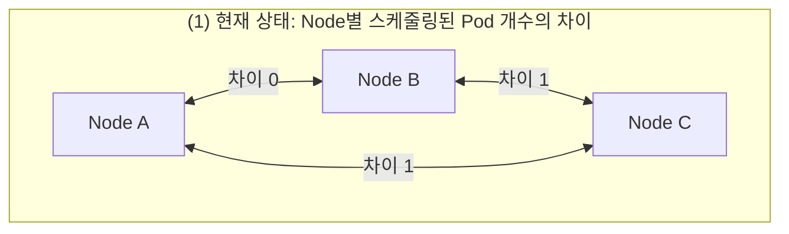
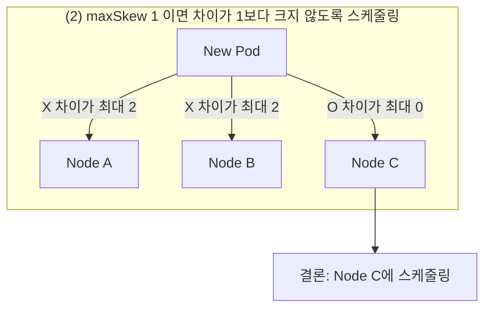

+++
date = 2025-12-19T21:00:00+09:00
title = "[그림과 실습으로 배우는 쿠버네티스 입문] 7장. 무상태 애플리케이션을 안전하게 만들기"
authors = ["Ji-Hoon Kim"]
tags = ["k8s", "kubernetes"]
categories = ["k8s", "kubernetes"]
series = ["k8s", "kubernetes"]
+++


## 7.1 애플리케이션의 헬스 체크

- 쿠버네티스에는 애플리케이션에 대한 헬스 체크를 수행하고, 정상적이지 않을 때 자동으로 Service 나 Pod 를 제어하는 기능이 있음
- 지금부터 설명할 세 종류의 Probe 를 용도에 맞게 잘 사용하면 매우 강력하게 작동함
    - Readiness probe
    - Liveness probe
    - Startup probe

### 7.1.1 Readiness probe

- 컨테이너가 실행 중인 상태와 트래픽을 받을 수 있는 상태는 같지 않을 수 있음
    - 초기화가 오래 걸리는 애플리케이션의 경우
- 이를 위해 컨테이너가 Ready 상태가 될 때까지의 시간과 엔드포인트를 제어하는 것이 Readiness probe
- `chapter-07/pod-readiness.yaml`

```yaml
apiVersion: v1
kind: Pod
metadata:
  labels:
    app: httpserver
  name: httpserver-readiness
spec:
  containers:
    - name: httpserver
      image: blux2/delayfailserver:1.1
      readinessProbe:
        httpGet:
          path: /healthz
          port: 8080
        initialDelaySeconds: 5
        periodSeconds: 5
```

- `/healthz` 라는 엔드포인트의 8080번 포트에 5초마다 헬스 체크 요청을 보내도록 설정하고 있음
- `initialDelaySeconds` 는 첫 번째 Probe 를 실행하기 전에 5초를 기다리는 것을 의미
- 요청 성공 기준
    - HTTP 응답이 200 이상 400 미만이면 Readiness Probe 가 성공한 것으로 간주
    - 그 외의 경우는 실패한 것으로 간주
- HTTP 요청 외에 명령어를 실행하거나 TCP 소켓을 사용하도록 Probe 를 설정할 수도 있음
    - 버전 1.24 부터는 gRPC 도 베타로 지원
    - 1.27 에 GA 된걸로 보임
        - https://github.com/kubernetes/kubernetes/blob/master/CHANGELOG/CHANGELOG-1.27.md?plain=1#L2430
- Readiness 라는 이름이지만, 컨테이너를 작동할 때만 아니라 Pod 의 라이프사이클 전체에 걸쳐 유효함
    - Readiness probe 에 실패한 Pod 는 Service 리소스의 연결 대상에서 제외되어 트래픽을 받지 않게 됨
- 따라서 적절히 모니터링하지 않으면 Pod 의 수가 줄어든 것을 알아차리지 못할 수도 있음

```bash
~/gitFolders/build-breaking-fixing-kubernetes master*
❯ k apply --filename chapter-07/pod-readiness.yaml
pod/httpserver-readiness created

~/gitFolders/build-breaking-fixing-kubernetes master*
❯ k get pod --watch --namespace default           
NAME                   READY   STATUS    RESTARTS   AGE
httpserver-readiness   0/1     Running   0          13s
httpserver-readiness   1/1     Running   0          13s
httpserver-readiness   0/1     Running   0          28s
^C%                                                                             
~/gitFolders/build-breaking-fixing-kubernetes master* 59s
❯ k logs httpserver-readiness --namespace default 
2025/12/11 20:11:05 Starting server...
2025/12/11 20:11:13 Health Check: OK
2025/12/11 20:11:18 Error: Service Unhealthy
2025/12/11 20:11:23 Error: Service Unhealthy
2025/12/11 20:11:28 Error: Service Unhealthy
2025/12/11 20:11:28 Error: Service Unhealthy
2025/12/11 20:11:33 Error: Service Unhealthy
2025/12/11 20:11:38 Error: Service Unhealthy
2025/12/11 20:11:43 Error: Service Unhealthy
2025/12/11 20:11:48 Error: Service Unhealthy
2025/12/11 20:11:53 Error: Service Unhealthy
2025/12/11 20:11:58 Error: Service Unhealthy
2025/12/11 20:12:03 Error: Service Unhealthy
2025/12/11 20:12:08 Error: Service Unhealthy
2025/12/11 20:12:13 Error: Service Unhealthy
2025/12/11 20:12:18 Error: Service Unhealthy
2025/12/11 20:12:23 Error: Service Unhealthy

~/gitFolders/build-breaking-fixing-kubernetes master*
❯ k delete --filename chapter-07/pod-readiness.yaml --namespace default       
pod "httpserver-readiness" deleted from default namespace
```

### 7.1.2 Liveness probe

- Probe 가 실패했을 때
    - Readiness probe 는 연결을 끊음
    - Liveness probe 는 Pod 를 재시작함
        - 이는 Pod 가 멈추었을 때 재시작으로 해결될 수 있는 경우에 유효
        - 하지만 재시작을 무한히 반복할 위험이 있으므로 신중하게 도입하는 것이 좋음
- `chapter-07/pod-liveness.yaml`

```yaml
apiVersion: v1
kind: Pod
metadata:
  labels:
    app: httpserver
  name: httpserver-liveness
spec:
  containers:
    - name: httpserver
      image: blux2/delayfailserver:1.1
      livenessProbe:
        httpGet:
          path: /healthz
          port: 8080
        initialDelaySeconds: 5
        periodSeconds: 5
```

- Liveness probe 와 Readiness probe 는 동시에 설정 가능
- 그러나 Liveness probe 는 Readiness probe 를 기다리지 않기 때문에, Readiness 를 먼저 실행하고 싶다면 `initialDelaySeconds`
  를 조정하거나, 뒤에서 설명할 Startup probe 를 사용해야 함
- 일반적으로는 다음과 같이 Readiness probe 를 먼저 실행하는 것을 권장함
- `chapter-07/probe-sample.txt`

```yaml
readinessProbe:
  httpGet:
    path: /health
    port: 8080
  initialDelaySeconds: 10
  periodSeconds: 5
livenessProbe:
  httpGet:
    path: /health
    port: 8080
  initialDelaySeconds: 30
  periodSeconds: 5
```

```bash
~/gitFolders/build-breaking-fixing-kubernetes master*
❯ k apply --filename chapter-07/pod-liveness.yaml --namespace default  
pod/httpserver-liveness created

~/gitFolders/build-breaking-fixing-kubernetes master* ⇡
❯ k get pod --watch --namespace default                              
NAME                  READY   STATUS    RESTARTS   AGE
httpserver-liveness   1/1     Running   0          5s
httpserver-liveness   1/1     Running   1 (0s ago)   25s
httpserver-liveness   1/1     Running   2 (1s ago)   51s
httpserver-liveness   1/1     Running   3 (1s ago)   76s
httpserver-liveness   1/1     Running   4 (1s ago)   101s
httpserver-liveness   0/1     CrashLoopBackOff   4 (0s ago)   2m5s
httpserver-liveness   1/1     Running            5 (52s ago)   2m57s
httpserver-liveness   0/1     CrashLoopBackOff   5 (1s ago)    3m21s
^C%                                                                             

```

- CrashLoopBackOff 가 발생하고 RESTARTS 횟수가 점점 늘어나는 것을 알 수 있음
- 이처럼 Liveness probe 에 실패하면 원인이 해결될 때까지 재시작을 반복함
    - 재시작으로 해결될 수 있는 경우라면 괜찮지만,
    - 애플리케이션을 수정해야 하는 버그인 경우에는 수정이 배포될 때까지 계속 재시작함
- 또한 Readiness probe 를 설정하지 않았거나, Readiness probe 와 Liveness probe 의 설정 내용이 다른 경우에는 주의가 필요함
- 이번처럼 STATUS 는 Running 이기 때문에, `k get pod` 명령어만으로는 Liveness probe 가 실패하고 있다는 것을 알아차리기 어려울 수 있음
- Liveness probe 는 신중하게 설정해야함
- Pod 를 describe 하면 Probe 가 실패하고 있는 것을 확인 가능
    - **RESTARTS 의 값이 이상하다고 느껴질 때는 확인해보자**

```bash
~/gitFolders/build-breaking-fixing-kubernetes master* ⇡ 3m 23s
❯ k describe pod httpserver-liveness --namespace default               
Name:             httpserver-liveness
Namespace:        default
Priority:         0
Service Account:  default
Node:             kind-control-plane/172.20.0.2
Start Time:       Fri, 12 Dec 2025 05:18:16 +0900
Labels:           app=httpserver
Annotations:      <none>
Status:           Running
IP:               10.244.0.6
IPs:
  IP:  10.244.0.6
Containers:
  httpserver:
    Container ID:   containerd://9ee9bc1b95e11ab96dcbf3b2b1dcee71a9f6a33d2be7b9c3667e8baa4ca96347
    Image:          blux2/delayfailserver:1.1
    Image ID:       docker.io/blux2/delayfailserver@sha256:84c46dd90117eda4f2545504e8ce9b2e595eef9fedb02aa2e0dcaa0c13cfeba0
    Port:           <none>
    Host Port:      <none>
    State:          Waiting
      Reason:       CrashLoopBackOff
    Last State:     Terminated
      Reason:       Error
      Exit Code:    2
      Started:      Fri, 12 Dec 2025 05:21:12 +0900
      Finished:     Fri, 12 Dec 2025 05:21:36 +0900
    Ready:          False
    Restart Count:  5
    Liveness:       http-get http://:8080/healthz delay=5s timeout=1s period=5s #success=1 #failure=3
    Environment:    <none>
    Mounts:
      /var/run/secrets/kubernetes.io/serviceaccount from kube-api-access-z7srg (ro)
Conditions:
  Type                        Status
  PodReadyToStartContainers   True 
  Initialized                 True 
  Ready                       False 
  ContainersReady             False 
  PodScheduled                True 
Volumes:
  kube-api-access-z7srg:
    Type:                    Projected (a volume that contains injected data from multiple sources)
    TokenExpirationSeconds:  3607
    ConfigMapName:           kube-root-ca.crt
    Optional:                false
    DownwardAPI:             true
QoS Class:                   BestEffort
Node-Selectors:              <none>
Tolerations:                 node.kubernetes.io/not-ready:NoExecute op=Exists for 300s
                             node.kubernetes.io/unreachable:NoExecute op=Exists for 300s
Events:
  Type     Reason     Age                   From               Message
  ----     ------     ----                  ----               -------
  Normal   Scheduled  3m50s                 default-scheduler  Successfully assigned default/httpserver-liveness to kind-control-plane
  Normal   Pulled     54s (x6 over 3m50s)   kubelet            Container image "blux2/delayfailserver:1.1" already present on machine
  Normal   Created    54s (x6 over 3m50s)   kubelet            Created container: httpserver
  Normal   Started    54s (x6 over 3m50s)   kubelet            Started container httpserver
  Warning  Unhealthy  30s (x18 over 3m35s)  kubelet            Liveness probe failed: HTTP probe failed with statuscode: 503
  Normal   Killing    30s (x6 over 3m25s)   kubelet            Container httpserver failed liveness probe, will be restarted
  Warning  BackOff    29s (x7 over 105s)    kubelet            Back-off restarting failed container httpserver in pod httpserver-liveness_default(792c30d7-d78d-4475-8048-f67615561f10)

~/gitFolders/build-breaking-fixing-kubernetes master* ⇡
❯ k delete --filename chapter-07/pod-liveness.yaml --namespace default 
pod "httpserver-liveness" deleted from default namespace
```

### 7.1.3 Startup probe

- Pod 의 초기 작동 시에만 적용되는 Probe
- 보통 작동이 느린 애플리케이션에 사용
- 1.18부터 도입된 기능으로, 그 이전에는 Readiness probe 나 Liveness probe 의 initialDelaySeconds 를 사용함
- 매니페스트는 Readiness probe 나 Liveness probe 와 거의 동일

```yaml
startupProbe:
  httpGet:
    path: /healthz
    port: liveness-port
  failureThreshold: 30
  periodSeconds: 10
```

- 이 매니페스트는 최대 30초 * 10회 = 300초 동안 컨테이너의 작동을 기다리도록 설정함

### 7.1.4 [망가뜨리기] State는 Running이지만…

```bash
~/gitFolders/build-breaking-fixing-kubernetes master* ⇡
❯ k apply --filename chapter-07/deployment-destruction.yaml --namespace default
deployment.apps/hello-server created

~/gitFolders/build-breaking-fixing-kubernetes master* ⇡
❯ k get pod --namespace default                                                
NAME                            READY   STATUS              RESTARTS   AGE
hello-server-54577b6988-mmj4f   0/2     ContainerCreating   0          7s
hello-server-54577b6988-mqsw8   0/2     ContainerCreating   0          7s
hello-server-54577b6988-w6bsk   0/2     ContainerCreating   0          7s

~/gitFolders/build-breaking-fixing-kubernetes master* ⇡
❯ k get pod --namespace default
NAME                            READY   STATUS              RESTARTS   AGE
hello-server-54577b6988-mmj4f   0/2     ContainerCreating   0          15s
hello-server-54577b6988-mqsw8   1/2     Running             0          15s
hello-server-54577b6988-w6bsk   1/2     Running             0          15s

~/gitFolders/build-breaking-fixing-kubernetes master* ⇡
❯ k get pod --namespace default
NAME                            READY   STATUS    RESTARTS   AGE
hello-server-54577b6988-mmj4f   1/2     Running   0          20s
hello-server-54577b6988-mqsw8   1/2     Running   0          20s
hello-server-54577b6988-w6bsk   1/2     Running   0          20s
```

- STATUS 가 Running 이지만, READY 가 1/2 인 상태
    - Pod 내 두 컨테이너 중 하나는 READY 가 아니라는 의미
- **Pod 내 컨테이너가 모두 READY 인지 주의깊게 보자**
- 잠시 뒤 한 번 더 조회

```bash
~/gitFolders/build-breaking-fixing-kubernetes master* ⇡
❯ k get pod --namespace default
NAME                            READY   STATUS    RESTARTS   AGE
hello-server-54577b6988-mmj4f   1/2     Running   0          4m21s
hello-server-54577b6988-mqsw8   1/2     Running   0          4m21s
hello-server-54577b6988-w6bsk   1/2     Running   0          4m21s
```

- 이건 너무 오래 걸리고 있다. Pod 의 상세 정보를 살펴보자.
- 임의의 Pod 에 대해

```bash
~/gitFolders/build-breaking-fixing-kubernetes master* ⇡
❯ k describe pod hello-server-54577b6988-w6bsk --namespace default 
Name:             hello-server-54577b6988-w6bsk
Namespace:        default
Priority:         0
Service Account:  default
Node:             kind-control-plane/172.20.0.2
Start Time:       Fri, 12 Dec 2025 05:26:55 +0900
Labels:           app=hello-server
                  pod-template-hash=54577b6988
Annotations:      <none>
Status:           Running
IP:               10.244.0.7
IPs:
  IP:           10.244.0.7
Controlled By:  ReplicaSet/hello-server-54577b6988
Containers:
  hello-server:
    Container ID:   containerd://1a8eb613660f60804d619b5b3f3d8dba9008bac72b00520682276df45679c6a5
    Image:          blux2/hello-server:1.6
    Image ID:       docker.io/blux2/hello-server@sha256:035c114efa5478a148e5aedd4e2209bcc46a6d9eff3ef24e9dba9fa147a6568d
    Port:           8080/TCP
    Host Port:      0/TCP
    State:          Running
      Started:      Fri, 12 Dec 2025 05:27:00 +0900
    Ready:          False
    Restart Count:  0
    Liveness:       http-get http://:8080/health delay=10s timeout=1s period=5s #success=1 #failure=3
    Readiness:      http-get http://:8081/health delay=5s timeout=1s period=5s #success=1 #failure=3
    Environment:    <none>
    Mounts:
      /var/run/secrets/kubernetes.io/serviceaccount from kube-api-access-6v55t (ro)
  busybox:
    Container ID:  containerd://9e55e526f62a8d03870e988ee4a190b2d62674f8c073ffaff39192fba01c6fc4
    Image:         busybox:1.36.1
    Image ID:      docker.io/library/busybox@sha256:6b219909078e3fc93b81f83cb438bd7a5457984a01a478c76fe9777a8c67c39e
    Port:          <none>
    Host Port:     <none>
    Command:
      sleep
      9999
    State:          Running
      Started:      Fri, 12 Dec 2025 05:27:08 +0900
    Ready:          True
    Restart Count:  0
    Environment:    <none>
    Mounts:
      /var/run/secrets/kubernetes.io/serviceaccount from kube-api-access-6v55t (ro)
Conditions:
  Type                        Status
  PodReadyToStartContainers   True 
  Initialized                 True 
  Ready                       False 
  ContainersReady             False 
  PodScheduled                True 
Volumes:
  kube-api-access-6v55t:
    Type:                    Projected (a volume that contains injected data from multiple sources)
    TokenExpirationSeconds:  3607
    ConfigMapName:           kube-root-ca.crt
    Optional:                false
    DownwardAPI:             true
QoS Class:                   BestEffort
Node-Selectors:              <none>
Tolerations:                 node.kubernetes.io/not-ready:NoExecute op=Exists for 300s
                             node.kubernetes.io/unreachable:NoExecute op=Exists for 300s
Events:
  Type     Reason     Age                     From               Message
  ----     ------     ----                    ----               -------
  Normal   Scheduled  5m1s                    default-scheduler  Successfully assigned default/hello-server-54577b6988-w6bsk to kind-control-plane
  Normal   Pulling    5m1s                    kubelet            Pulling image "blux2/hello-server:1.6"
  Normal   Pulled     4m56s                   kubelet            Successfully pulled image "blux2/hello-server:1.6" in 4.749s (4.749s including waiting). Image size: 3650825 bytes.
  Normal   Created    4m56s                   kubelet            Created container: hello-server
  Normal   Started    4m56s                   kubelet            Started container hello-server
  Normal   Pulling    4m56s                   kubelet            Pulling image "busybox:1.36.1"
  Normal   Pulled     4m48s                   kubelet            Successfully pulled image "busybox:1.36.1" in 4.843s (7.665s including waiting). Image size: 1909538 bytes.
  Normal   Created    4m48s                   kubelet            Created container: busybox
  Normal   Started    4m48s                   kubelet            Started container busybox
  Warning  Unhealthy  2m57s (x25 over 4m47s)  kubelet            Readiness probe failed: Get "http://10.244.0.7:8081/health": dial tcp 10.244.0.7:8081: connect: connection refused

```

- 분석 내용
    - Readiness probe 가 실패하고 있다고 출력되고 있음
    - hello-server, busybox 컨테이너의 상태가 각각 다름
        - hello-server - Status: Running, Ready: False
        - busybox - Status: Running, Ready: True
    - 실패한 컨테이너가 hello-server 라는 것을 알 수 있다.
- 아래는 Readiness probe 의 설정 내용
    - `chapter-07/deployment-destruction.yaml`

```yaml
apiVersion: apps/v1
kind: Deployment
metadata:
  name: hello-server
  labels:
    app: hello-server
spec:
  replicas: 3
  selector:
    matchLabels:
      app: hello-server
  template:
    metadata:
      labels:
        app: hello-server
    spec:
      containers:
        - name: hello-server
          image: blux2/hello-server:1.6
          ports:
            - containerPort: 8080 # <----------------- 컨테이너 포트
          readinessProbe:
            httpGet:
              path: /health
              port: 8081 # <------------------------ Readiness probe 의 포트
            initialDelaySeconds: 5
            periodSeconds: 5
          livenessProbe:
            httpGet:
              path: /health
              port: 8080 # <------------------------ Liveness probe 의 포트
            initialDelaySeconds: 10
            periodSeconds: 5
        - name: busybox
          image: busybox:1.36.1
          command:
            - sleep
            - "9999"
```

- 컨테이너 포트와 Readiness probe 의 포트는 다를 수 있음
- 그런데 Liveness probe 의 포트와 컨테이너의 포트는 동일한데 Readiness probe 의 포트만 다른 것이 수상함
- 로그를 확인해보자

```bash
~/gitFolders/build-breaking-fixing-kubernetes master* ⇡
❯ k logs hello-server-54577b6988-w6bsk --namespace default 
Defaulted container "hello-server" out of: hello-server, busybox
2025/12/11 20:27:00 Starting server on port 8080
2025/12/11 20:27:10 Health Status OK
2025/12/11 20:27:15 Health Status OK
2025/12/11 20:27:20 Health Status OK
# ...
```

- 로그를 보면 헬스 체크가 정기적으로 실행되고 있음을 확인
    - 이는 Liveness probe 설정에 따른 것
    - 따라서 Readiness probe 의 포트 번호가 잘못되었을 가능성이 높아 보임
- 구현을 확인해보자.
    - `hello-server/main.go`

```go
package main

import (
    "fmt"
    "github.com/prometheus/client_golang/prometheus/promhttp"
    "log"
    "net/http"
    "os"
)

func main() {
    port := os.Getenv("PORT")
    if port == "" {
        port = "8080" // <------------- 환경 변수 PORT 가 없으면 8080 을 사용하도록 설정
    }

    http.HandleFunc("/", func(w http.ResponseWriter, r *http.Request) {
        if r.URL.Path != "/" {
            http.NotFound(w, r)
            return
        }
        fmt.Fprintf(w, "Hello, world! Let's learn Kubernetes!")
    })

    http.HandleFunc("/healthz", func(w http.ResponseWriter, r *http.Request) {
        if r.URL.Path != "/healthz" {
            http.NotFound(w, r)
            return
        }
        w.WriteHeader(http.StatusOK)
        fmt.Fprintf(w, "OK")
        log.Printf("Health Status OK")
    })

    http.Handle("/metrics", promhttp.Handler())

    log.Printf("Starting server on port %s\n", port)
    err := http.ListenAndServe(":"+port, nil)
    if err != nil {
        log.Fatal(err)
    }

}
```

- 즉, 현재 매니페스트에서 환경 변수 PORT 를 지정하지 않음 → 서버의 포트는 8080 → Liveness probe 는 8080 을 사용하고 있어서 정상적으로 체크됨
- 따라서 Readiness probe 의 포트번호 8081 가 잘못된 것으로 판단됨

```yaml
~/gitFolders/build-breaking-fixing-kubernetes master* ⇡
❯ k edit deployment --namespace default
deployment.apps/hello-server edited

~/gitFolders/build-breaking-fixing-kubernetes master* ⇡ 20s
❯ k get pod --namespace default
NAME                            READY   STATUS        RESTARTS   AGE
hello-server-54577b6988-mmj4f   1/2     Running       0          8m25s
hello-server-54577b6988-mqsw8   1/2     Running       0          8m25s
hello-server-54577b6988-w6bsk   1/2     Terminating   0          8m25s
hello-server-5fd8bd6855-txf6k   1/2     Running       0          5s
hello-server-5fd8bd6855-zjl54   2/2     Running       0          12s

~/gitFolders/build-breaking-fixing-kubernetes master* ⇡
❯ k get pod --namespace default
NAME                            READY   STATUS    RESTARTS   AGE
hello-server-5fd8bd6855-rrsh5   2/2     Running   0          55s
hello-server-5fd8bd6855-txf6k   2/2     Running   0          62s
hello-server-5fd8bd6855-zjl54   2/2     Running   0          69s

~/gitFolders/build-breaking-fixing-kubernetes master* ⇡
❯ k delete --filename chapter-07/deployment-destruction.yaml --namespace default
deployment.apps "hello-server" deleted from default namespace

```

## 7.2 애플리케이션에 적절한 리소스 지정하기

- 안정적인 운영을 위해서는 애플리케이션에 적절한 리소스를 지정하는 것이 중요함
- **특히 쿠버네티스에서는 리소스 지정에 따라 스케줄링이 달라지기 때문에 반드시 명시적으로 지정해야 함**
- 기본적으로 지정할 수 있는 리소스
    - CPU
    - 메모리
    - Ephemeral Storage
- `chapter-07/deployment-resource-handson.yaml`

```yaml
apiVersion: apps/v1
kind: Deployment
metadata:
  name: hello-server
  labels:
    app: hello-server
spec:
  replicas: 3
  selector:
    matchLabels:
      app: hello-server
  template:
    metadata:
      labels:
        app: hello-server
    spec:
      containers:
        - name: hello-server
          image: blux2/hello-server:1.6
          ports:
            - containerPort: 8080
          resources:
            requests:
              memory: "5Gi"
              cpu: "10m"
            limits:
              memory: "5Gi"
              cpu: "10m"
          readinessProbe:
            httpGet:
              path: /health
              port: 8080
            initialDelaySeconds: 5
            periodSeconds: 5
          livenessProbe:
            httpGet:
              path: /health
              port: 8080
            initialDelaySeconds: 10
            periodSeconds: 5
```

### 7.2.1 Resource requests로 컨테이너의 리소스 사용량 요구하기

- 확보하고 싶은 리소스의 최소 사용량을 지정함
- 쿠버네티스의 스케줄러는 이 값을 보고 스케줄링할 노드를 결정함
- requests 로 지정한 값을 확보할 수 있는 노드를 찾아 스케줄링하는데 그러한 노드를 찾을 수 없으면 Pod 는 스케줄링되지 않음
- 컨테이너별로 CPU 와 메모리의 requests 를 지정할 수 있음

```yaml
resources:
  requests:
    memory: "64Mi"
    cpu: "10m"
```

### 7.2.2 Resource limits로 컨테이너의 리소스 사용량 제어하기

- 컨테이너가 사용할 수 있는 리소스 사용량의 상한을 지정함
- 컨테이너는 이 limits 를 초과하여 리소스를 사용할 수 없음
- 메모리가 상한값을 초과하는 경우
    - Out Of Memory (OOM) 로 Pod 가 종료됨
- CPU 가 상한값을 초과한 경우
    - Pod 가 바로 종료되지 않음
    - 대신 스로틀링 (Throttling) 이 발생하여 애플리케이션의 동작이 느려짐

```yaml
resources:
  limits:
    memory: "64Mi"
    cpu: "10m"
```

### 7.2.3 리소스의 단위

- 메모리
    - 단위를 지정하지 않으면 1 = 1바이트
    - 기본적인 단위: K(kilo), M(mega) 등
    - 1K = 1킬로바이트 != 1Ki
    - 1M = 1메가바이트 != 1Mi
    - 일반적으로 K = 10^3, Ki = 2^10
    - https://kubernetes.io/docs/reference/kubernetes-api/common-definitions/quantity/
- CPU
    - 단위를 지정하지 않으면 1 = CPU 1코어
    - 1m = 0.001 코어 = 10^-3 코어
    - 일반적으로 정수를 사용하여 코어나 밀리코어를 지정함

### 7.2.4 Pod의 Quality of Service(QoS) 클래스

- 리소스를 설정할 때는 쿠버네티스의 QoS 기능에 대해 알아 두는 것이 좋음
- OOM Killer 란 노드의 메모리가 전부 소진되었을 때 해당 노드에 있는 모든 컨테이너가 멈춰 버리는 것을 방지하기 위한 프로그램
- OOM Killer 는 QoS 에 따라 Pod 의 우선순위를 정하고 우선순위가 낮은 Pod 부터 OOM Kill 을 수행함
- QoS 클래스의 종류
    - Guaranteed, Burstable, BestEffort
- BestEffort, Burstable, Guaranteed 순서대로 OOM Kill 이 수행됨
- Guaranteed
    - Pod 의 모든 컨테이너에 대해 리소스의 requests 와 limits 가 지정되어 있고, 메모리와 CPU 전부 requests = limit 인 경우
- Burstable
    - Pod 의 컨테이너 중 적어도 하나는 메모리 또는 CPU 의 requests 와 limits 가 지정되어 있는 경우
- BestEffort
    - Guaranteed, Burstable 이 아닌 것을 의미하여 리소스에 아무것도 지정되어 있지 않은 경우

```bash
~/gitFolders/build-breaking-fixing-kubernetes master* ⇡
❯ k apply --filename chapter-07/pod-resource-handson.yaml --namespace default 
pod/hello-server created

~/gitFolders/build-breaking-fixing-kubernetes master* ⇡
❯ k get pod --namespace default                                              
NAME           READY   STATUS              RESTARTS   AGE
hello-server   0/1     ContainerCreating   0          18s 

~/gitFolders/build-breaking-fixing-kubernetes master* ⇡
❯ k get pod --namespace default
NAME           READY   STATUS    RESTARTS   AGE
hello-server   1/1     Running   0          38s

~/gitFolders/build-breaking-fixing-kubernetes master* ⇡
❯ k get pod hello-server --output jsonpath='{.status.qosClass}' --namespace default
Guaranteed%                                                                     

~/gitFolders/build-breaking-fixing-kubernetes master* ⇡
❯ k delete --filename chapter-07/pod-resource-handson.yaml --namespace default 
pod "hello-server" deleted from default namespace

```

### 7.2.5 [망가뜨리기] 또 Pod가 고장났다

- **이번 실습은 쿠버네티스 노드의 메모리가 8GiB 라고 가정**
    - 노드의 메모리가 16GiB 이상인 경우, 문제가 재현되지 않을 수 있음
- **쿠버네티스 노드 메모리 조회 방법**

```bash
~/gitFolders/build-breaking-fixing-kubernetes master* ⇡ 16s
❯ k describe node --namespace default         
Name:               kind-control-plane
Roles:              control-plane
Labels:             beta.kubernetes.io/arch=arm64
                    beta.kubernetes.io/os=linux
                    kubernetes.io/arch=arm64
                    kubernetes.io/hostname=kind-control-plane
                    kubernetes.io/os=linux
                    node-role.kubernetes.io/control-plane=
Annotations:        node.alpha.kubernetes.io/ttl: 0
                    volumes.kubernetes.io/controller-managed-attach-detach: true
CreationTimestamp:  Fri, 12 Dec 2025 06:17:42 +0900
Taints:             <none>
Unschedulable:      false
Lease:
  HolderIdentity:  kind-control-plane
  AcquireTime:     <unset>
  RenewTime:       Fri, 12 Dec 2025 06:19:07 +0900
Conditions:
  Type             Status  LastHeartbeatTime                 LastTransitionTime                Reason                       Message
  ----             ------  -----------------                 ------------------                ------                       -------
  MemoryPressure   False   Fri, 12 Dec 2025 06:18:25 +0900   Fri, 12 Dec 2025 06:17:39 +0900   KubeletHasSufficientMemory   kubelet has sufficient memory available
  DiskPressure     False   Fri, 12 Dec 2025 06:18:25 +0900   Fri, 12 Dec 2025 06:17:39 +0900   KubeletHasNoDiskPressure     kubelet has no disk pressure
  PIDPressure      False   Fri, 12 Dec 2025 06:18:25 +0900   Fri, 12 Dec 2025 06:17:39 +0900   KubeletHasSufficientPID      kubelet has sufficient PID available
  Ready            True    Fri, 12 Dec 2025 06:18:25 +0900   Fri, 12 Dec 2025 06:18:04 +0900   KubeletReady                 kubelet is posting ready status
Addresses:
  InternalIP:  172.20.0.2
  Hostname:    kind-control-plane
Capacity:
  cpu:                2
  ephemeral-storage:  22268480Ki
  hugepages-1Gi:      0
  hugepages-2Mi:      0
  hugepages-32Mi:     0
  hugepages-64Ki:     0
  memory:             8113864Ki
  pods:               110
Allocatable:
  cpu:                2
  ephemeral-storage:  22268480Ki
  hugepages-1Gi:      0
  hugepages-2Mi:      0
  hugepages-32Mi:     0
  hugepages-64Ki:     0
  memory:             8113864Ki
  pods:               110
System Info:
  Machine ID:                 226c3bc6cc9c40d09051f97a535d8602
  System UUID:                b724560d-a167-4eef-b257-3df8ad207aa4
  Boot ID:                    dc3726cf-bad7-454c-99be-cea850fc4b5b
  Kernel Version:             6.8.0-50-generic
  OS Image:                   Debian GNU/Linux 12 (bookworm)
  Operating System:           linux
  Architecture:               arm64
  Container Runtime Version:  containerd://2.1.3
  Kubelet Version:            v1.34.0
  Kube-Proxy Version:         
PodCIDR:                      10.244.0.0/24
PodCIDRs:                     10.244.0.0/24
ProviderID:                   kind://docker/kind/kind-control-plane
Non-terminated Pods:          (9 in total)
  Namespace                   Name                                          CPU Requests  CPU Limits  Memory Requests  Memory Limits  Age
  ---------                   ----                                          ------------  ----------  ---------------  -------------  ---
  kube-system                 coredns-66bc5c9577-5xz7n                      100m (5%)     0 (0%)      70Mi (0%)        170Mi (2%)     80s
  kube-system                 coredns-66bc5c9577-888sn                      100m (5%)     0 (0%)      70Mi (0%)        170Mi (2%)     80s
  kube-system                 etcd-kind-control-plane                       100m (5%)     0 (0%)      100Mi (1%)       0 (0%)         87s
  kube-system                 kindnet-qsl4f                                 100m (5%)     100m (5%)   50Mi (0%)        50Mi (0%)      80s
  kube-system                 kube-apiserver-kind-control-plane             250m (12%)    0 (0%)      0 (0%)           0 (0%)         87s
  kube-system                 kube-controller-manager-kind-control-plane    200m (10%)    0 (0%)      0 (0%)           0 (0%)         88s
  kube-system                 kube-proxy-jzpd4                              0 (0%)        0 (0%)      0 (0%)           0 (0%)         80s
  kube-system                 kube-scheduler-kind-control-plane             100m (5%)     0 (0%)      0 (0%)           0 (0%)         87s
  local-path-storage          local-path-provisioner-7b8c8ddbd6-rccsx       0 (0%)        0 (0%)      0 (0%)           0 (0%)         80s
Allocated resources:
  (Total limits may be over 100 percent, i.e., overcommitted.)
  Resource           Requests    Limits
  --------           --------    ------
  cpu                950m (47%)  100m (5%)
  memory             290Mi (3%)  390Mi (4%)
  ephemeral-storage  0 (0%)      0 (0%)
  hugepages-1Gi      0 (0%)      0 (0%)
  hugepages-2Mi      0 (0%)      0 (0%)
  hugepages-32Mi     0 (0%)      0 (0%)
  hugepages-64Ki     0 (0%)      0 (0%)
Events:
  Type    Reason                   Age                From             Message
  ----    ------                   ----               ----             -------
  Normal  Starting                 78s                kube-proxy       
  Normal  Starting                 95s                kubelet          Starting kubelet.
  Normal  NodeHasSufficientMemory  95s (x8 over 95s)  kubelet          Node kind-control-plane status is now: NodeHasSufficientMemory
  Normal  NodeHasNoDiskPressure    95s (x8 over 95s)  kubelet          Node kind-control-plane status is now: NodeHasNoDiskPressure
  Normal  NodeHasSufficientPID     95s (x7 over 95s)  kubelet          Node kind-control-plane status is now: NodeHasSufficientPID
  Normal  NodeAllocatableEnforced  95s                kubelet          Updated Node Allocatable limit across pods
  Normal  Starting                 87s                kubelet          Starting kubelet.
  Normal  NodeAllocatableEnforced  87s                kubelet          Updated Node Allocatable limit across pods
  Normal  NodeHasSufficientMemory  87s                kubelet          Node kind-control-plane status is now: NodeHasSufficientMemory
  Normal  NodeHasNoDiskPressure    87s                kubelet          Node kind-control-plane status is now: NodeHasNoDiskPressure
  Normal  NodeHasSufficientPID     87s                kubelet          Node kind-control-plane status is now: NodeHasSufficientPID
  Normal  RegisteredNode           81s                node-controller  Node kind-control-plane event: Registered Node kind-control-plane in Controller
  Normal  NodeReady                68s                kubelet          Node kind-control-plane status is now: NodeReady

```

```bash
~/gitFolders/build-breaking-fixing-kubernetes master ⇡
❯ k apply --filename chapter-07/deployment-resource-handson.yaml --namespace default 
deployment.apps/hello-server created

```

- 아무리 기다려봐도 Pod 가 전부 작동하지 않을 것. Pod 의 상태를 확인해보자.

```bash
~/gitFolders/build-breaking-fixing-kubernetes master* ⇡
❯ k get pod --namespace default
NAME                            READY   STATUS    RESTARTS   AGE
hello-server-554cb47c88-dccps   0/1     Pending   0          51s
hello-server-554cb47c88-qn5cc   0/1     Pending   0          51s
hello-server-554cb47c88-shng6   1/1     Running   0          51s

```

- Pending 상태인 Pod 의 이름을 하나 복사하여 상세 정보를 확인해보자.

```bash
~/gitFolders/build-breaking-fixing-kubernetes master* ⇡
❯ k describe pod hello-server-554cb47c88-dccps --namespace default         
Name:             hello-server-554cb47c88-dccps
Namespace:        default
Priority:         0
Service Account:  default
Node:             <none>
Labels:           app=hello-server
                  pod-template-hash=554cb47c88
Annotations:      <none>
Status:           Pending
IP:               
IPs:              <none>
Controlled By:    ReplicaSet/hello-server-554cb47c88
Containers:
  hello-server:
    Image:      blux2/hello-server:1.6
    Port:       8080/TCP
    Host Port:  0/TCP
    Limits:
      cpu:     10m
      memory:  5Gi
    Requests:
      cpu:        10m
      memory:     5Gi
    Liveness:     http-get http://:8080/health delay=10s timeout=1s period=5s #success=1 #failure=3
    Readiness:    http-get http://:8080/health delay=5s timeout=1s period=5s #success=1 #failure=3
    Environment:  <none>
    Mounts:
      /var/run/secrets/kubernetes.io/serviceaccount from kube-api-access-fjk7c (ro)
Conditions:
  Type           Status
  PodScheduled   False 
Volumes:
  kube-api-access-fjk7c:
    Type:                    Projected (a volume that contains injected data from multiple sources)
    TokenExpirationSeconds:  3607
    ConfigMapName:           kube-root-ca.crt
    Optional:                false
    DownwardAPI:             true
QoS Class:                   Guaranteed
Node-Selectors:              <none>
Tolerations:                 node.kubernetes.io/not-ready:NoExecute op=Exists for 300s
                             node.kubernetes.io/unreachable:NoExecute op=Exists for 300s
Events:
  Type     Reason            Age   From               Message
  ----     ------            ----  ----               -------
  Warning  FailedScheduling  95s   default-scheduler  0/1 nodes are available: 1 Insufficient memory. no new claims to deallocate, preemption: 0/1 nodes are available: 1 No preemption victims found for incoming pod.

```

- FailedScheduling 이라고 출력됨
    - 요구한 메모리 양을 할당할 수 있는 노드가 없다는 메시지
- 노드 설정 확인

```bash
~/gitFolders/build-breaking-fixing-kubernetes master* ⇡
❯ k describe pod hello-server-554cb47c88-dccps --namespace default         
Name:             hello-server-554cb47c88-dccps
Namespace:        default
Priority:         0
Service Account:  default
Node:             <none>
Labels:           app=hello-server
                  pod-template-hash=554cb47c88
Annotations:      <none>
Status:           Pending
IP:               
IPs:              <none>
Controlled By:    ReplicaSet/hello-server-554cb47c88
Containers:
  hello-server:
    Image:      blux2/hello-server:1.6
    Port:       8080/TCP
    Host Port:  0/TCP
    Limits:
      cpu:     10m
      memory:  5Gi
    Requests:
      cpu:        10m
      memory:     5Gi
    Liveness:     http-get http://:8080/health delay=10s timeout=1s period=5s #success=1 #failure=3
    Readiness:    http-get http://:8080/health delay=5s timeout=1s period=5s #success=1 #failure=3
    Environment:  <none>
    Mounts:
      /var/run/secrets/kubernetes.io/serviceaccount from kube-api-access-fjk7c (ro)
Conditions:
  Type           Status
  PodScheduled   False 
Volumes:
  kube-api-access-fjk7c:
    Type:                    Projected (a volume that contains injected data from multiple sources)
    TokenExpirationSeconds:  3607
    ConfigMapName:           kube-root-ca.crt
    Optional:                false
    DownwardAPI:             true
QoS Class:                   Guaranteed
Node-Selectors:              <none>
Tolerations:                 node.kubernetes.io/not-ready:NoExecute op=Exists for 300s
                             node.kubernetes.io/unreachable:NoExecute op=Exists for 300s
Events:
  Type     Reason            Age   From               Message
  ----     ------            ----  ----               -------
  Warning  FailedScheduling  95s   default-scheduler  0/1 nodes are available: 1 Insufficient memory. no new claims to deallocate, preemption: 0/1 nodes are available: 1 No preemption victims found for incoming pod.

~/gitFolders/build-breaking-fixing-kubernetes master* ⇡
❯ k describe node --namespace default                             
Name:               kind-control-plane
Roles:              control-plane
Labels:             beta.kubernetes.io/arch=arm64
                    beta.kubernetes.io/os=linux
                    kubernetes.io/arch=arm64
                    kubernetes.io/hostname=kind-control-plane
                    kubernetes.io/os=linux
                    node-role.kubernetes.io/control-plane=
Annotations:        node.alpha.kubernetes.io/ttl: 0
                    volumes.kubernetes.io/controller-managed-attach-detach: true
CreationTimestamp:  Fri, 12 Dec 2025 06:17:42 +0900
Taints:             <none>
Unschedulable:      false
Lease:
  HolderIdentity:  kind-control-plane
  AcquireTime:     <unset>
  RenewTime:       Fri, 12 Dec 2025 06:21:30 +0900
Conditions:
  Type             Status  LastHeartbeatTime                 LastTransitionTime                Reason                       Message
  ----             ------  -----------------                 ------------------                ------                       -------
  MemoryPressure   False   Fri, 12 Dec 2025 06:21:29 +0900   Fri, 12 Dec 2025 06:17:39 +0900   KubeletHasSufficientMemory   kubelet has sufficient memory available
  DiskPressure     False   Fri, 12 Dec 2025 06:21:29 +0900   Fri, 12 Dec 2025 06:17:39 +0900   KubeletHasNoDiskPressure     kubelet has no disk pressure
  PIDPressure      False   Fri, 12 Dec 2025 06:21:29 +0900   Fri, 12 Dec 2025 06:17:39 +0900   KubeletHasSufficientPID      kubelet has sufficient PID available
  Ready            True    Fri, 12 Dec 2025 06:21:29 +0900   Fri, 12 Dec 2025 06:18:04 +0900   KubeletReady                 kubelet is posting ready status
Addresses:
  InternalIP:  172.20.0.2
  Hostname:    kind-control-plane
Capacity:
  cpu:                2
  ephemeral-storage:  22268480Ki
  hugepages-1Gi:      0
  hugepages-2Mi:      0
  hugepages-32Mi:     0
  hugepages-64Ki:     0
  memory:             8113864Ki
  pods:               110
Allocatable:
  cpu:                2
  ephemeral-storage:  22268480Ki
  hugepages-1Gi:      0
  hugepages-2Mi:      0
  hugepages-32Mi:     0
  hugepages-64Ki:     0
  memory:             8113864Ki
  pods:               110
System Info:
  Machine ID:                 226c3bc6cc9c40d09051f97a535d8602
  System UUID:                b724560d-a167-4eef-b257-3df8ad207aa4
  Boot ID:                    dc3726cf-bad7-454c-99be-cea850fc4b5b
  Kernel Version:             6.8.0-50-generic
  OS Image:                   Debian GNU/Linux 12 (bookworm)
  Operating System:           linux
  Architecture:               arm64
  Container Runtime Version:  containerd://2.1.3
  Kubelet Version:            v1.34.0
  Kube-Proxy Version:         
PodCIDR:                      10.244.0.0/24
PodCIDRs:                     10.244.0.0/24
ProviderID:                   kind://docker/kind/kind-control-plane
Non-terminated Pods:          (10 in total)
  Namespace                   Name                                          CPU Requests  CPU Limits  Memory Requests  Memory Limits  Age
  ---------                   ----                                          ------------  ----------  ---------------  -------------  ---
  default                     hello-server-554cb47c88-shng6                 10m (0%)      10m (0%)    5Gi (64%)        5Gi (64%)      2m5s
  kube-system                 coredns-66bc5c9577-5xz7n                      100m (5%)     0 (0%)      70Mi (0%)        170Mi (2%)     3m45s
  kube-system                 coredns-66bc5c9577-888sn                      100m (5%)     0 (0%)      70Mi (0%)        170Mi (2%)     3m45s
  kube-system                 etcd-kind-control-plane                       100m (5%)     0 (0%)      100Mi (1%)       0 (0%)         3m52s
  kube-system                 kindnet-qsl4f                                 100m (5%)     100m (5%)   50Mi (0%)        50Mi (0%)      3m45s
  kube-system                 kube-apiserver-kind-control-plane             250m (12%)    0 (0%)      0 (0%)           0 (0%)         3m52s
  kube-system                 kube-controller-manager-kind-control-plane    200m (10%)    0 (0%)      0 (0%)           0 (0%)         3m53s
  kube-system                 kube-proxy-jzpd4                              0 (0%)        0 (0%)      0 (0%)           0 (0%)         3m45s
  kube-system                 kube-scheduler-kind-control-plane             100m (5%)     0 (0%)      0 (0%)           0 (0%)         3m52s
  local-path-storage          local-path-provisioner-7b8c8ddbd6-rccsx       0 (0%)        0 (0%)      0 (0%)           0 (0%)         3m45s
Allocated resources:
  (Total limits may be over 100 percent, i.e., overcommitted.)
  Resource           Requests      Limits
  --------           --------      ------
  cpu                960m (48%)    110m (5%)
  memory             5410Mi (68%)  5510Mi (69%)
  ephemeral-storage  0 (0%)        0 (0%)
  hugepages-1Gi      0 (0%)        0 (0%)
  hugepages-2Mi      0 (0%)        0 (0%)
  hugepages-32Mi     0 (0%)        0 (0%)
  hugepages-64Ki     0 (0%)        0 (0%)
Events:
  Type    Reason                   Age              From             Message
  ----    ------                   ----             ----             -------
  Normal  Starting                 3m43s            kube-proxy       
  Normal  Starting                 4m               kubelet          Starting kubelet.
  Normal  NodeHasSufficientMemory  4m (x8 over 4m)  kubelet          Node kind-control-plane status is now: NodeHasSufficientMemory
  Normal  NodeHasNoDiskPressure    4m (x8 over 4m)  kubelet          Node kind-control-plane status is now: NodeHasNoDiskPressure
  Normal  NodeHasSufficientPID     4m (x7 over 4m)  kubelet          Node kind-control-plane status is now: NodeHasSufficientPID
  Normal  NodeAllocatableEnforced  4m               kubelet          Updated Node Allocatable limit across pods
  Normal  Starting                 3m52s            kubelet          Starting kubelet.
  Normal  NodeAllocatableEnforced  3m52s            kubelet          Updated Node Allocatable limit across pods
  Normal  NodeHasSufficientMemory  3m52s            kubelet          Node kind-control-plane status is now: NodeHasSufficientMemory
  Normal  NodeHasNoDiskPressure    3m52s            kubelet          Node kind-control-plane status is now: NodeHasNoDiskPressure
  Normal  NodeHasSufficientPID     3m52s            kubelet          Node kind-control-plane status is now: NodeHasSufficientPID
  Normal  RegisteredNode           3m46s            node-controller  Node kind-control-plane event: Registered Node kind-control-plane in Controller
  Normal  NodeReady                3m33s            kubelet          Node kind-control-plane status is now: NodeReady

```

- 이번에 생성한 컨테이너 하나가 전체 메모리의 64%를 사용하고 있음

    ```bash
    default hello-server-554cb47c88-shng6 10m (0%) 10m (0%) 5Gi (64%) 5Gi (64%) 2m5s
    ```

- 이 상태에서는 나머지 두 개의 Pod 를 실행할 수 없음
- Deployment 에 지정한 메모리의 크기를 확인

```bash
~/gitFolders/build-breaking-fixing-kubernetes master* ⇡
❯ k get deployment hello-server -o=jsonpath='{.spec.template.spec.containers[0].resources.requests}' --namespace default
{"cpu":"10m","memory":"5Gi"}%                                                   
```

- 여기서는 단순히 메모리의 requests 와 limit 를 64Mi 로 변경하여 문제를 해결하겠음

```bash
~/gitFolders/build-breaking-fixing-kubernetes master* ⇡
❯ k edit deployment hello-server --namespace default
deployment.apps/hello-server edited

~/gitFolders/build-breaking-fixing-kubernetes master* ⇡ 41s
❯ k get deployment hello-server -o=jsonpath='{.spec.template.spec.containers[0].resources.requests}' --namespace default
{"cpu":"10m","memory":"64Mi"}%                                                  

~/gitFolders/build-breaking-fixing-kubernetes master* ⇡
❯ k get pod --namespace default
NAME                           READY   STATUS    RESTARTS   AGE
hello-server-b54f97688-4pdpj   1/1     Running   0          113s
hello-server-b54f97688-c6kk7   1/1     Running   0          59s
hello-server-b54f97688-skn6d   1/1     Running   0          86s

~/gitFolders/build-breaking-fixing-kubernetes master* ⇡
❯ k delete --filename chapter-07/deployment-resource-handson.yaml --namespace default 
deployment.apps "hello-server" deleted from default namespace

```

- 이번에는 메모리 누수를 발생시켜 OOM 을 발생시켜 보자
- 이번 실습에서 사용하는 Go 프로그램은 메모리 누수가 발생하도록 작성되어 있음
    - 굳이 디버깅하지는 않음

```bash
~/gitFolders/build-breaking-fixing-kubernetes master* ⇡
❯ k apply --filename chapter-07/deployment-memory-leak.yaml --namespace default
deployment.apps/hello-server created

~/gitFolders/build-breaking-fixing-kubernetes master* ⇡
❯ k get pod --namespace default                                                
NAME                           READY   STATUS    RESTARTS   AGE
hello-server-585469975-8cwf6   1/1     Running   0          66s
hello-server-585469975-c4fq4   1/1     Running   0          66s
hello-server-585469975-vrksr   1/1     Running   0          66s

~/gitFolders/build-breaking-fixing-kubernetes master* ⇡
❯ k port-forward deployment/hello-server 8080:8080 --namespace default
Forwarding from 127.0.0.1:8080 -> 8080
Forwarding from [::1]:8080 -> 8080
Handling connection for 8080

# Terminal 2
~
❯ curl localhost:8080
curl: (52) Empty reply from server

```

- 응답이 오지 않음
- 상태 변화를 확인하기 위해 다른 터미널을 열고, `--watch` 옵션으로 Pod 상태가 업데이트되는 내용을 실시간으로 출력하자.

```bash
~
❯ k get pod --watch --namespace default                               
NAME                           READY   STATUS    RESTARTS   AGE
hello-server-585469975-8cwf6   1/1     Running   0          2m17s
hello-server-585469975-c4fq4   1/1     Running   0          2m17s
hello-server-585469975-vrksr   1/1     Running   0          2m17s
hello-server-585469975-8cwf6   0/1     OOMKilled   0          2m37s
^C%                                                                             

```

- 15초 정도 지나면 OOMKilled 가 표시될 것
- 그리고 계속해서 RESTARTS 가 증가할 것
- 모니터링은 종료하고, OOMKilled 가 발생한 Pod 에 대해 상세 내용을 확인해보자.

```bash
~ 30s
❯ k describe pod hello-server-585469975-8cwf6 --namespace default 
Name:             hello-server-585469975-8cwf6
Namespace:        default
Priority:         0
Service Account:  default
Node:             kind-control-plane/172.20.0.2
Start Time:       Fri, 12 Dec 2025 06:30:26 +0900
Labels:           app=hello-server
                  pod-template-hash=585469975
Annotations:      <none>
Status:           Running
IP:               10.244.0.9
IPs:
  IP:           10.244.0.9
Controlled By:  ReplicaSet/hello-server-585469975
Containers:
  hello-server:
    Container ID:   containerd://4b7eb58c1deb814b2b9cb2c3f7349582520ffa4fb4bca672e4fb9ea484bd1ea8
    Image:          blux2/hello-server:1.7
    Image ID:       docker.io/blux2/hello-server@sha256:e34bb060e65c7f5cc58001c7e373e781e481b8875426227c3e1e4ac7709059af
    Port:           8080/TCP
    Host Port:      0/TCP
    State:          Running
      Started:      Fri, 12 Dec 2025 06:33:17 +0900
    Last State:     Terminated
      Reason:       OOMKilled
      Exit Code:    137
      Started:      Fri, 12 Dec 2025 06:30:49 +0900
      Finished:     Fri, 12 Dec 2025 06:33:02 +0900
    Ready:          True
    Restart Count:  1
    Limits:
      cpu:     10m
      memory:  100Mi
    Requests:
      cpu:        10m
      memory:     100Mi
    Environment:  <none>
    Mounts:
      /var/run/secrets/kubernetes.io/serviceaccount from kube-api-access-xrvmq (ro)
Conditions:
  Type                        Status
  PodReadyToStartContainers   True 
  Initialized                 True 
  Ready                       True 
  ContainersReady             True 
  PodScheduled                True 
Volumes:
  kube-api-access-xrvmq:
    Type:                    Projected (a volume that contains injected data from multiple sources)
    TokenExpirationSeconds:  3607
    ConfigMapName:           kube-root-ca.crt
    Optional:                false
    DownwardAPI:             true
QoS Class:                   Guaranteed
Node-Selectors:              <none>
Tolerations:                 node.kubernetes.io/not-ready:NoExecute op=Exists for 300s
                             node.kubernetes.io/unreachable:NoExecute op=Exists for 300s
Events:
  Type    Reason     Age                  From               Message
  ----    ------     ----                 ----               -------
  Normal  Scheduled  3m8s                 default-scheduler  Successfully assigned default/hello-server-585469975-8cwf6 to kind-control-plane
  Normal  Pulling    3m5s                 kubelet            Pulling image "blux2/hello-server:1.7"
  Normal  Pulled     2m59s                kubelet            Successfully pulled image "blux2/hello-server:1.7" in 5.72s (5.721s including waiting). Image size: 3650985 bytes.
  Normal  Created    31s (x2 over 2m59s)  kubelet            Created container: hello-server
  Normal  Pulled     31s                  kubelet            Container image "blux2/hello-server:1.7" already present on machine
  Normal  Started    17s (x2 over 2m45s)  kubelet            Started container hello-server

```

- Event 에 출력된 내용만으로는 OOMKilled 되었는지 여부를 알 수 없음
- Readiness probe, Liveness probe 가 설정되어 있어도 ‘타임아웃’ 이라고만 표시되어 정확한 이유를 알 수 없음
- **이때 확인해야 하는 것이 Last State 와 Reason**
- 다음 명령으로 lastState 를 확인해보자.

```bash
~
❯ k get pod hello-server-585469975-8cwf6 --output=jsonpath="{.status.containerStatuses[0].lastState}" --namespace default | jaq .
{
  "terminated": {
    "containerID": "containerd://5837d3c9a51b5aa00903cbcb884a654a8a634c7bd95714ac7085302ac486490e",
    "exitCode": 137,
    "finishedAt": "2025-12-11T21:33:02Z",
    "reason": "OOMKilled",
    "startedAt": "2025-12-11T21:30:49Z"
  }
}
```

- lastState 가 terminated 이고 reason 에 OOMKilled 라고 출력됨
- kubectl edit 으로 수정해보자.

```bash
~
❯ k edit deployment/hello-server --namespace default 
deployment.apps/hello-server edited

~
❯ k get pod --namespace default
NAME                            READY   STATUS    RESTARTS   AGE
hello-server-86dff7b688-4ccgg   1/1     Running   0          107s
hello-server-86dff7b688-8pbds   1/1     Running   0          83s
hello-server-86dff7b688-rmtqh   1/1     Running   0          63s

```

- 다시 port-forward 로 잘 되는지 확인해보자.

```bash
# Terminal 1
~/gitFolders/build-breaking-fixing-kubernetes master* ⇡ 4m 49s
❯ k port-forward deployment/hello-server 8080:8080 --namespace default
Forwarding from 127.0.0.1:8080 -> 8080
Forwarding from [::1]:8080 -> 8080
Handling connection for 8080
^C%                                                                             

# Terminal 2
~
❯ curl localhost:8080
Hello, world! Let's learn Kubernetes!%                                          

```

- 정리하고 끝

```bash
~/gitFolders/build-breaking-fixing-kubernetes master* ⇡ 16s
❯ k delete --filename chapter-07/deployment-memory-leak.yaml --namespace default
deployment.apps "hello-server" deleted from default namespace

```

## 7.3 Pod 스케줄링의 편리한 기능 이해하기

- 서비스를 안전하게 운영하기 위해서는 Pod 의 스케줄링을 제어하는 기능에 대해 알아 두는 것이 좋음
- 여기서는 노드와 Pod 의 관계를 제어할 수 있는 기능을 소개함

### 7.3.1 Node selector로 노드 지정하기

- Node selector 는 특정 노드에만 스케줄링하기 위해 사용함
- 노드에 설정된 레이블을 바탕으로 제어됨
- 예를 들어 SSD 를 사용하는 노드에만 disktype: ssd 라는 레이블을 설정하면, 다음과 같은 매니페스트로 SSD 를 사용하는 노드에만 Pod 를 스케줄링할 수 있음
- `chapter-07/pod-nodeselector.yaml`

```yaml
apiVersion: v1
kind: Pod
metadata:
  name: nginx
spec:
  containers:
    - name: nginx
      image: nginx:latest
  nodeSelector:
    disktype: ssd
```

### 7.3.2 Affinity와 Anti-affinity로 Pod 스케줄링을 유연하게 지정하기

- Affinity
    - “유사성”이나 “밀접한 관계”라는 뜻
- 노드와 Pod, 또는 Pod 끼리 “가까워지도록” 또는 “가까워지지 않도록” 스케줄링을 제약함
- Affinity / Anti-Affinity 의 세 종류
    - Node affinity
    - Pod affinity
    - Pod anti-affinity

**Node affinity**

- Node affinity 는 Node selector 와 거의 유사하지만, Node selector 와 달리 “가능하면 스케줄링한다”는 선택이 가능
- Node selector 는 해당 노드가 존재하지 않으면 Pod 를 스케줄링할 수 없기 때문에 노드 장애에 취약함
- Node affinity 를 사용하면 스케줄링을 제어하면서도 노드 장애에도 대응할 수 있어 반드시 특정 노드에 스케줄링해야 하는 경우가 아니라면 이 방법을 선택하는 것이 좋음
- 대신 Node selector 보다 유연하게 노드를 지정할 수 있는 만큼 설정 방법은 다소 복잡함
- `affinity.nodeAffinity` 아래에는 `requiredDuringSchedulingIgnoredDuringExecution` 과
  `preferredDuringSchedulingIgnoredDuringExecution` 의 두 가지를 지정 가능
- 각각에 따라 매니페스트 작성 방법이 달라짐
- `requiredDuringSchedulingIgnoredDuringExecution`
    - 해당 노드를 찾지 못한 경우 Pod 를 스케줄링하지 않음
    - Node selector 와 유사하지만, 노드를 지정하는 방법이 더 유연함
- `preferredDuringSchedulingIgnoredDuringExecution`
    - 해당 노드를 찾지 못한 경우 적절한 노드에 스케줄링함
- 노드를 지정할 때는 `matchExpressions` 를 사용함
    - https://kubernetes.io/docs/concepts/overview/working-with-objects/labels/#resources-that-support-set-based-requirements
- `chapter-07/pod-nodeaffinity.yaml`

```yaml
apiVersion: v1
kind: Pod
metadata:
  name: node-affinity-pod
spec:
  affinity:
    nodeAffinity:
      preferredDuringSchedulingIgnoredDuringExecution:
        - weight: 1
          preference:
            matchExpressions:
              - key: disktype
                operator: In
                values:
                  - ssd
  containers:
    - name: node-affinity-pod
      image: nginx:latest
```

- 위 매니페스트를 해석하자면
    - 노드에 설정된 레이블의 key 가 disktype 이고 value 가 ssd 인 노드에 스케줄링하되
    - 대응하는 노드가 없어도 Pod 를 스케줄링한다
- operator 에는 In 외에도 NotIn 이나 Exists 등을 사용하여 노드를 유연하게 지정할 수 있음
- 또한 `preferredDuringSchedulingIgnoredDuringExecution` 를 지정한 경우
    - weight 를 반드시 지정해야 함
- 여러 `preferredDuringSchedulingIgnoredDuringExecution` 을 지정하는 경우
    - 각 조건에 가중치를 부여하여 weight 의 합계가 가장 높은 노드에 스케줄링함
- 이 매니페스트를 적용하면 노드 레이블이 일치하지 않은 노드에도 Pod 이 스케줄링됨

**Pod affinity 와 Pod anti-affinity**

- podAffinity 와 podAntiAffinity 는 spec.affinity 밑에 작성하지만, “Pod 간의 Affinity”라고 이해하는 것이 좋음
- Node affinity
    - 노드의 레이블을 기반으로 스케줄링을 제어
- Pod affinity and Pod anti-affinity
    - 현재 노드에 스케줄링된 Pod 의 레이블을 기반으로 스케줄링함
- 자주 사용하는 패턴은 노드의 장애에 대비하여 같은 애플리케이션의 Pod 를 같은 노드에 배치하지 않도록 규칙을 추가하는 것
    - Deployment 로 Pod 를 다중화해도 전부 같은 노드에 배치된다면 해당 노드만 고장나도 Pod 는 전멸(서비스 중단)하게 됨
    - 이 규칙을 추가함으로써 Pod 를 여러 노드에 분산 배치할 수 있음
- 다만, 최근에 등장한 Pod Topology Spread Constraints 를 사용할 수 있는 경우도 있으니 참고 바람
- `requiredDuringSchedulingIgnoredDuringExecution`,
  `preferredDuringSchedulingIgnoredDuringExecution` 의 두 가지 규칙을 지정할 수 있음
- `chapter-07/pod-antiaffinity.yaml`

```yaml
apiVersion: v1
kind: Pod
metadata:
  name: pod-anti-affinity
  labels:
    app: nginx
spec:
  affinity:
    podAntiAffinity:
      preferredDuringSchedulingIgnoredDuringExecution:
        - weight: 100
          podAffinityTerm:
            labelSelector:
              matchExpressions:
                - key: app
                  operator: In
                  values:
                    - nginx
            topologyKey: kubernetes.io/hostname
  containers:
    - name: nginx
      image: nginx:latest
```

- 위 매니페스트를 해석하자면
    - app:nginx 레이블의 Pod 들이 가능한 같은 노드에 스케줄링하지 않는다.
- 여기서는 topologyKey 에 kubernetes.io/hostname 을 지정하여 “같은 호스트(노드)에 배치” 하지 않도록 하고 있음
- `kubernetes.io/zone` 을 지정하면 “같은 데이터 센터 (Zone) 에 Pod 를 배치하지 않도록” 할 수도 있음

### 7.3.3 Pod 분산을 위한 Pod Topology Spread Constraints 설정하기

- Pod Topology Spread Constraints 는 Pod 를 분산시키기 위한 설정
- topologyKey 를 사용하여 Pod 를 어떻게 분산시킬지 표현할 수 있음
- 예를 들어 topologyKey 에 kubernetes.io/hostname 을 지정하면, 호스트 간에 Pod 를 분산하여 스케줄링할 수 있음
    - Pod anti-affinity 로도 비슷한 설정을 할 수 있지만, 이 기능은 나중에 도입된 만큼 더 유연하게 설정할 수 있음
- Pod anti-affinity 의 `preferredDuringSchedulingIgnoredDuringExecution` 를 사용할 때 Pod 의 수가 노드의 수를 초과하면
    - 더 이상 제어되지 않음
    - 단일 노드에 Pod 가 편중될 수도 있음
- 반대로 분산시키기 위해 `requiredDuringSchedulingIgnoredDuringExecution` 을 사용하면
    - Pod 수가 노드의 수를 초과할 수 없게 됨
- Pod Topology Spread Constraints 를 사용하면
    - Pod 의 수가 노드의 수를 초과해도 최대한 분산되도록 설정할 수 있음
- `chapter-07/pod-topology.yaml`

```yaml
kind: Pod
apiVersion: v1
metadata:
  name: mypod
  labels:
    app: nginx
spec:
  topologySpreadConstraints:
    - maxSkew: 1
      topologyKey: zone
      whenUnsatisfiable: DoNotSchedule
      labelSelector:
        matchLabels:
          app: nginx
  containers:
    - name: nginx
      image: nginx:latest
```

- maxSkew 란?





- Pod Topology Spread Constraints 는 스케일 다운 시 재분산되지 않는다는 한계점도 있어 만능은 아님
    - 따라서 도입할 때는 공식 문서를 통해 자세한 내용을 확인 후 도입

### 7.3.4 Taint와 Toleration

- Taint 와 Toleration 은 서로 쌍을 이루는 개념

| Taint       | Toleration                                       |
|-------------|--------------------------------------------------|
| 노드에 부여하는 설정 | Pod 에 부여하는 설정                                    |
| 오염          | 관용 (노드가 가지는 Taint 를 Pod 가 허용할 수 있는지 여부를 설정하는 개념) |

- Node affinity 는 ‘특정 Pod 를 어떤 노드에 스케줄링할지’를 지정
- Taint 와 Toleration 은 ‘특정 노드에 특정 Pod 만을 스케줄링할지’를 지정
    - 그 외의 Pod는 거부
- 노드에 Taint 를 추가하는 방법은 아래와 같음
    - **매니페스트로 지정하는 방법은 클라우드 서비스마다 다르기 때문에 생략함**

```bash
k taint nodes <대상 노드 이름> <label 이름>=<label 값>:<Taint 효과>
```

- 예를 들어 다음과 같이 Taint 를 설정한다고 가정하면

```bash
k taint nodes node1 disktype=ssd:NoSchedule
```

- 이 Taint 에 대응하는 Toleration 을 지정하는 방법은 다음과 같음 (`chapter-07/pod-tolerations.yaml`)

```yaml
apiVersion: v1
kind: Pod
metadata:
  name: nginx
spec:
  containers:
    - name: nginx
      image: nginx:latest
      imagePullPolicy: IfNotPresent
  tolerations:
    - key: "disktype"
      value: "ssd"
      operator: "Equal"
      effect: "NoSchedule"
```

- Node affinity 의 경우 노드에서 스케줄링을 거부할 수 없기 때문에, Affinity 를 설정하지 않은 Pod 도 스케줄링됨
- 반면 Taint 와 Toleration 을 설정하면 SSD를 사용하고 싶은 Pod 외에는 스케줄링되지 않게 됨
- 노드 관리자가 아니더라도 Taint 로 인해 Pod 가 스케줄링되지 않을 수도 있기에 Taint, Toleration 을 함께 알아 두는 것이 좋음

### 7.3.5 Tips: Pod Priority와 Preemption

- Pod 에는 Priority 를 설정할 수 있음
    - 하지만 이로 인해 예상치 못한 스케줄링이 발생할 수 있으니 주의해서 사용해야 함
- Pod 의 Priority 는 Pod 별로 부여하는 것이 아니라, PriorityClass 라는 리소스를 사용함
- Priority 를 설정하는 순서는 다음과 같음
    - PriorityClass 를 생성한다.

        ```yaml
        apiVersion: scheduling.k8s.io/v1
        kind: PriorityClass
        metadata:
            name: high-priority
        value: 1000000 # <---------------- 값이 클수록 우선순위가 높아짐
        globalDefault: false
        description: "This priority class should be used for XYZ service pods only."
        ```

    - 위에서 설정한 PriorityClass 를 Pod 의 매니페스트에 지정한다.

        ```yaml
        apiVersion: v1
        kind: Pod
        metadata:
            name: nginx
        spec:
            containers:
                - name: nginx
                  image: nginx:1.25.3
            priorityClassName: high-priority
        ```

- 우선순위가 높은 Pod 를 스케줄링할 때 어떤 일이 일어나는지
    - 앞에서 priorityClassName 을 지정한 nginx Pod 가 어느 노드에도 스케줄링될 수 없을 때 선점 (preemption) 이 발생
    - 특정 노드에 스케줄링된 nginx Pod 보다 우선순위가 낮은 Pod 를 강제 퇴거 (Evict) 하여 nginx Pod 가 스케줄링됨
- 참고로 쿠버네티스에서는 system-cluster-critical 과 system-node-critical 이라는 PriorityClass 를 기본으로 생성함

```bash
~
❯ k describe priorityClasses --namespace default
Name:              system-cluster-critical
Value:             2000000000
GlobalDefault:     false
PreemptionPolicy:  PreemptLowerPriority
Description:       Used for system critical pods that must run in the cluster, but can be moved to another node if necessary.
Annotations:       <none>
Events:            <none>

Name:              system-node-critical
Value:             2000001000
GlobalDefault:     false
PreemptionPolicy:  PreemptLowerPriority
Description:       Used for system critical pods that must not be moved from their current node.
Annotations:       <none>
Events:            <none>

```

- 일반 애플리케이션보다 쿠버네티스 클러스터용 Pod 를 우선적으로 스케줄링하기 위해 높은 Priority 가 부여되어 있음
- system-node-critical PriorityClass 를 사용하는 Pod 를 확인해보자.

```bash
~
❯ k get pods --all-namespaces -o jsonpath="{range.items[?(@.spec.priorityClassName=='system-node-critical')]}{.metadata.name}{'\t'}{.metadata.namespace}{'\n'}{end}"
etcd-kind-control-plane    kube-system
kindnet-qsl4f    kube-system
kube-apiserver-kind-control-plane    kube-system
kube-controller-manager-kind-control-plane    kube-system
kube-proxy-jzpd4    kube-system
kube-scheduler-kind-control-plane    kube-system

```

### 7.3.6 [망가뜨리기] Pod 스케줄링 실패

**준비: kind 사용하기**

먼저 kind 를 사용할 준비를 해야 한다. (`kind/multinode-config.yaml`)

```yaml
kind: Cluster
apiVersion: kind.x-k8s.io/v1alpha4
nodes:
  - role: control-plane
  - role: worker
  - role: worker
```

```bash
~/gitFolders/build-breaking-fixing-kubernetes master ⇡
❯ kind delete cluster
Deleting cluster "kind" ...
Deleted nodes: ["kind-control-plane"]

~/gitFolders/build-breaking-fixing-kubernetes master ⇡
❯ kind create cluster -n kind-multinode --config kind/multinode-config.yaml --image=kindest/node:v1.29.0
Creating cluster "kind-multinode" ...
 ✓ Ensuring node image (kindest/node:v1.29.0) 🖼 
 ✓ Preparing nodes 📦 📦 📦  
 ✓ Writing configuration 📜 
 ✓ Starting control-plane 🕹️ 
 ✓ Installing CNI 🔌 
 ✓ Installing StorageClass 💾 
 ✓ Joining worker nodes 🚜 
Set kubectl context to "kind-kind-multinode"
You can now use your cluster with:

kubectl cluster-info --context kind-kind-multinode

Not sure what to do next? 😅  Check out https://kind.sigs.k8s.io/docs/user/quick-start/

~/gitFolders/build-breaking-fixing-kubernetes master* ⇡ 1m 13s
❯ k get node
NAME                           STATUS   ROLES           AGE   VERSION
kind-multinode-control-plane   Ready    control-plane   40s   v1.29.0
kind-multinode-worker          Ready    <none>          22s   v1.29.0
kind-multinode-worker2         Ready    <none>          16s   v1.29.0

```

**Pod를 스케줄링할 수 없는 실습**

`chapter-07/deployment-schedule-handson.yaml`

```yaml
apiVersion: apps/v1
kind: Deployment
metadata:
  name: hello-server
  labels:
    app: hello-server
spec:
  replicas: 3
  selector:
    matchLabels:
      app: hello-server
  template:
    metadata:
      labels:
        app: hello-server
    spec:
      affinity:
        podAntiAffinity:
          requiredDuringSchedulingIgnoredDuringExecution:
            - labelSelector:
                matchExpressions:
                  - key: app
                    values:
                      - hello-server
                    operator: In
              topologyKey: kubernetes.io/hostname
      containers:
        - name: hello-server
          image: blux2/hello-server:1.8
          ports:
            - containerPort: 8080

```

```bash
~/gitFolders/build-breaking-fixing-kubernetes master* ⇡
❯ k apply --filename chapter-07/deployment-schedule-handson.yaml --namespace default 
deployment.apps/hello-server created

~/gitFolders/build-breaking-fixing-kubernetes master* ⇡
❯ k get pod --namespace default
NAME                           READY   STATUS    RESTARTS   AGE
hello-server-9c5ff67bd-kdt4s   0/1     Pending   0          31s
hello-server-9c5ff67bd-kg9xk   1/1     Running   0          31s
hello-server-9c5ff67bd-vtgcj   1/1     Running   0          31s

#
# 1개의 Pod 가 Pending 상태
# Pending 상태인 Pod 의 세부 사항을 확인
#

~/gitFolders/build-breaking-fixing-kubernetes master* ⇡
❯ k describe pod hello-server-9c5ff67bd-kdt4s --namespace default 
Name:             hello-server-9c5ff67bd-kdt4s
Namespace:        default
Priority:         0
Service Account:  default
Node:             <none>
Labels:           app=hello-server
                  pod-template-hash=9c5ff67bd
Annotations:      <none>
Status:           Pending
IP:               
IPs:              <none>
Controlled By:    ReplicaSet/hello-server-9c5ff67bd
Containers:
  hello-server:
    Image:        blux2/hello-server:1.8
    Port:         8080/TCP
    Host Port:    0/TCP
    Environment:  <none>
    Mounts:
      /var/run/secrets/kubernetes.io/serviceaccount from kube-api-access-2mppr (ro)
Conditions:
  Type           Status
  PodScheduled   False 
Volumes:
  kube-api-access-2mppr:
    Type:                    Projected (a volume that contains injected data from multiple sources)
    TokenExpirationSeconds:  3607
    ConfigMapName:           kube-root-ca.crt
    Optional:                false
    DownwardAPI:             true
QoS Class:                   BestEffort
Node-Selectors:              <none>
Tolerations:                 node.kubernetes.io/not-ready:NoExecute op=Exists for 300s
                             node.kubernetes.io/unreachable:NoExecute op=Exists for 300s
Events:
  Type     Reason            Age   From               Message
  ----     ------            ----  ----               -------
  Warning  FailedScheduling  49s   default-scheduler  0/3 nodes are available: 1 node(s) had untolerated taint {node-role.kubernetes.io/control-plane: }, 2 node(s) didn't match pod anti-affinity rules. preemption: 0/3 nodes are available: 1 Preemption is not helpful for scheduling, 2 No preemption victims found for incoming pod.

```

- Events 정보를 해석해보자.
-

`0/3 nodes are available: 1 node(s) had untolerated taint {node-role.kubernetes.io/control-plane: }, 2 node(s) didn't match pod anti-affinity rules. preemption: 0/3 nodes are available: 1 Preemption is not helpful for scheduling, 2 No preemption victims found for incoming pod.`

- `0/3 nodes are available`
    - 3개의 노드 중 어느 곳에도 스케줄링할 수 없었음
- `1 node(s) had untolerated taint {node-role.kubernetes.io/control-plane: }`
    - 1개의 노드에 `{node-role.kubernetes.io/control-plane: }` 이라는 Taint 가 붙어 있지만, 이에 대응하는 Toleration 이
      Pod 에 없기 때문에 스케줄링할 수 없었음
- `2 node(s) didn't match pod anti-affinity rules.`
    - 2개의 노드는 Pod anti-affinity 규칙에 맞지 않기 때문에 스케줄링할 수 없었음
- `preemption: 0/3 nodes are available`
    - Preemption 에 의해 스케줄링할 수 있는 노드가 없음
- 즉, 스케줄링할 수 없음을 알게 되었다.
- 어떻게 고쳐야 할까?
- 먼저 Toleration 과 Affinity 에 대한 설정을 매니페스트로 확인해보자.

```bash
~/gitFolders/build-breaking-fixing-kubernetes master* ⇡
❯ k get deployment hello-server --output=jsonpath="{.spec.template.spec.tolerations}" --namespace default | jaq  

# 아무것도 출력되지 않음

~/gitFolders/build-breaking-fixing-kubernetes master* ⇡
❯ k get deployment hello-server --output=jsonpath="{.spec.template.spec.affinity}" --namespace default | jaq
{
  "podAntiAffinity": {
    "requiredDuringSchedulingIgnoredDuringExecution": [
      {
        "labelSelector": {
          "matchExpressions": [
            {
              "key": "app",
              "operator": "In",
              "values": [
                "hello-server"
              ]
            }
          ]
        },
        "topologyKey": "kubernetes.io/hostname"
      }
    ]
  }
}
```

- Toleration 에 대한 설정은 없고, Pod anti-affinity 만 설정되어 있음
- 이 Pod anti-affinity 설정은 “app:hello-server 레이블을 가진 Pod 가 이미 실행 중인 노드에는 새로운 Pod를 스케줄링하지 않음” 을 의미
- 노드가 3개인데, 왜 Pod 3개가 스케줄링되지 않았을까?
- 단서를 얻을 수 있는 곳은 앞서 확인한 `1 node(s) had untolerated taint {node-role.kubernetes.io/control-plane: }`
  이 부분이다.
- 다음 명령으로 노드의 ~~Toleration~~ Taint 을 확인해보자.
    - Toleration 을 확인한다고 했지만, 실제로는 Taint 키를 출력하고 있음

```bash
~/gitFolders/build-breaking-fixing-kubernetes master* ⇡
❯ k get nodes -o custom-columns='NAME:.metadata.name,TAINTS-KEY:.spec.taints[*].key'
NAME                           TAINTS-KEY
kind-multinode-control-plane   node-role.kubernetes.io/control-plane
kind-multinode-worker          <none>
kind-multinode-worker2         <none>

```

- kind-multinode-control-plane 이라는 이름의 노드에 node-role.kubernetes.io/control-plane 이라는 Taint 가 설정되어 있음
- 이는 이 노드가 컨트롤 플레인 역할을 수행하기 때문에 일반적인 Pod 가 스케줄링되지 않도록 설정된 것
- 해결 방법은 여러가지가 있음
    1. Toleration 을 추가하여 Taint: {node-role:kubernetes.io/control-plane: } 가 설정되어 있는 노드에 스케줄링될 수 있게
       한다.
    2. 노드를 늘려서 Pod anti-affinity 가 지켜지도록 한다.
    3. Deployment 의 replicas 를 줄여 Pod anti-affinity 가 지켜지도록 한다.
    4. requiredDuringSchedulingIgnoredDuringExecution 을
       preferredDuringSchedulingIgnoredDuringExecution 으로 변경하여 Pod anti-affinity 를 지키지 않아도 문제없도록 한다.
- 그 외에도 노드의 Taint 를 제거하거나 Pod anti-affinity 를 제거하는 방법도 있음

|   | 테스트 환경                   | 운영 환경                                                 |
|---|--------------------------|-------------------------------------------------------|
| 1 | 선택해도 문제없음                | 애플리케이션 서버를 컨트롤 플레인용 노드에 스케줄링하는 것은 적절하지 않기 때문에 권장하지 않음 |
| 2 | 실습 환경에 따라 선택하기 어려울 수도 있음 | 비용이 발생하기 때문에 불가피한 경우가 아니라면 추천하지 않음                    |
| 3 | 선택해도 문제없음                | 일반적임                                                  |
| 4 | 선택해도 문제없음                | 일반적임                                                  |

- 이번에는 가장 간단한 3번으로 진행
    - 다음 명령으로 replicas 를 2로 변경

```bash
~/gitFolders/build-breaking-fixing-kubernetes master* ⇡
❯ k scale deployment hello-server --replicas=2 --namespace default 
deployment.apps/hello-server scaled

~/gitFolders/build-breaking-fixing-kubernetes master* ⇡
❯ k get pod --namespace default
NAME                           READY   STATUS    RESTARTS   AGE
hello-server-9c5ff67bd-kg9xk   1/1     Running   0          63m
hello-server-9c5ff67bd-vtgcj   1/1     Running   0          63m

~/gitFolders/build-breaking-fixing-kubernetes master* ⇡
❯ k delete --filename chapter-07/deployment-schedule-handson.yaml --namespace default 
deployment.apps "hello-server" deleted from default namespace

```

## 7.4 애플리케이션 스케일링하기

- 애플리케이션에 대한 요청이 증가하면 하나의 Pod 로는 부하를 견딜 수 없게 되므로 애플리케이션을 스케일링하여 안정성을 높여야 함
- 일반적으로 스케일링에는 수평과 수직의 두 가지 방법이 있음

|    | 수평 스케일링                                 | 수직 스케일링                                       |
|----|-----------------------------------------|-----------------------------------------------|
| 개념 | 동시에 동작하는 애플리케이션의 개수를 늘리는 것              | 사용 리소스를 늘리는 것                                 |
| 예시 | 하나의 서버에 대한 부하를 분산하기 위해 여러 대의 서버로 늘리는 경우 | 애플리케이션이 필요로 하는 메모리가 늘어난만큼 사용할 수 있는 메모리를 늘리는 것 |

- 쿠버네티스에는 자동으로 수평 스케일링과 수직 스케일링을 할 수 있음

### 7.4.1 수평 스케일링

**Horizontal Pod Autoscaler**

- HPA(Horizontal Pod Autoscaler) 를 사용하면 자동으로 Pod 의 수를 늘리거나 줄일 수 있음
- HPA 는 일반적으로 CPU 나 메모리 값을 기준으로 Pod 의 수를 조절하지만, 다른 메트릭을 기준으로 할 수 도 있음
- HPA 를 사용하려면 `metrics-server` 를 설치해야 함
- 설치하고 HPA 를 작동시켜보자.

```bash
~/gitFolders/build-breaking-fixing-kubernetes master* ⇡
❯ kind delete cluster --name kind-multinode
Deleting cluster "kind-multinode" ...
Deleted nodes: ["kind-multinode-worker" "kind-multinode-control-plane" "kind-multinode-worker2"]

~/gitFolders/build-breaking-fixing-kubernetes master ⇡
❯ kind create cluster
Creating cluster "kind" ...
 ✓ Ensuring node image (kindest/node:v1.34.0) 🖼
 ✓ Preparing nodes 📦  
 ✓ Writing configuration 📜 
 ✓ Starting control-plane 🕹️ 
 ✓ Installing CNI 🔌 
 ✓ Installing StorageClass 💾 
Set kubectl context to "kind-kind"
You can now use your cluster with:

kubectl cluster-info --context kind-kind

Not sure what to do next? 😅  Check out https://kind.sigs.k8s.io/docs/user/quick-start/

#
# 이전 kind-multinode 삭제 후 기본으로 재설치한 뒤 진행
#

~/gitFolders/build-breaking-fixing-kubernetes master ⇡ 14s
❯ k apply --filename https://github.com/kubernetes-sigs/metrics-server/releases/download/v0.6.4/components.yaml
serviceaccount/metrics-server created
clusterrole.rbac.authorization.k8s.io/system:aggregated-metrics-reader created
clusterrole.rbac.authorization.k8s.io/system:metrics-server created
rolebinding.rbac.authorization.k8s.io/metrics-server-auth-reader created
clusterrolebinding.rbac.authorization.k8s.io/metrics-server:system:auth-delegator created
clusterrolebinding.rbac.authorization.k8s.io/system:metrics-server created
service/metrics-server created
deployment.apps/metrics-server created
apiservice.apiregistration.k8s.io/v1beta1.metrics.k8s.io created

~/gitFolders/build-breaking-fixing-kubernetes master ⇡
❯ k patch --namespace kube-system deployment metrics-server --type=json --patch="[{'op': 'add', 'path':'/spec/template/spec/containers/0/args/-', 'value':'--kubelet-insecure-tls'}]"
deployment.apps/metrics-server patched

~/gitFolders/build-breaking-fixing-kubernetes master ⇡
❯ k get deployment metrics-server --namespace kube-system
NAME             READY   UP-TO-DATE   AVAILABLE   AGE
metrics-server   1/1     1            1           2m44s

# READY 가 1/1, AVAILABLE 이 1 이면 정상

```

- 다음과 같이 매니페스트를 작성하면 수평 스케일링이 동작하게 됨
- `chapter-07/hpa-hello-server.yaml`

```yaml
apiVersion: apps/v1
kind: Deployment
metadata:
  name: hpa-handson
  labels:
    app: hello-server
spec:
  selector:
    matchLabels:
      app: hello-server
  template:
    metadata:
      labels:
        app: hello-server
    spec:
      containers:
        - name: hello-server
          image: blux2/hello-server:1.8
          ports:
            - containerPort: 8080
          resources:
            requests:
              memory: "10Mi"
              cpu: "5m"
            limits:
              memory: "10Mi"
              cpu: "5m"
---
apiVersion: autoscaling/v2
kind: HorizontalPodAutoscaler
metadata:
  name: hello-server-hpa
spec:
  minReplicas: 1
  maxReplicas: 10
  metrics:
    - resource:
        name: cpu
        target:
          averageUtilization: 50
          type: Utilization
      type: Resource
  scaleTargetRef:
    apiVersion: apps/v1
    kind: Deployment
    name: hpa-handson
---
apiVersion: v1
kind: Service
metadata:
  name: hello-server-service
spec:
  selector:
    app: hello-server
  ports:
    - protocol: TCP
      port: 8080
      targetPort: 8080

```

| minReplicas, maxReplicas  | 자동으로 조절될 Pod 개수의 최솟값과 최댓값을 지정                                               |
|---------------------------|-----------------------------------------------------------------------------|
| metrics                   | 조절의 기준이 되는 메트릭을 지정                                                          |
| target.averageUtilization | 애플리케이션의 바람직한 CPU 사용률을 지정 (50으로 지정하면 CPU 사용률이 언제나 50% 이하가 되도록 Pod 수를 조절하게 됨) |

- 자세한 계산 방법은 아래 링크를 참고
    - https://kubernetes.io/docs/tasks/run-application/horizontal-pod-autoscale/#algorithm-details
- 이제 이 매니페스트를 사용해서 실제로 스케일링하는 모습을 살펴보자.

```bash
# Terminal 1
~/gitFolders/build-breaking-fixing-kubernetes master ⇡
❯ k apply --filename chapter-07/hpa-hello-server.yaml --namespace default 
deployment.apps/hpa-handson created
horizontalpodautoscaler.autoscaling/hello-server-hpa created
service/hello-server-service created

~/gitFolders/build-breaking-fixing-kubernetes master* ⇡
❯ k get hpa --watch --namespace default                                  
NAME               REFERENCE                TARGETS              MINPODS   MAXPODS   REPLICAS   AGE
hello-server-hpa   Deployment/hpa-handson   cpu: <unknown>/50%   1         10        1          16s
hello-server-hpa   Deployment/hpa-handson   cpu: 0%/50%          1         10        1          61s
hello-server-hpa   Deployment/hpa-handson   cpu: 20%/50%         1         10        1          106s
hello-server-hpa   Deployment/hpa-handson   cpu: 0%/50%          1         10        1          2m1s
#...
```

- TARGETS 가 0%에서 변하지 않고, REPLICAS 도 1에서 증가하지 않음
- 의도적으로 부하를 걸어서 Pod 가 증가하는 모습을 보자.
- 다른 터미널을 열어서 아래 명령어를 실행해보자.

```bash
# Terminal 2
~ 7s
❯ k --namespace default run --stdin --tty load-generator --rm --image=busybox:1.28 --restart=Never -- /bin/sh -c "while sleep 0.01; do wget -q -O- http://hello-server-service.default.svc.cluster.local:8080; done" 
All commands and output from this session will be recorded in container logs, including credentials and sensitive information passed through the command prompt.
If you don't see a command prompt, try pressing enter.
Hello, world! Let's learn Kubernetes!Hello, world! Let's learn Kubernetes!Hello, world! Let's learn Kubernetes!Hello, world! Let's learn Kubernetes!Hello, world! Let's learn Kubernetes!Hello, world! Let's learn Kubernetes!Hello, world! Let's learn Kubernetes!Hello, world! Let's learn Kubernetes!Hello, world! Let's learn Kubernetes!Hello, world! Let's learn Kubernetes!Hello, world! Let's learn Kubernetes!
#...
```

```bash
# Terminal 1
hello-server-hpa   Deployment/hpa-handson   cpu: 120%/50%        1         10        1          8m1s
hello-server-hpa   Deployment/hpa-handson   cpu: 120%/50%        1         10        3          8m16s
hello-server-hpa   Deployment/hpa-handson   cpu: 220%/50%        1         10        3          8m31s
hello-server-hpa   Deployment/hpa-handson   cpu: 140%/50%        1         10        5          8m46s
hello-server-hpa   Deployment/hpa-handson   cpu: 86%/50%         1         10        9          9m1s
hello-server-hpa   Deployment/hpa-handson   cpu: 15%/50%         1         10        9          9m16s
hello-server-hpa   Deployment/hpa-handson   cpu: 0%/50%          1         10        9          9m31s
hello-server-hpa   Deployment/hpa-handson   cpu: 2%/50%          1         10        9          10m
```

- 부하를 계속 걸면, maxReplicas 로 지정한 10개까지 Pod 가 증가함
- 이처럼 부하가 발생함에 따라 Pod 가 스케일링되므로 갑작스런 부하의 증가에 대응할 수 있음
    - 실제로 Pod 가 스케일링되면서 Terminal 2 의 출력이 빨라짐
- 다만 실습을 통해 알 수 있듯이 스케일링에는 약간의 시간이 걸리기 때문에 급격한 스파이크에는 대응할 수 없음에 주의해야 함

```bash
~/gitFolders/build-breaking-fixing-kubernetes master* ⇡ 13m 32s
❯ k delete --filename chapter-07/hpa-hello-server.yaml --namespace default 
deployment.apps "hpa-handson" deleted from default namespace
horizontalpodautoscaler.autoscaling "hello-server-hpa" deleted from default namespace
service "hello-server-service" deleted from default namespace
```

### 7.4.2 수직 스케일링

**Vertical Pod Autoscaler**

- VPA(Vertical Pod Autoscaler) 를 사용하면 Resource requests/limits 값을 자동으로 변경할 수 있음
- 그러나 VPA 는 동일한 리소스에 대해 앞서 설명한 HPA 와 동시에 사용할 수 없기 때문에, HPA 만 사용하는 경우가 많음
- VPA 는 별도의 설치가 필요하며, 자세한 내용은 공식 repository 를 참고
- https://github.com/kubernetes/autoscaler/tree/master/vertical-pod-autoscaler

## 7.5 노드 정지에 대비하기

- 노드의 고장이나, 쿠버네티스 버전 업데이트 등의 이유로 노드를 셧다운해야 하는 경우가 종종 발생함
- 쿠버네티스는 노드가 셧다운되더라도 안전하게 서비스를 계속 운영할 수 있는 기능들을 제공함
- 이러한 기능을 사용하여 노드가 멈추더라도 문제없이 서비스를 계속 운영할 수 있도록 해야 함

### 7.5.1 애플리케이션의 가용성을 보증하는 PodDisruptionBudget(PDB)

- Deployment 를 설명하면서 안전하게 Pod 를 업데이트하는 방법에 대해 알아봤음
- 하지만 Deployment 로 커버할 수 있는 것은 어디까지나 Pod 를 업데이트할 때뿐
- 실제 운영 환경에서는 노드의 유지보수를 위해 노드에서 Pod 를 제거하여, Pod 가 늘어나거나 줄어드는 경우가 자주 발생함
- 이러한 경우에도 노드에서 Pod 를 안전하게 제거하기 위한 기능 중 하나가 PodDisruptionBudget(PDB)
- 서비스 중단이 발생하면 안 되는 애플리케이션에게는 필수적인 설정
- Budget 이란 무엇일까?
    - 예산을 설정해 두면 ‘예산을 초과하지 않도록’ 쿠버네티스가 동작함
    - 각각의 값은 정수 값(Pod의 개수) 또는 백분율(Pod의 비율)로 지정할 수 있음

| minAvailable            | maxUnavailable           |
|-------------------------|--------------------------|
| 최소 몇 개의 Pod 가 정상이어야 하는지 | 최대 몇 개의 Pod 가 비정상이어도 되는지 |

- `chapter-07/pdb-hello-server.yaml`

```yaml
apiVersion: apps/v1
kind: Deployment
metadata:
  name: hello-server
  labels:
    app: hello-server
spec:
  replicas: 3
  selector:
    matchLabels:
      app: hello-server
  template:
    metadata:
      labels:
        app: hello-server
    spec:
      containers:
        - name: hello-server
          image: blux2/hello-server:1.8
```

- `chapter-07/pdb.yaml`

```yaml
apiVersion: policy/v1
kind: PodDisruptionBudget
metadata:
  name: hello-server-pdb
spec:
  minAvailable: 2
  selector:
    matchLabels:
      app: hello-server
```

- replicas 3개 중에서 2개가 반드시 정상 동작해야 함
- 가령 어떤 이유로 하나의 Pod 가 Pending 이 되었다면 app: hello-server 인 Pod 를 노드에서 제거할 수 없게 됨
    - 왜냐하면 해당 작업은 ‘예산을 넘는’ 일이 되었기 때문

---

- `chapter-07/hello-server-node-handson.yaml`
    - 그냥 존재하는 코드 첨부

```yaml
apiVersion: apps/v1
kind: Deployment
metadata:
  name: hello-server
  labels:
    app: hello-server
spec:
  replicas: 3
  selector:
    matchLabels:
      app: hello-server
  template:
    metadata:
      labels:
        app: hello-server
    spec:
      affinity:
        podAntiAffinity:
          requiredDuringSchedulingIgnoredDuringExecution:
            - labelSelector:
                matchExpressions:
                  - key: app
                    values:
                      - hello-server
                    operator: In
              topologyKey: kubernetes.io/hostname
      containers:
        - name: hello-server
          image: blux2/hello-server:1.8
          ports:
            - containerPort: 8080
---
apiVersion: policy/v1
kind: PodDisruptionBudget
metadata:
  name: hello-server-pdb
spec:
  maxUnavailable: 10%
  selector:
    matchLabels:
      app: hello-server

```
