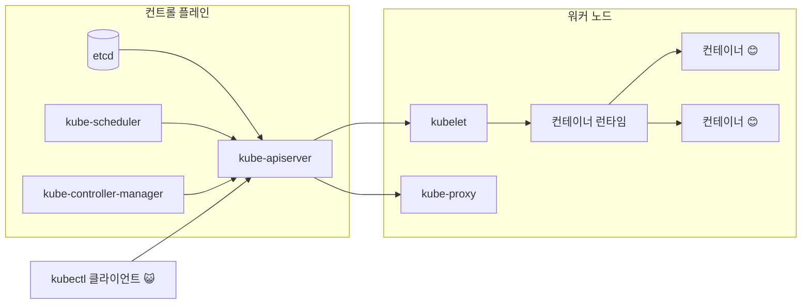
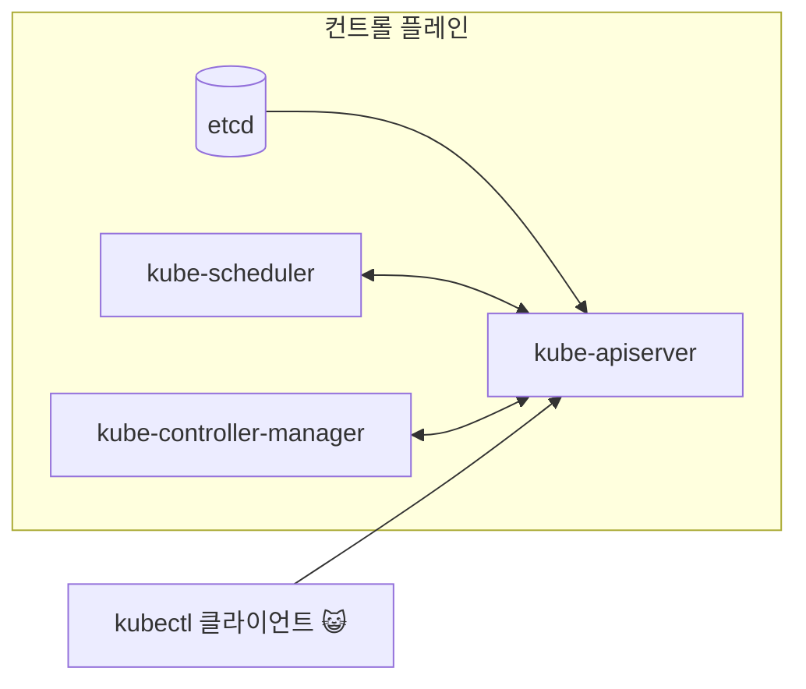
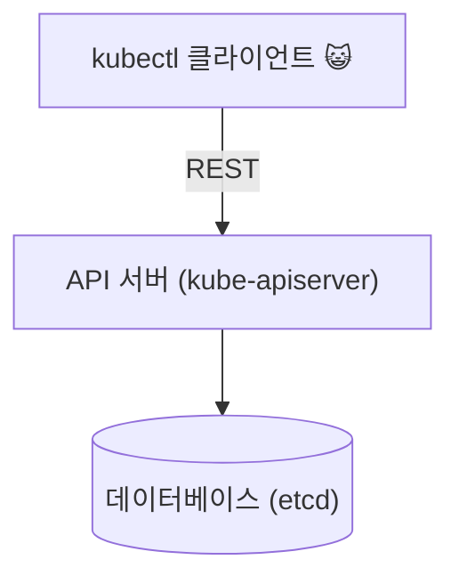
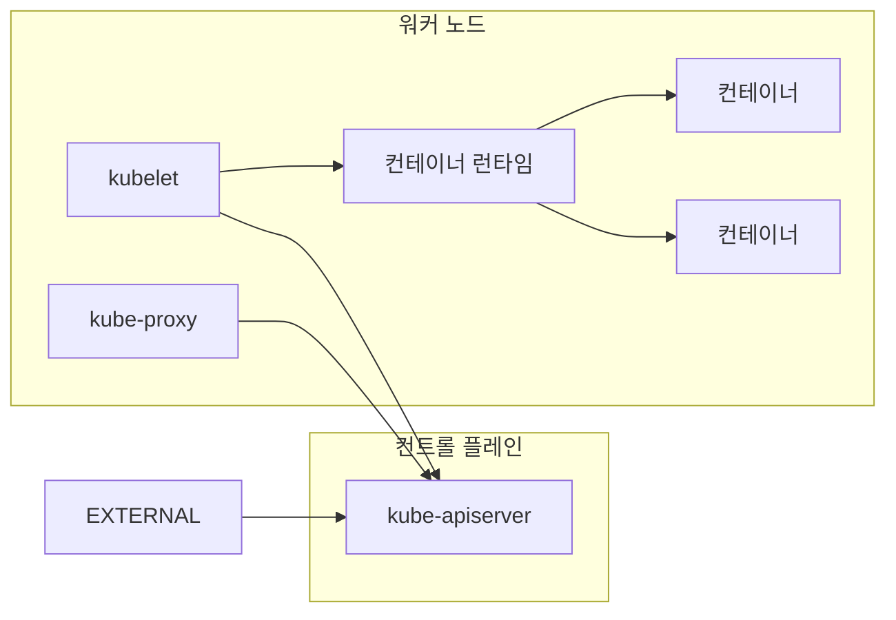
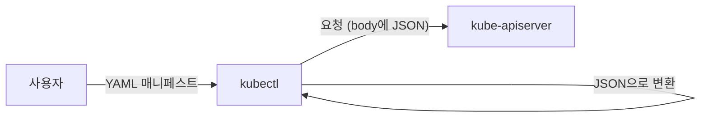
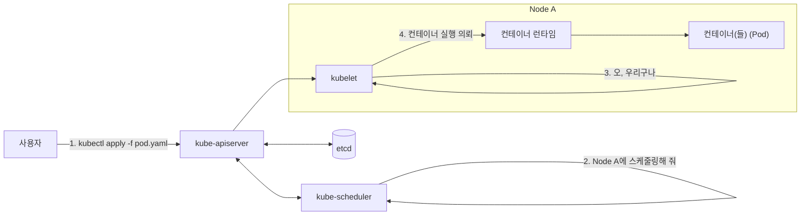
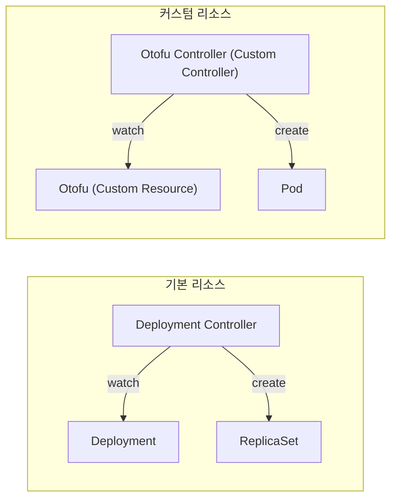

+++
date = 2025-12-20T20:00:00+09:00
title = "[그림과 실습으로 배우는 쿠버네티스 입문] 9장. 쿠버네티스의 구조와 아키텍처 이해하기"
authors = ["Ji-Hoon Kim"]
tags = ["k8s", "kubernetes"]
categories = ["k8s", "kubernetes"]
series = ["k8s", "kubernetes"]
+++


## 9.1 쿠버네티스의 아키텍처에 대하여

- 쿠버네티스는 ‘일반적인 웹 서비스처럼 애플리케이션 서버와 데이터베이스로 구성되어 있다’고 생각하면 쉽게 이해할 수 있음

## 9.2 아키텍처 개요



## 9.3 쿠버네티스 클러스터의 핵심인 컨트롤 플레인



- kube-system 이라는 네임스페이스를 확인하면 이러한 컴포넌트들이 실제로 Pod 로 동작하고 있음을 알 수 있다.

```bash
~
❯ k get pod --namespace kube-system                                       
NAME                                         READY   STATUS    RESTARTS      AGE
coredns-66bc5c9577-48nh6                     1/1     Running   1 (24m ago)   22h
coredns-66bc5c9577-vl988                     1/1     Running   1 (24m ago)   22h
etcd-kind-control-plane                      1/1     Running   2 (24m ago)   22h
kindnet-gltkb                                1/1     Running   1 (24m ago)   22h
kube-apiserver-kind-control-plane            1/1     Running   2 (24m ago)   22h
kube-controller-manager-kind-control-plane   1/1     Running   2 (24m ago)   22h
kube-proxy-g5wfv                             1/1     Running   1 (24m ago)   22h
kube-scheduler-kind-control-plane            1/1     Running   2 (24m ago)   22h
metrics-server-6c69b9fbc4-bts9x              1/1     Running   2 (23m ago)   22h

```



- kube-apiserver 는 REST 로 통신할 수 있는 API 서버
- etcd 는 분산형 키-값 저장소, 일종의 데이터베이스
- 실제로 kube-apiserver 는 사용자 (kubectl) 로부터 요청을 받아 etcd 에 데이터를 저장함
- 또한 `kubectl get` 명령어는 etcd 에 저장된 데이터를 kube-apiserver 로부터 받아옴

```bash
~
❯ k get pod --v=7 --namespace kube-system 
I1219 03:11:42.026445   11544 loader.go:405] Config loaded from file:  /Users/bossm0n5t3r/.kube/config
I1219 03:11:42.026825   11544 envvar.go:172] "Feature gate default state" feature="InformerResourceVersion" enabled=true
I1219 03:11:42.026835   11544 envvar.go:172] "Feature gate default state" feature="WatchListClient" enabled=true
I1219 03:11:42.026838   11544 envvar.go:172] "Feature gate default state" feature="ClientsAllowCBOR" enabled=false
I1219 03:11:42.026840   11544 envvar.go:172] "Feature gate default state" feature="ClientsPreferCBOR" enabled=false
I1219 03:11:42.026843   11544 envvar.go:172] "Feature gate default state" feature="InOrderInformers" enabled=true
I1219 03:11:42.026846   11544 envvar.go:172] "Feature gate default state" feature="InOrderInformersBatchProcess" enabled=true
I1219 03:11:42.029103   11544 round_trippers.go:527] "Request" verb="GET" url="https://127.0.0.1:50573/api/v1/namespaces/kube-system/pods?limit=500" headers=<
	Accept: application/json;as=Table;v=v1;g=meta.k8s.io,application/json;as=Table;v=v1beta1;g=meta.k8s.io,application/json
	User-Agent: kubectl/v1.35.0 (darwin/arm64) kubernetes/6645204
 >
I1219 03:11:42.055056   11544 round_trippers.go:632] "Response" status="200 OK" milliseconds=25
NAME                                         READY   STATUS    RESTARTS      AGE
coredns-66bc5c9577-48nh6                     1/1     Running   1 (29m ago)   23h
coredns-66bc5c9577-vl988                     1/1     Running   1 (29m ago)   23h
etcd-kind-control-plane                      1/1     Running   2 (29m ago)   23h
kindnet-gltkb                                1/1     Running   1 (29m ago)   23h
kube-apiserver-kind-control-plane            1/1     Running   2 (29m ago)   23h
kube-controller-manager-kind-control-plane   1/1     Running   2 (29m ago)   23h
kube-proxy-g5wfv                             1/1     Running   1 (29m ago)   23h
kube-scheduler-kind-control-plane            1/1     Running   2 (29m ago)   23h
metrics-server-6c69b9fbc4-bts9x              1/1     Running   2 (29m ago)   22h

```

- `k get pod` 을 했을 때 어떤 요청이 이루어지고 있는지 알 수 있음

```bash
I1219 03:11:42.029103   11544 round_trippers.go:527] "Request" verb="GET" url="https://127.0.0.1:50573/api/v1/namespaces/kube-system/pods?limit=500" headers=<
	Accept: application/json;as=Table;v=v1;g=meta.k8s.io,application/json;as=Table;v=v1beta1;g=meta.k8s.io,application/json
	User-Agent: kubectl/v1.35.0 (darwin/arm64) kubernetes/6645204
 >
I1219 03:11:42.055056   11544 round_trippers.go:632] "Response" status="200 OK" milliseconds=25
```

- `https://127.0.0.1:50573/api/v1/namespaces/kube-system/pods?limit=500` 에 대한 GET 요청에 대해 200 OK 응답을
  반환하고 있음
- 그렇다면 다른 컴포넌트는 무엇을 하고 있을까?
- kube-scheduler
    - Pod 를 노드에 스케줄링하는 역할을 담당
    - Affinity 등을 설명하면서 Pod 의 스케줄링에 대해 살펴봤는데, 이를 결정하는 것이 kube-scheduler
- kube-controller-manager
    - 쿠버네티스의 최소한의 동작을 위한 여러 컨트롤러를 실행
    - ‘매니페스트의 내용에 따라 움직이는’ 프로그램 전반을 컨트롤러라고 함
    - 예를 들어 매니페스트에 replicas: 3 이라고 쓰여 있으면 Pod 를 3개 준비하는 것이 Replication Controller 의 역할
- Node Lifecycle Controller
    - 노드가 다운되었을 때 알림을 줌

## 9.4 애플리케이션 실행을 담당하는 워커 노드



- 워커 노드에서는 실제 애플리케이션 컨테이너가 돌아감
- 컨트롤 플레인은 다중화를 고려하여 3대 정도의 노드로 구성하는 반면, 워커 노드는 규모에 따라 100대가 될 수도 있음
- kubelet
    - 클러스터 내의 각 노드에서 동작하며 Pod 에 연결된 컨테이너를 관리
    - 노드가 Pod 에 스케줄링되면 kubelet 이 컨테이너 런타임에 지시하여 컨테이너를 실행함
- kube-proxy
    - 클러스터 내의 각 노드에서 동작하며 Service 리소스의 설정에 따라 네트워크 설정을 수행함
    - kube-proxy 에 의해 클러스터 안과 밖의 네트워크 세션에서 Pod 로의 네트워크 통신이 가능해짐
- 컨테이너 런타임
    - 컨테이너를 실행하는 역할을 수행하는 소프트웨어
    - 쿠버네티스 특유의 기술은 아님
    - 구체적으로 containerd 나 CRI-O 등이 있음

## 9.5 쿠버네티스 클러스터에 접근하기 위한 CLI: kubectl



- kubectl 은 kube-apiserver 와 통신하기 위해 CLI 도구
- kube-apiserver 는 RESTful API 서버이므로, kubectl 없이도 curl 등으로 통신 가능
- 하지만 그렇게 통신하는 것은 매우 번거롭기 때문에 래퍼 도구인 kubectl 을 사용함
- kube-apiserver 와 통신하는 것은 매우 번거롭기 때문에 래퍼 도구인 kubectl 을 사용함
- kube-apiserver 와 통신하기 위해서는 모든 것인 JSON 형식이어야 하고, kubectl 이 사용자에게 더 보기 쉬운 형태인 YAML 형식으로 변환해줌

## 9.6 kubectl apply 이후 컨테이너가 실행될 때까지의 흐름

- `k apply --filename pod.yaml` (Pod 를 생성하는 매니페스트) 를 실행했을 때 어떤 일이 벌어지는지



- kubectl 에 의해 kube-apiserver 에 Pod 생성 지시가 전달됨
- etcd 에는 매니페스트의 정보가 저장됨
- 매니페스트의 내용을 바탕으로 스케줄러가 어떤 노드에서 컨테이너를 실행할지 결정함
- kubectl 은 자기가 돌고 있는 노드에서 컨테이너를 실행해야 함을 감지하고 컨테이너 런타임에 지시하여 컨테이너를 실행함

## 9.7 [만들고, 망가뜨리기] 쿠버네티스는 부서지지 않는다?

### 9.7.1 준비: 클러스터 구축하기

```bash
~/gitFolders/build-breaking-fixing-kubernetes master ⇡
❯ kind delete cluster                                   
Deleting cluster "kind" ...
Deleted nodes: ["kind-control-plane"]

~/gitFolders/build-breaking-fixing-kubernetes master ⇡
❯ kind create cluster -n multinode-nodeport --config kind/multinode-nodeport.yaml --image=kindest/node:v1.29.0
Creating cluster "multinode-nodeport" ...
 ✓ Ensuring node image (kindest/node:v1.29.0) 🖼 
 ✓ Preparing nodes 📦 📦 📦  
 ✓ Writing configuration 📜 
 ✓ Starting control-plane 🕹️ 
 ✓ Installing CNI 🔌 
 ✓ Installing StorageClass 💾 
 ✓ Joining worker nodes 🚜 
Set kubectl context to "kind-multinode-nodeport"
You can now use your cluster with:

kubectl cluster-info --context kind-multinode-nodeport

Have a question, bug, or feature request? Let us know! https://kind.sigs.k8s.io/#community 🙂

~/gitFolders/build-breaking-fixing-kubernetes master ⇡ 1m 12s
❯ k get node
NAME                               STATUS   ROLES           AGE     VERSION
multinode-nodeport-control-plane   Ready    control-plane   2m33s   v1.29.0
multinode-nodeport-worker          Ready    <none>          2m10s   v1.29.0
multinode-nodeport-worker2         Ready    <none>          2m11s   v1.29.0

```

### 9.7.2 hello-server 실행하기

```bash
~/gitFolders/build-breaking-fixing-kubernetes master ⇡
❯ k apply --filename chapter-09/hello-server.yaml --namespace default 
deployment.apps/hello-server created
poddisruptionbudget.policy/hello-server-pdb created
service/hello-server-external created

~/gitFolders/build-breaking-fixing-kubernetes master ⇡
❯ k get pod --namespace default                                      
NAME                          READY   STATUS    RESTARTS   AGE
hello-server-965f5b86-79744   1/1     Running   0          35s
hello-server-965f5b86-lmzp5   1/1     Running   0          35s
hello-server-965f5b86-qdkmq   1/1     Running   0          35s

~/gitFolders/build-breaking-fixing-kubernetes master ⇡
❯ k get node multinode-nodeport-worker -o jsonpath='{.status.addresses[?(@.type=="InternalIP")].address}' 
172.20.0.3

~/gitFolders/build-breaking-fixing-kubernetes master ⇡
❯ colima ssh
bossm0n5t3r@colima:/Users/bossm0n5t3r/gitFolders/build-breaking-fixing-kubernetes$ curl 172.20.0.3:30599
Hello, world! Let\'s learn Kubernetes!
bossm0n5t3r@colima:/Users/bossm0n5t3r/gitFolders/build-breaking-fixing-kubernetes$ exit
logout

~/gitFolders/build-breaking-fixing-kubernetes master ⇡ 11s
❯ curl localhost:30599
Hello, world! Let's learn Kubernetes!%                                          

```

### 9.7.3 컨트롤 플레인 정지하기

```bash
~/gitFolders/build-breaking-fixing-kubernetes master ⇡
❯ docker ps               
CONTAINER ID   IMAGE                  COMMAND                  CREATED         STATUS         PORTS                        NAMES
6be34d255073   kindest/node:v1.29.0   "/usr/local/bin/entr…"   8 minutes ago   Up 8 minutes   127.0.0.1:30599->30599/tcp   multinode-nodeport-worker
e8b82592147e   kindest/node:v1.29.0   "/usr/local/bin/entr…"   8 minutes ago   Up 8 minutes   127.0.0.1:51439->6443/tcp    multinode-nodeport-control-plane
9f99cc675625   kindest/node:v1.29.0   "/usr/local/bin/entr…"   8 minutes ago   Up 8 minutes                                multinode-nodeport-worker2

```

- multinode-nodeport-control-plane 의 container ID 가 `e8b82592147e` 임을 확인
- `e8b82592147e` 를 정지함

```bash
~/gitFolders/build-breaking-fixing-kubernetes master ⇡
❯ docker stop e8b82592147e   
e8b82592147e
```

- hello-server 에 접속 시도

```bash
~/gitFolders/build-breaking-fixing-kubernetes master ⇡ 10s
❯ colima ssh                                      
bossm0n5t3r@colima:/Users/bossm0n5t3r/gitFolders/build-breaking-fixing-kubernetes$ curl 172.20.0.3:30599
Hello, world! Let\'s learn Kubernetes!
bossm0n5t3r@colima:/Users/bossm0n5t3r/gitFolders/build-breaking-fixing-kubernetes$ exit
logout

~/gitFolders/build-breaking-fixing-kubernetes master ⇡ 5s
❯ curl localhost:30599
Hello, world! Let's learn Kubernetes!%                                          

```

- 문제 없이 동작 확인
- Pod 의 STATUS 를 확인해보자

```bash
~/gitFolders/build-breaking-fixing-kubernetes master ⇡
❯ k get pod --namespace default
The connection to the server 127.0.0.1:51439 was refused - did you specify the right host or port?

```

- 접속 불가 상태
- 컨트롤 플레인을 멈춰서 kube-apiserver 에 접속할 수 없기 때문
- 그러나 컨트롤 플레인이 정지되더라도 컨테이너는 계속 실행됨
- kube-apiserver 에 접속할 수 없기 때문에 컨테이너를 업데이트하거나 Pod 의 수를 변경할 수는 없지만 적어도 서비스가 즉시 멈추지는 않음
- 이것이 쿠버네티스가 장애에 강하다고 하는 이유
- 컨트롤 플레인을 다시 시작하면, 이전처럼 kubectl 을 사용할 수 있게 됨

```bash
~/gitFolders/build-breaking-fixing-kubernetes master ⇡
❯ docker start e8b82592147e 
e8b82592147e
```

- Pod 를 조회할 수 있는지 확인 후 클러스터 정리

```bash
~/gitFolders/build-breaking-fixing-kubernetes master ⇡
❯ k get pod --namespace default
NAME                          READY   STATUS    RESTARTS   AGE
hello-server-965f5b86-79744   1/1     Running   0          6m6s
hello-server-965f5b86-lmzp5   1/1     Running   0          6m6s
hello-server-965f5b86-qdkmq   1/1     Running   0          6m6s

~/gitFolders/build-breaking-fixing-kubernetes master ⇡
❯ kind delete cluster --name multinode-nodeport
Deleting cluster "multinode-nodeport" ...
Deleted nodes: ["multinode-nodeport-worker" "multinode-nodeport-control-plane" "multinode-nodeport-worker2"]

~/gitFolders/build-breaking-fixing-kubernetes master ⇡
❯ kind create cluster
Creating cluster "kind" ...
 ✓ Ensuring node image (kindest/node:v1.35.0) 🖼 
 ✓ Preparing nodes 📦  
 ✓ Writing configuration 📜 
 ✓ Starting control-plane 🕹️ 
 ✓ Installing CNI 🔌 
 ✓ Installing StorageClass 💾 
Set kubectl context to "kind-kind"
You can now use your cluster with:

kubectl cluster-info --context kind-kind

Have a question, bug, or feature request? Let us know! https://kind.sigs.k8s.io/#community 🙂

~/gitFolders/build-breaking-fixing-kubernetes master ⇡ 48s
❯ k get pod --namespace kube-system
NAME                                         READY   STATUS    RESTARTS   AGE
coredns-7d764666f9-fr2lq                     1/1     Running   0          98s
coredns-7d764666f9-p25qm                     1/1     Running   0          98s
etcd-kind-control-plane                      1/1     Running   0          106s
kindnet-hwcb2                                1/1     Running   0          98s
kube-apiserver-kind-control-plane            1/1     Running   0          106s
kube-controller-manager-kind-control-plane   1/1     Running   0          106s
kube-proxy-lc97v                             1/1     Running   0          98s
kube-scheduler-kind-control-plane            1/1     Running   0          106s

```

## 9.8 쿠버네티스를 확장하는 방법

- 쿠버네티스의 특징 중 하나는 ‘사용자가 스스로 확장할 수 있다’는 것
- 여기서는 어떤 구조로 확장 가능한지만 설명
    - 실제로 확장하려면 더 많은 지식이 필요해서 실습은 생략함, 12장 참고
- 지금까지 Pod 나 Deployment 등의 ‘리소스’를 생성해 왔는데 쿠버네티스가 표준으로 제공하는 리소스만으로는 부족할 때가 있음
- 예를 들어 Argo CD 라는 OSS 는 지정한 리포지터리의 이름과 경로의 매니페스트를 자동으로 배포함
- 하지만 기존의 리소스만으로는 이 기능을 구현할 수 없음
- ‘리포지터리의 이름’, ‘경로’를 지정하는 리소스와 이 리소스의 내용을 바탕으로 ‘자동 배포를 수행하는’ 프로그램이 필요함
- 여기서 말하는 독자적인 리소스가 Custom Resource (CR) 이며, CR 을 만들기 위해 필요한 정의가 Custom Resource Definition (CRD)
  입니다.
- 또한 CR 을 참조하여 동작하는 프로그램을 ‘커스텀 컨트롤러’ 라고 함
    - 여기서 말하는 컨트롤러는 kube-controller-manager 에서 설명한 컨트롤러와 같은 개념
- 쿠버네티스 표준으로 탑재된 Deployment Controller 는 kube-controller-manager 에 포함되어 있음
- 커스텀 컨트롤러는 각자가 쿠버네티스를 ‘커스텀'하기 위해 사용하는 컨트롤러



- ConfigMap 에 필요한 정보를 저장하고 해당 정보를 읽는 프로그램을 작성해도 되지 않을까 생각할 수 있음
- 쿠버네티스의 공식 문서의 **Should I add a custom resource to my Kubernetes cluster?** 에서는 이에 대한 판단 기준을 제시하고
  있음 (다음 중 하나라도 해당된다면 ConfigMap 을 사용하는 것이 좋다고)
    - https://kubernetes.io/docs/concepts/extend-kubernetes/api-extension/custom-resources/#should-i-add-a-custom-resource-to-my-kubernetes-cluster
    - 널리 사용되는 잘 문서화된 설정 파일 형식이 있다
        - 예를 들어 mysql.cnf 이나 pom.xml
    - 설정 전체를 ConfigMap 의 키 하나에 넣고 싶다
    - Pod 에서 동작하는 프로그램이 자신의 설정을 위해 해당 파일을 사용한다
    - 쿠버네티스의 API 가 아닌 Pod 의 파일이나 환경 변수로 사용하고 싶다
    - 파일이 업데이트되었을 때 Deployment 를 사용하여 RollingUpdate 를 실행하고 싶다
- `k get <CR 이름>` 으로 정보를 확인하거나, 선언적인 매니페스트를 사용하여 Reconcile 처리를 수행하는 것과 같이 쿠버네티스의 방식으로 쿠버네티스를 확장하고 싶은
  경우에는 CR 을 이용하는 것이 좋음
- Argo CD 는 ‘쿠버네티스에서 동작하는 쿠버네티스용 배포 도구’ 이므로 CR 을 사용하기에 적합한 경우
