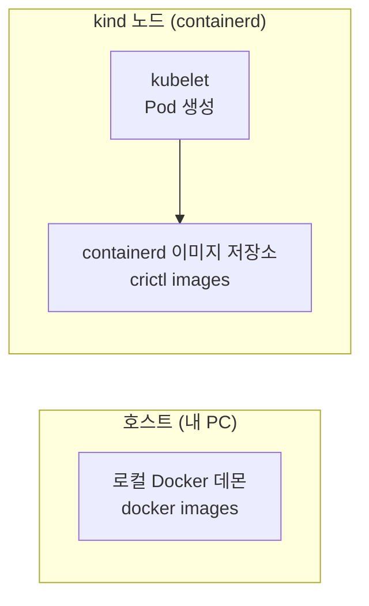
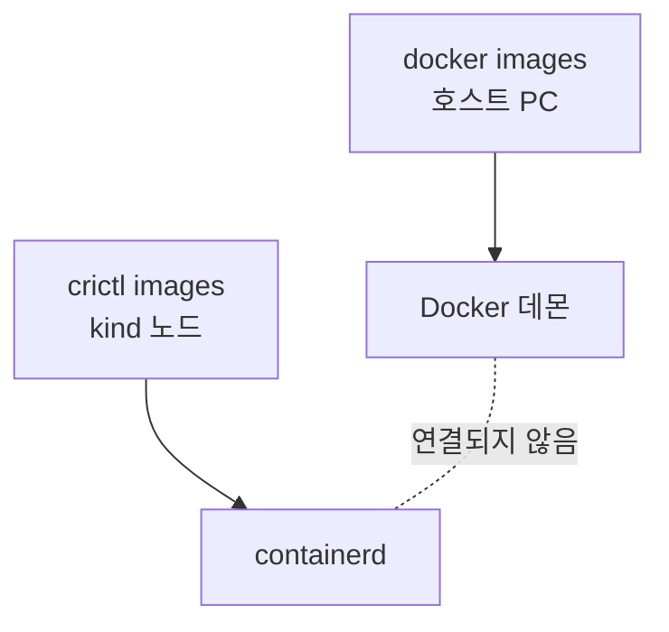

+++
date = 2025-11-23T19:00:00+09:00
title = "Kind에서 로컬 Docker 이미지를 사용하는 방법 완벽 정리"
authors = ["Ji-Hoon Kim"]
tags = ["docker", "kubernetes", "k8s", "kind"]
categories = ["docker", "kubernetes", "k8s", "kind"]
series = ["kind"]
+++


## 들어가며

Kubernetes를 로컬에서 학습할 때 가장 많이 사용하는 도구가 바로 **kind(Kubernetes in Docker)** 이다.

kind는 간단한 명령으로 로컬 Kubernetes 클러스터를 만들 수 있고, 강의나 실습 환경에서 널리 활용된다.

그런데 많은 초심자들이 공통적으로 겪는 문제가 있다.

> “내 로컬 Docker 이미지가 Pod에서 바로 실행되지 않는다”
>
> “ErrImagePull / ImagePullBackOff 에러가 난다”

왜 이런 문제가 발생하는지, 어떻게 해결하는지, 그리고 kind 노드의 이미지 관리 방법까지 그림과 함께 정리해본다.

## 1. 왜 로컬 Docker 이미지가 Pod에서 바로 사용되지 않을까?

kind는 Kubernetes 클러스터를 **Docker 컨테이너 내부에 생성**한다.

즉, PC의 Docker 데몬과 kind 노드 내부의 Docker 엔진(containerd)은 **전혀 다른 환경**이다.

### ⚠️ 개념적으로 이렇게 분리되어 있다:



즉:

```
내 컴퓨터 Docker 이미지 목록 != kind 노드의 Docker 이미지 목록
```

따라서 Pod를 생성하면 Kubernetes는 다음 순서로 동작한다:

1. kind 노드(containerd)에 이미지가 존재하는지 확인
2. 없으면 원격 레지스트리에서 pull 시도
3. 로컬 빌드 이미지라면 당연히 pull 실패 → ErrImagePull

## 2. 해결 방법: kind 노드에 이미지 직접 로드하기

kind는 로컬에서 빌드한 이미지를 **노드(containerd)로 직접 복사(load)** 하는 기능을 제공한다.

```bash
kind load docker-image hello-server:1.0.0
```

### 이미지 로드 흐름:


이미지를 로드한 후 Pod를 생성하면 정상적으로 로컬 이미지를 사용한다.

```bash
kubectl apply -f hello-world.yaml
kubectl get pod
```

## 3. Pull 정책(imagePullPolicy) 확인하기

이미지 태그가 latest이면 Kubernetes는 기본적으로:

```yaml
imagePullPolicy: Always
```

즉, **항상 원격 레지스트리에서 pull** 하려고 한다.

→ 로컬 이미지를 사용하려면 pull을 끄는 게 중요하다.

### ⭐ best practice

- 태그는 latest 대신 1.0.0, 0.1.2 등 명시적 버전 사용
- imagePullPolicy는 기본값 IfNotPresent 유지

```yaml
containers:
  - name: hello-server
    image: hello-server:1.0.0
    imagePullPolicy: IfNotPresent
```

## 4. kubectl run 으로도 로컬 이미지를 사용할 수 있을까?

가능하다.

kind 노드에 이미지를 로드했다면 **Pod 생성 방식과 상관없이 모두 사용 가능**하다.

```bash
kubectl run test --image=hello-server:1.0.0 --port=8080
```

단, 이미지 이름과 태그가 **정확히 일치**해야 한다.

## 5. kind 노드 내부 이미지 목록 확인하기

로컬 Docker의 docker images는 아무 소용이 없다.

kind는 **containerd 기반**이므로 다음으로 조회해야 한다:

```bash
docker exec -it kind-control-plane crictl images
```

특정 이미지를 확인하려면:

```bash
docker exec -it kind-control-plane crictl images | grep hello-server
```

### 구조적으로 이렇게 동작한다:



호스트의 Docker 데몬과 kind 노드의 containerd는 **완전히 분리된 공간**임을 의미한다.

## 6. kind 노드 내부 이미지 삭제하기

삭제 역시 containerd 기준으로 처리해야 한다.

### ✔ 단일 노드 삭제

```bash
docker exec -it kind-control-plane crictl rmi hello-server:1.0.0
```

### ✔ 멀티 노드 클러스터 삭제 (worker 노드 포함)

```bash
for node in $(kind get nodes); do
  docker exec -it $node crictl rmi hello-server:1.0.0
done
```

### 삭제 흐름:


## 7. 요약

| **작업**                | **명령**                                          |
|-----------------------|-------------------------------------------------|
| 로컬 이미지 kind 노드로 로드    | kind load docker-image hello-server:1.0.0       |
| 노드 이미지 목록 확인          | docker exec kind-control-plane crictl images    |
| 노드 이미지 삭제             | docker exec kind-control-plane crictl rmi <이미지> |
| Pod에서 로컬 이미지 사용       | image: hello-server:1.0.0 + IfNotPresent        |
| kubectl run 으로도 사용 가능 | kubectl run test --image=hello-server:1.0.0     |

## 마무리

kind는 Kubernetes 실습에 매우 좋은 도구지만,

로컬 Docker 이미지와 kind 노드의 containerd 이미지가 **서로 완전히 독립된 환경**이라는 점 때문에 처음에 혼란이 올 수 있다.

이번 글에서 정리한 흐름만 이해하면:

1. 로컬에서 docker build
2. kind로 kind load docker-image
3. Kubernetes에서 Pod 실행
4. 이미지 목록 조회/삭제 관리

이 흐름을 완전히 이해할 수 있고, 로컬에서 Kubernetes 테스트 작업을 훨씬 빠르고 안정적으로 수행할 수 있다.
